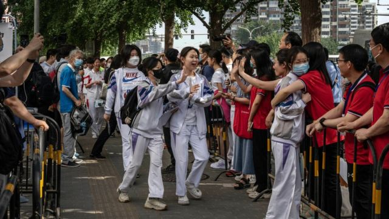
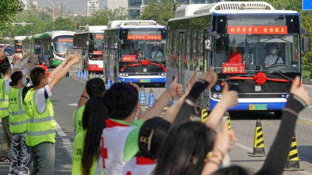
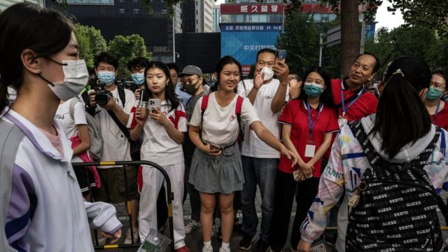
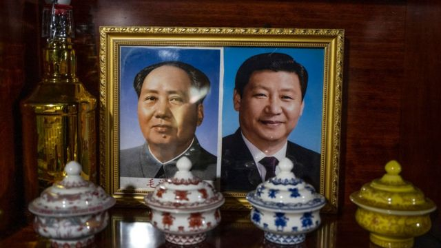

# [Chinese] 中国高考作文首现“习近平语录” 要求考生按命题“体现思考”

#  中国高考作文首现“习近平语录” 要求考生按命题“体现思考”

> 图像来源，  Getty Images
>
> 图像加注文字，2023年6月7日，北京考生走出考场。

**中国一年一度的大学招生考试“高考”周三（6月7日）拉开帷幕。在一份多个省份采用的语文考卷中，作文试题引述了中国领导人习近平的讲话，要求考生据此写出感想。**

这是中国高考罕见地将现任领导人的语录纳入高考作文。此前，只有中共建政领袖毛泽东的诗词登上过试卷。毛泽东生前撰写了大量诗词，在中共党内被誉为“思想家”和“诗词巨匠”。他的《沁园春 雪》等诗词被收入中国中学语文课本。

据中国官方媒体报道，此次高考中，教育部命题的全国乙卷作文试题以“吹灭别人的灯，并不会让自己更加光明；阻挡别人的路，也不会让自己行得更远”、“一花独放不是春，百花齐放春满园。如果世界上只有一种花朵，就算这种花朵再美，那也是单调的”为提要，要求考生以此写一篇文章，体现自身的思考。

题目中更强调，这两句话是“习近平总书记的讲话，以生动形象的语言说出了普遍的道理”。

公开资讯显示，第一段文字出自今年3月，习近平在北京出席中国共产党与世界政党高层对话会时发表的谈话内容。

第二段则是习近平2014年3月在联合国教科文组织总部的演讲内容。这句话被用于宣扬中国政府提出的“构建人类命运共同体”理念。

> 图像来源，  Getty Images
>
> 图像加注文字，这套语文试题使用的地区包括河南、山西、江西、内蒙古、新疆、陕西等12省区。

> 图像来源，  Getty Images

今年中国高考语文科目共有七套试卷，其中由教育部考试中心命题的试卷四套，北京、天津、上海则自行命题，因此共有7个不同作文考题。

这套以“习语录”为作文题的全国乙卷由教育部命题，使用的地区包括河南、山西、江西、内蒙古、新疆、陕西等12省区，覆盖考生广泛。

在中国受到审查的社交媒体上，该作文题引发网民热议。有网友表示，“给我的第一感觉就是说中美关系，美国想尽方法阻碍中国的伟大复兴，逆全球化进程损人不利己。”

一些海外社交媒体上的网民则批评该作文题是“政治入侵教育”。还有人指其是让学生作“政治表态”。

> 图像来源，  Getty Images
>
> 图像加注文字，有批评称该作文题是让学生作“政治表态”。

直接要求考生以领导人语录撰写高考作文并不常见。在2017年，全国二卷曾要求学生以包括毛泽东诗句“数风流人物，还看今朝”在内的名句为题，写出感触。

近年来，中国的宣传部门不断加强对于习近平的歌颂。早在2018年，一些电视台就推出了有关习近平思想的综艺节目。例如以娱乐综艺节目闻名的湖南卫视播出了学习习近平思想的电视问答节目《新时代学习大会》，央视紧随其后推出《平“语”近人——习近平总书记用典》。

各地都开展了学习“习思想”的主题教育活动，多座大学成立了习近平思想研究中心。

习近平成功开始第三任期后，高级官员中也掀起了歌颂习近平的热潮。在《习近平著作选读》发行后，被视为习近平亲信的中共中共政治局常委、中央书记处书记蔡奇强调，要推动习思想“入脑入心入魂”。

除了全国乙卷，其他三份全国卷的作文题目分别是“时间”、“好的故事”、“自己的空间”。

地方卷中，上海卷的作文试题为：“一个人乐意去探索陌生世界，仅仅是因为好奇心吗？”引导考生以“探索”为概念作文，再次得到不少好评。

北京卷要考生从“续航”或“亮相”中选一为题写文章。天津卷则要求考生写出对“一代人有一代人的使命与挑战，一代人有一代人的责任和担当”的想法。

