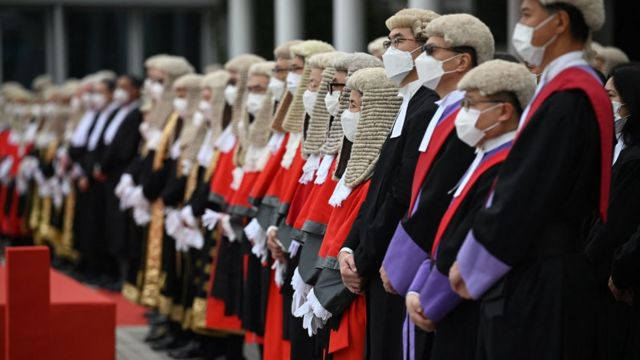
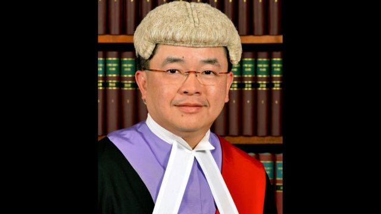
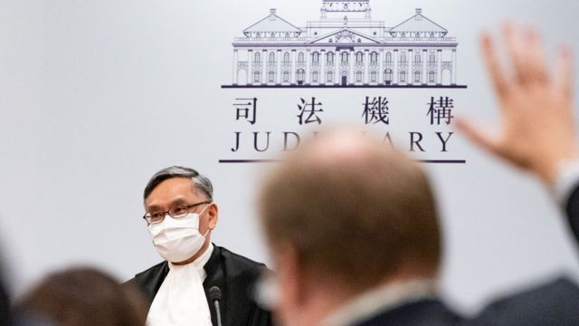
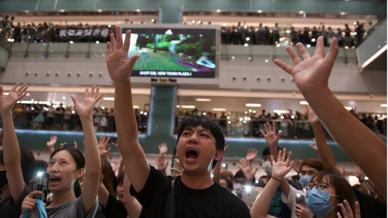

# [Chinese] 香港《国安法》指定法官被揭“司法抄袭” 98%判词“逐字复制”

#  香港《国安法》指定法官被揭“司法抄袭” 98%判词“逐字复制”

> 图像来源，  Getty Images
>
> 图像加注文字，图为2023年1月香港法官出席法律年度开启典礼

**《香港国安法》指定法官、香港高等法院原讼庭法官陈嘉信，近日被揭发在多宗民事案件中的判辞涉“司法抄袭”（judicial copying）和“广泛整合律师的陈词”（extensive corporation of counsel's submission）。**

终审法院首席法官张举能表示，抄袭行为绝不能接受，已对陈嘉信作出“严肃训诫”。

抄袭情况在香港司法界罕见，事件引起外界质疑其公信力，特别是陈嘉信近日负责审理《愿荣光归香港》歌曲禁制令案。

该首“反送中”抗议歌曲在2019年匿名创作，被示威者视为非官方的香港“国歌”。香港律政司司长6月5日向高等法院申请对这首歌曲的禁制令，禁止以任何方式发布、复制、表演及在网上传播。

##  “无一完整句子亲自撰写”

> 图像来源，  Hong Kong Judiciary
>
> 图像加注文字，陈嘉信身兼《香港国安法》指定法官

陈嘉信法官于2021年4月，裁定生产“黄道人双料活络油”的星洲药业等，侵犯“黄道益活络油”商标。

被告不服上诉，指陈嘉信法官的判辞超过98%内容均来自原告的书面陈辞，余下的2%也没有一句完整句子是由陈嘉信亲自撰写，质疑陈履行司法职能时欠缺独立思考，没有给予充份理由。

上诉庭发现，陈嘉信法官的判辞将原告陈述逐字复制，只有表面改动，例如将英文缩写“P”改为“原告”（the plaintiff）、“Ds”改为“被告”（the defendants），“背景”（Background）一字改为“引言”（Introduction）。

上诉庭最终裁定陈嘉信法官的行为属司法抄袭，批准上诉，下令案件交由另一法官重审，并批评陈嘉信法官全盘抄袭原告一方的陈辞，败诉方自然感不满，觉得陈是在“走捷径”和放弃司法职责。

##  影响司法信心

> 图像来源，  Getty Images
>
> 图像加注文字，图为终审法院首席法官张举能

香港司法机构回应指，终审法院首席法官张举能及高等法院首席法官潘兆初已就抄袭一事对陈嘉信法官作出严肃训诫，陈法官表示明白和同意。

张举能完全同意上诉法庭判案书中提到，判案书不能抄袭的意见。他认为，抄袭行为对诉讼双方不公平，亦影响到公众对司法的信心，绝不能接受。

香港上诉庭6月14日审理另一宗同样由陈嘉信审理的案件，上诉方是鹰君集团罗家么子罗启瑞，答辩方是家族信托受托人汇丰国际信托、HSBC Trustee（Hong Kong） Ltd、三子罗嘉瑞及KSL Management Ltd。

上诉方指，陈嘉信法官在该案判词中广泛覆述汇丰国际信托一方及罗嘉瑞一方的陈词，并一字不漏引用汇丰国际信托一方部分陈词，质疑陈嘉信处理案件时并无独立思考。

##  《愿荣光》案主审法官

> 图像来源，  Getty Images
>
> 图像加注文字，2019年示威者经常在集会上唱《愿荣光归香港》

陈嘉信是《香港国安法》指定法官之一，近日负责处理律政司申请禁制歌曲《愿荣光归香港》的案件，该案押後至7月21日正式审理。

他曾是民主派47人初选案的三位指定法官之一，但今年初开审前因健康理由退出，由法官李运腾替补。

2021年，陈嘉信联同指定法官杜丽冰、彭宝琴审理《国安法》首案，裁定唐英杰“煽动他人分裂国家罪”和“恐怖活动罪”成立，判处他监禁9年。

根据《香港国安法》第44条，香港行政长官应当从裁判官、区域法院法官、高等法院原讼法庭法官、上诉法庭法官以及终审法院法官中指定若干名法官，也可从暂委或者特委法官中指定若干名法官， 负责处理危害国家安全犯罪案件。

该法律又指，行政长官在指定法官前，可征询香港特区维护国家安全委员会和终审法院首席法官的意见。上述指定法官任期一年。凡有危害国家安全言行的，不得被指定为审理危害国家安全犯罪案件的法官。

