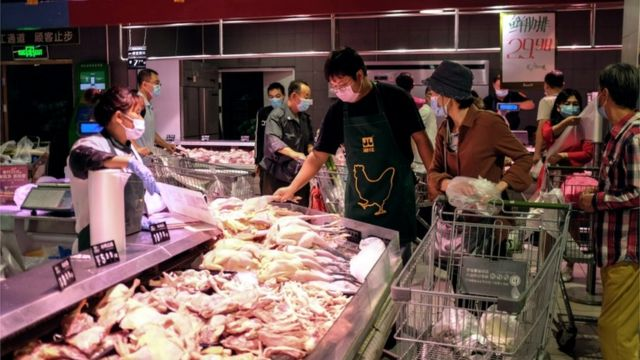
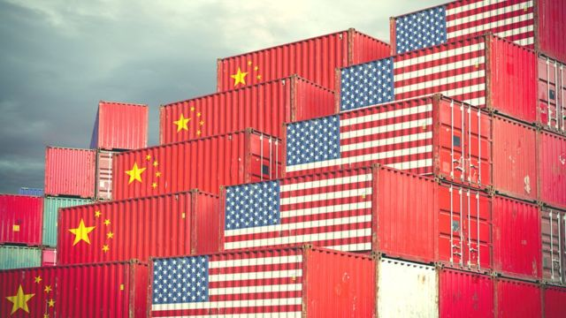
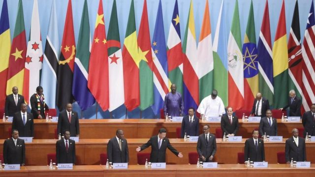
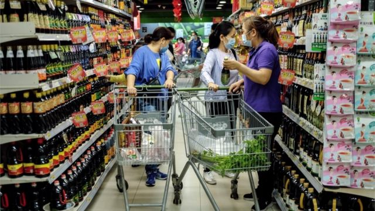
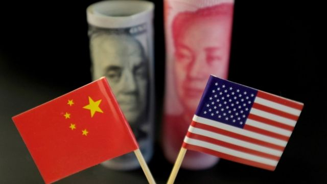

# [Chinese] 美国为何要终结中国的“发展中国家”地位

#  美国为何要终结中国的“发展中国家”地位

> 图像来源，  EPA

**6月8日，美国参议院外交关系委员会投票通过一项名为“结束中国的发展中国家地位法”（Ending China's Developing Nation Status Act）的法案，此举为美国参议院全体投票铺平道路。**

今年月底，美国众议院也曾全票通过一项类似法案。按照美国的立法流程，众议院和参议院分别通过后，再交由美国总统签署，法律将正式生效。目前还没有消息美国参议院何时会对法案进行投票。

此法案要求美国的行政部门采取措施，推动国际组织终止中国的“发展中国家”地位，并将中国的地位改为“发达国家”。

中国外交部发言人汪文斌回应称，“美国想把‘发达国家’的帽子强加给中国，不是出于对中国发展成就的赞赏肯定，而是醉翁之意不在酒，是要把剥夺中国的发展中国家地位作为遏制中国发展的一张牌。”

##  好处——为何中国不想当“发达国家”？

长远来看，中国当然是想当“发达国家”的，并且早在上世纪80年代就提出了这一构想，即所谓的“三步走”战略，其中的第三步，就是在2049年中共建政100周年时，人均国民生产总值达到中等发达国家水平，人民生活比较富裕，基本实现现代化。

“现在（放弃发展中国家地位）还不是时候，当个发展中国家，既有政治利益，也有经济利益。”一位在香港的国际关系学者向BBC中文表示。

比如在世界贸易组织（WTO）协定中，有超过150项条款都明确发展中国家享有”特殊和差别待遇“（Special and Differential treatment），发展中国家成员可在关税减免、延长磋商期限、非关税壁垒等方面享有更优惠的待遇。

不过，在双边贸易中，很多发达国家会根据实际情况，决定是否给予另一国发展中国家地位。比如，在2020年2月美国贸易代表办公室就宣布取消25个经济体的世界贸易组织（WTO）发展中国家优惠待遇，其中就包括中国，还有比中国经济水平更高的中国香港、新加坡、韩国，甚至还包括经济水平更低的阿尔巴尼亚、阿根廷、印度、印尼、马来西亚、泰国、乌克兰和越南等。

但在其他国际条约中，发展中国家也能享受优待，尤其是环保领域。1972年的《人类环境宣言》、1987年的《蒙特利尔议定书》、1992年的《联合国气候变化框架公约》、1997年的《京都议定书》，以及2015年的《巴黎协定》，都在不同程度上承认发达国家应该照顾发展中国家，并允许后者暂缓执行减排措施，以及更宽松的减排义务，还要求发达国家向发展中国家提供资金和技术。

背后的逻辑是，发达国家在过去几百年间是温室气体的主要排放国，所以现在应该承担比发展中国家更多的减排义务。

> 图像来源，  Getty Images

在政治上，中国长期将自身定义为“最大的发展中国家”，早在毛泽东时代就提出“第三世界”的理念，在国际战略上从美苏选边站，过渡到团结“亚非拉兄弟”。

“政治上的利益发达国家几乎无一例外是欧美发达国家，深度嵌入西方的政治体系、话语体系、国际治理体系，中国很难在西方固有体系中取得领导地位。”上述学者表示，因此中国选择发展自己在发展中国家，或者说新兴民族国家中的地位，中国经常说是被非洲兄弟”抬进“联合国的，第三世界、亚非拉等概念在中国耳熟能详，改革开放后，开始出现金砖五国、亚开行等，都是中国通过“发展中国家”构建多极化世界秩序的努力。

值得一提的是，在一次中非合作论坛上，中国领导人照例称中国为“最大的发展中国家”，台下一众非洲领导人则都笑了，认为中国过分谦虚了，中国和非洲诸国显然不是一类国家。这一幕还曾一度在中文社交媒体上广泛传播。

##  标准——怎样才算发展中国家？

在回应美国国会相关法案时，中国外交部发言人说，“中国作为世界上最大发展中国家的地位，既有充分的事实依据，也有坚实的国际法基础，不是美国国会的一项法案就能够一笔勾销的。”

那么有没有确切标准，能够判断中国是否为发展中国家？

> 图像来源，  Getty Images
>
> 图像加注文字，2018年中非合作论坛北京峰会

最明确的标准来自联合国统计司（UNSD），该机构在一项名为M49的地区和国家分类标准中，非常明确地区分了发达国家和发展中国家——日本、加拿大、美国、澳大利亚、新西兰，以及整个欧洲认定为发达国家；在贸易统计过程中，又增加了以色列、塞浦路斯、百慕大、格陵兰、圣皮埃尔和密克隆等一些岛屿和地区为发达国家；其余则都为发展中国家，中国自然也在其列。

不过联合国网站显示，M49目前的版本是1999年制定。而且还特地声明，在联合国系统内没有发展中国家和发达国家（或地区）的定义。然而，在1996年，“发达地区”和“发展中地区”的区分被引入统计用的标准国家或地区代码（即M49）。这些分组在当时只是为了统计上的方便，并不表示对任何国家或地区的发展阶段的判断。

综合性更高的划分标准来自联合国开发计划署（UNDP），该机构综合考量健康、教育、经济及不平等维度，为全球不同发展程度的国家评估一个人类发展指数（HDI），并分为极高、高、中、低四档，只有第一档国家属于发达国家，其他三档为发展中国家。

按照此标准，中国在2022年人类发展指数为0.768，排名全球79，属于高HDI组别，因此属于发展中国家。不过极高HDI的国家为66个，中国的排名已比较接近。

世界银行（World Bank）则按照国民总收入（GNI）将各个经济体分为高收入、中等偏高收入、中等偏低收入和低收入四个类别。同样，高收入经济体为发达国家，其余三类为发展中国家。

每年7月世界银行会公布一个标准，目前迈入高收入国家行列的标准是人均GNI超过13205美元。中国2月份公布的数据显示，去年中国的人均国民总收入（GNI）为12608美元，但已达到上述标准的95%。

世贸组织（WTO）一般接受任何国家声称自己是“发展中国家”的说法。所以，经济指标都已符合“发达国家”的一些国家和地区也会选择坚持自己是“发展中国家”，从而享有在世贸组织的优惠待遇。

这种制度下，很少有国家会主动放弃自己“发展中国家”的地位，其中一例就是韩国——2019年10月25日，韩国政府决定自动放弃在WTO中享受“发展中国家待遇”的地位。但当时，韩国的人类发展指数排名已高达22，高于法国、西班牙、意大利。世界银行当时公布的韩国人均国民总收入也达到4.3万美元，与日本持平，是中国的接近三倍。

> 图像来源，  EPA

##  争论——中美各执一词

上述学者称，几乎所有国际标准中，中国依然被算作“发展中国家”，但有两个不容忽视的事实：

一、发展中国家涵盖范围极广，相比于也门、卢旺达等国，中国显然离发达国家的水平更接近，甚至如果今年人民币升值一点，中国就将跨入世行的发达国家门槛。

二、这还是在人均的范畴讨论，如果把这个乘以14亿，中国的庞大体量和国际政治、经济影响力，只有美国和整个欧盟可以匹敌，因此与"发展中国家"的印象区别很大。

体量vs人均，就是中国和美国在这个问题上的核心论点。

在中国，从媒体到外交官，在这个问题上的论点都聚焦在——中国的经济发展虽快，但国内发展不平衡，人均还未达到发达国家水平，而且是否为发达国家不应只考虑经济，而应综合考虑社会、医疗等方面。

在美国，无论参议院还是众议院，都聚焦在中国庞大的体量上——中国已经成为世界上最大的出口国和第二大经济体，不再符合发展中国家的标准，应该被剥夺这些优惠待遇。

“从经济和军事规模到在世界各国的大规模投资，显然中国已经不再是‘发展中国家’，”来自马里兰州议员克里斯·范·荷伦（Chris Van Hollen）在一份书面声明中说，“长期以来，中国一直利用这一地位在多边协议中获得不公平的优势。”

> 图像来源，  Reuters

犹他州的共和党人米特·罗姆尼（Mitt Romney）也发声明称，“中国拥有世界第二大经济体，并有望在经济上超越美国......中国在全球舞台上继续被视为发展中国家是很荒谬的。”

此前在众议院表决类似法案时，议员金映玉（Young Kim）也表示，中国是世界上第二大的经济体，占了全球经济18.6%，他们的经济规模仅次于美国，美国被视为发达国家，中国也应如此。

这些议员们的发言也在一定程度上揭示了美国这么做的目的。

对此，中国现代国际关系研究院美国研究所副研究员张志新撰文称，美国这么做其实就是为了确保其在经济、贸易、科技、金融等领域的优势地位，重新构建有利于维护美国自身霸权的国际政治经济新秩序。

“在中美战略竞争日益加剧时，美国国会此举，一方面是为了确保在经贸谈判中获得更有利的筹码，另一方面则是从根本上希望与中国‘脱钩’‘断链’，从而遏制或延缓中国的崛起。”张志新称。

那么美国能够成功吗？上述学者给出的答案是，“一定范围内能成功，但影响不会太大。”

她表示，世界银行、世贸组织、IMF等国际组织，美国作为主要缔约国，其影响力非常大，如果有一项两党全票通过的法案支持，那么将会非常有力地影响这些组织。但这些国际组织在中美对峙的大背景下，都在面临失效的困境，而且在现实的贸易中，美国对华关税依然延续贸易战时期，远高于WTO框架下对发达国家设置的关税，所以并不会改变双方的贸易现状。

“需要注意的是，中国的谈判能力也在加强，而且美国也不会希望极限施压下，迫使中国退出国际组织而另起炉灶，那么双方拉扯的空间就比较大。其实中美在这件事上的侧重点不同，美国希望降低中国在国际组织间获得的经济利益；中国更看重的，应该是国际政治上的诉求，即团结第三世界国家，以形成与西方不同的另一极力量，中国完全可以在外交场上坚持发展中国家的定位，同时在国际组织里做出一些妥协。”

