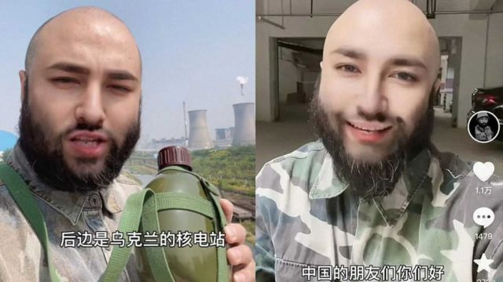
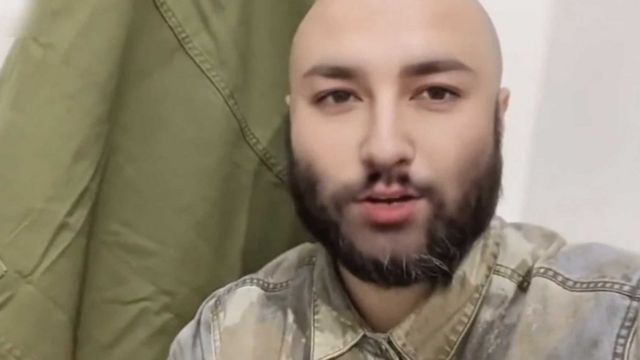

# [Chinese] “柯察铁”、“王抗美”到“娜娜” 那些图谋爱国财的虚假“歪果仁”

#  “柯察铁”、“王抗美”到“娜娜” 那些图谋爱国财的虚假“歪果仁”

> 图像来源，  Social media

**几个月来，中国抖音上一名男子吸引了超过30万粉丝。他声称自己是一名在乌克兰前线作战的俄罗斯士兵，但人们发现他实际位于中国河南省。**

抖音在上周发布的一份声明中表示，由于他仿冒俄罗斯军人“博取流量”，已无限期封禁其账号。

这名男子的账号名为“保尔·柯察铁”，显然受到《钢铁是怎样炼成的》主人公保尔·柯察金（Pavel Korchagin）启发。

在影片中，这名光头并留有络腮胡的男子说着普通话。他称自己是一名车臣特种部队的士兵。

“中国的朋友们你们好，我们现在乌克兰哈尔科夫的核电站。”他在一条被广为转发的影片中说道。

在其他的影片中，他还声称自己扣押了乌克兰总统泽连斯基（Volodymyr Zelensky）的汽车，并活捉了美军士兵，尽管目前没有现役美国士兵参加乌克兰战争。

借助这些影片的热度，他得以在自己的网店大卖包括伏特加酒、蜂蜜在内的俄罗斯商品。在其真实身份被揭穿后，有网友留言评论调侃称这一做法“创意销售，配合民情”，掌握了“流量密码”。

> 图像来源，  Social media
>
> 图像加注文字，网友发现他的IP地址在中国河南，并非他所称的乌克兰前线。

然而，一些网友发现了疑点，例如他说话带有中国方言口音，而其账号的IP地址显示他在河南省。根据监管要求，中国的很多社交媒体目前都会显示发帖人的IP地址。

人们还发现，他的视频中所谓的“核电站”其实是河南洛阳的一家发电厂。

据中国媒体“第六声”（Sixth Tone）报道，他最终被发现使用了Deepfake技术和人工智能工具，来改变自己的外表，编造虚假身份。

在被揭穿后，“保尔·柯察铁”删除了所有影片，并将账号名改为“王抗美”。

在中国，这并不是社交媒体上的内容创作者第一次利用外国身份在网上赚钱。

去年，一位自称来自俄罗斯、名叫“娜娜”的女子因分享自己在中国的生活而走红，吸引了近200万粉丝，并借此销售了大量商品。

但该账号最终被揭露是一名中国人通过化妆和使用变脸特效工具来假冒俄罗斯人，在被用户投诉和官方媒体批评后被封号。

去年年底，中国国家互联网信息办公室发布《互联网信息服务深度合成管理规定》，要求深度合成服务提供商发现利用深度合成服务制作和传播虚假信息的，应当“及时采取辟谣措施”。

该规定还要求深度合成服务提供商在提供合成人声和人脸替换服务时，应当在生成信息内容的“合理位置”进行标注。

