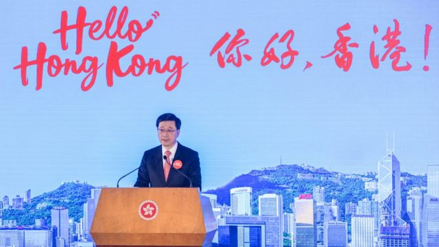
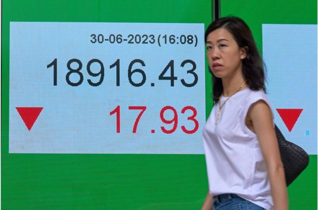
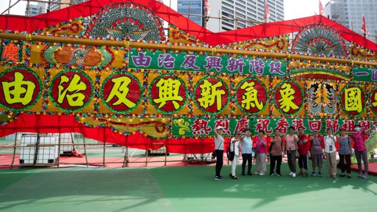

# [Chinese] 李家超上任一周年：中国香港特首的有为与无为

#  李家超上任一周年：中国香港特首的有为与无为

  * 叶靖斯 
  * BBC中文记者 香港报道 

> 图像来源，  SOPA Images/LightRocket via Getty Images
>
> 图像加注文字，一年前，李家超成为首位出身自警察部队的香港特首。
 2022年7月1日  **，香港会议展览中心内，在中共中央总书记兼中国国家主席习近平面前，李家超宣誓就任香港特区行政长官，正式成为第一位出身于警察系统的特首。在他任满一年之际，对李家超的专访、李家超的署名文章，近日陆续发表。**

这些多数来自官方媒体的报道与文章罗列了李家超一年来的“成果”，中国政府驻港最高代表、香港中联办主任郑雁雄甚至说：“昔日熟悉的、可爱的香港回来了。”

然而，民间对其政绩几何的议论似乎并不特別热烈。香港资深新闻编辑杨健兴回忆，过去每逢政权移交周年，总会有各式各样的民间团体等召开新闻发布会，评论过去一年特区政府的施政功过，提出诉求，“但你留意一下这几天的香港，没有的，没有这样的氛围”。

李家超的第一份“成绩表”到底都写着什么，似乎是一个各说各话的问题。

##  从李家超参选起，各式各样的口号

一年前，李家超带着多句口号上台，例如“以结果为目标”，“问题很多，但每天解决一个，一年就有365个”，讲KPI（关键绩效指标）。

在就任一周年前的一个周末，行政长官办公室在社交媒体 发表一连两集回顾视频  ，又来了两句口号。

李家超说：“时不我待，（香港特区政府）是要追时间、追结果、追成绩，令市民觉得我们的政策，他真的受惠了，有幸福、有希望。”

影片末端，李家超与行政长官办公室特别助理黄芷渊一同说：“所以我们必须以行动争取信任，以结果拉近距离，以成绩凝聚互信。”

李家超又在中国央企出版物《紫荆》 发表署名文章  ，称其政府过去一年“着力提高治理水平”、“不断增强发展动能”、“切实排解民生忧难”和“共同维护和谐稳定”，其中包括“简约公屋”计划，成立“引进重点企业办公室”、“人才服务窗口”，推出“高端人才通行证计划”等。

“大致上我不觉得他这一年有什么很具体的突破性改变。”旅英香港公共行政学者钟剑华博士如此评价李家超担任特首的第一年。

> 图像来源，  China News Service
>
> 图像加注文字，过去一年里，港府推出了“你好香港”等运动。

钟剑华对BBC中文说：“福利可以说是什么都没提过，劳工也可以说什么都没提过，那剩下来的就是些大型发展项目——‘明日大屿’、北部都会区那些——事实上也看不到有什么很突破的进展，就连融资方案都还在吹风中。”

北部都会区和“ 明日大屿愿景  ”这两大项目 都是上一任特首林郑月娥所留下的  。在《紫荆》的文章中，李家超称有关项目正“按序推进”；直属中国政府驻港机关的《大公报》近日刊登对财政司司长陈茂波的专访，陈茂波称两项工程的融资安排“会采用创新思维融资，减政府财政压力”。

时事评论员杨健兴觉得，要盘点李家超过去一年的实质政绩，“不是有很多东西能数得出来”。

约一年半前仍是《众新闻》主笔的杨健兴对BBC中文说：“过去这12个月，特区政府有许多动作，有许多口号，有许多新玩意，有许多架构改动，增加了许多‘工作小组’，搞许多运动——‘开心香港’那一类——但很实在的东西，例如说疫情后的经济恢复得比预期慢，股市金融也不理想。”

> 图像来源，  Getty Images
>
> 图像加注文字，在“七一”特区成立周年前一天，香港恒生指数6月30日收报18916点，比前日跌17点。

在“七一”特区成立周年前一天，香港恒生指数6月30日收报18916点，比前日跌17点，但比2023年首个交易日跌864点，累计跌幅4.37%。

从民意调查看，李家超的支持率也并非特别高：香港民意研究计划6月中公布的每月官员民望调查显示，李家超支持率为44%；星岛新闻集团6月底公布的民调显示，57.6%市民满意特区政府工作表现；《香港01》6月底公布的网上民调，以10分为满分，李家超首年施政得分5.2分。

李家超在接受隶属于官方中新社的香港中通社专访时说：“分数是别人给的。”

李家超还称，他在2022年10月发表的首份《施政报告》中提出要招揽3.5万个海外优质人才，计划启动后的五个月内便已批出4.9万人的来港许可，已超出指标。中通社称，“数据已经印证了香港的吸引力”。

李家超又对官方中国中央电视台说：“其实我们在通关以后，1000万（访港）旅客大关，在首五个月已经突破了，特别现在气氛好，消费方面都特别活跃，餐馆、旅游景点都人潮涌涌，很热闹。而且我看到市民都比以前开心多了。”

但也有亲建制言论提出了对李家超首年施政的质疑。

中国全国政协港澳台侨委员会副主任、广州暨南大学“一国两制”与基本法研究院副院长屠海鸣在《信报》专栏中评论李家超政府在引进人才和近期宣布开放部分行业引进外劳时说：“不纠结细枝末节，以香港整体利益和长远利益为重，果断决策，果敢出手。特区政府做事风格，让人耳目一新！”

但屠海鸣同时说：“本届政府改善民生突出了‘急难愁盼’，有可圈可点之举，也有不敢恭维之处，还需要再加一把力。”他并未说明有哪些地方让人“不敢恭维”。

新加坡《海峡时报》专栏作者、香港学研社召集人戴庆成的文章说：“如果香港要维持国际竞争中的优势，就必须不断奔跑，甚至要将步伐加倍，否则就会失去原先的优势。李家超在影片中形容世界变得很快，不进则退，所以‘香港不能慢、不能等’，是说到了点子上。问题是：港府有什么应对的招数呢？”

##  凡事国安先行？

钟剑华博士说：“这一年来，我觉得最突出的就是打压公民社会，事事都讲国安。”

“越搞越细致了，现在连学校招标伙食都得加入国安条款。李家超做得最多的便是在不同环节加入国安条款。”

李家超在中通社的专访中说：“我是一个心急的人，但也要谨慎……香港不只是疫情的困扰，我们的问题比任何一个政府累积更多，我们曾经历‘黑暴’（2019年“反送中”示威）、立法会拖垮政府施政，双重打击。”

他又对央视说：“我们香港现在社会，当然总体来讲是平稳的，也非常安全的，但是破坏力量在我刚才提到的背景下不会放松的，他们也会继续的。”

6月20日，李家超在出席行政会议前被媒体问及“七一”纪念日情势时又说：“任何人士如果利用这个机会骑劫，或者制造不良气氛或进行破坏性活动，我们一定会追究有关人士的法律责任，亦不会容许再有类似事情骑劫这个值得庆祝的日子。”

> 图像来源，  EPA
>
> 图像加注文字，自中国人大颁布《香港国安法》后，北京与香港官方舆论反复强调香港已进入“由治及兴”阶段。

过去数个月，李家超政府不时提出“软对抗”之说，将之形容为威胁中国国家安全行径，他更曾说“不犯法不代表不可以造成破坏”。

在此背景下，俗称“23条立法”再次提上了日程，李家超表明最迟将在2024年立法——中国全国人大常委会三年前颁布《香港国安法》，将颠覆国家政权等四项行为在港入刑，但全国人大常委会法工委主任沈春耀当时已表明，香港仍须依照香港《基本法》第23条规定，完成本地国安立法，将其他危害中国国家安全行为入刑。

北京驻港代表表达了对这些思维的认可：中国中央政府驻香港联络办公室主任郑雁雄6月30日出席亲政府民间团体的“七一”庆祝活动时说：“回想前些年，一度面临的严峻局面，对比今天宾客汇聚，活力迸发的崭新气象，大家都更加清醒地认识到，香港再也不能搞错方向，搞乱自己，再也不能被人利用、被人蒙蔽。

“大家也更加清醒地看到，‘一国’越坚固、‘两制’越精彩。”

随着“口罩令”在3月1日全面撤销，香港因2019年冠状病毒病（COVID-19；新冠病毒病）疫情而实施的限制措施告一段落。游行集会恢复，但也有原民主派团体成员试图申办“五一”劳动节游行，却在疑似被警察国安处人员带署调查后撤回申请；“六四”天安门事件周年，维多利亚公园足球场首次由亲政府社团租用举办嘉年华会，警察在维园周边带走多人。

杨健兴认为，李家超政府重视国安的程度“有点觉得已经过了火”，“政治上已经收得很紧，一个可见的将来都不会有很大幅度的放宽”。

他还指出，“七一”前夕民间团体竞相对媒体发表对政府施政不满的氛围已不复存在，“其实挺能反映社会（对政府）的期望已相当的低”。

政治氛围的另一个变化或许也能从香港民意研究所的民调上体现：民研在6月初宣布，“因应相关政府部门经过风险评估后的建议”，取消发表进行已久的年度“六四”民意调查，随后再宣布将会取消大约四之一的定期调查题目，部分余下的民调项目也会转作内部参考和付费服务等。

香港民研公告称：“有关课题初步包括回归系列、身分认同、两岸问题、 世界视野、六四事件、议员评分、部队民望和部份社会指标等。”

曾任香港民研副行政总裁的钟剑华对BBC中文说：“民研的调查被国安处劝谕不要发表，也不是第一次了。”他不愿意进一步谈论香港民研状况。

前《信报》总编辑、香港浸会大学传理学院新闻系专业应用教授陈景祥在《明报》撰文评论香港竞争优势时，也对此状况提出忧虑：“从2020年开始，我们看到的是政府公权力不断膨胀，普罗大众的民权和自由空间则不断收窄。很明显，这是开倒车、反现代文明而行的趋势，令人十分不安。”

陈景祥说：“过去一年，有说法指香港开始‘由治及兴’。无可否认，从2022年开始，香港逐步走出社会动荡、人心惶惶的困局，社会安定了，一切重新恢复正常，封闭三年的对内地和国际交通也全面重开。但这些都只是‘复常’（恢复正常），一切从头开始；距离蓬勃兴旺、人心舒畅的‘及兴’，仍然十分遥远。”

##  社会压抑未解

> 图像来源，  Reuters
>
> 图像加注文字，李家超称香港市民“比以前开心多了”，非建制评论人士并不认同。

杨健兴认为，自北京强调对香港享有“全面管治权”以来，李家超是“比任何一位特首都配合北京”的香港首长。

钟剑华也说：“他没表现，正是他作为现在这种形势下的特首应有的表现。”

对于李家超与官员们高呼警惕的“软对抗”，钟剑华认为确实存在。

“你呼吁人们捐献器官，人们去签字不再捐献；你叫人拿到‘消费券’之后留港消费，刺激香港经济，人们统统拿着这些钱去台湾旅游、去日本旅游。这样的‘软对抗’便是李家超最头疼的。”

“因为政府没有号召力，也无法重新建立人们对现在这个政府的信任。”

香港岭南大学校长郑国汉教授行将退休，他近日宴请媒体记者时称，特区政府“最有责任”带领社会“走上复和路，促进社会和谐”，但同时称“不能放下心结”的港人应移民他处。

多家香港媒体引述郑国汉说：“你在这里不开心，没可能搞‘香港独立’。所以他去一个更适合自己的地方，让社会少些张力。可以换人，觉得香港不适合就走，大量觉得适合的人进来。”

身在英国的钟剑华认为，已持续一段时间的香港“移民潮”，下一波将是较年长甚至是退休的港人带着积蓄离开。他对BBC中文称，最近已接待过好几位到英国“旅行探路”的朋友。

陈景祥在《明报》撰文说：“一场大动荡后，新一届政府首要做的应是与民休息，让社会恢复元气。回归下半场香港在政治、经济、社会和国际联系各方面都截然不同，过去的成功方程式已不管用，我们需要一份新的社会契约。”

“所谓新社会契约，要处理的是当前一系列急待解决的议题，如贫富差距、官民关系、经社停滞、身分矛盾、陆港关系等。这些问题不是单靠市场、靠个人努力就可以解决，政府要主导介入，令社会分配更公平。政府要致力打造的应是一个更稳定、更包容，可以良性互动的社会。”

有别于官方所称的朝气勃勃，杨健兴认为香港目前仍处于一种压抑状态。要是李家超政府在未来一年能做出一、两件实在的经济民生发展，也许能改善社会的感觉，“但目前不太看得到这样的氛围”。

