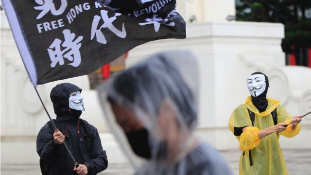
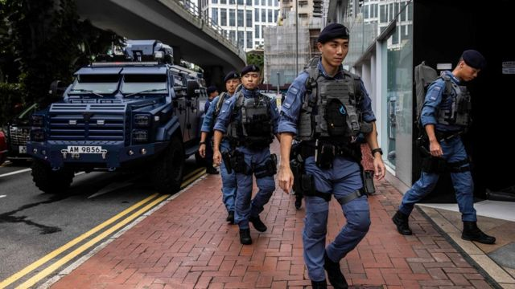
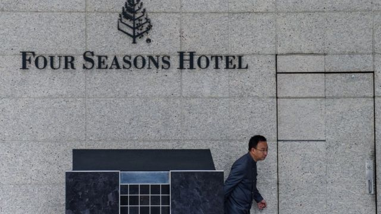
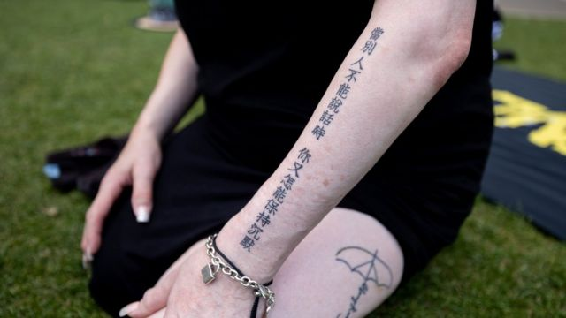

# [Chinese] 香港国安法“域外效力”引发寒蝉效应 海外港人的噤声与坚持

#  香港国安法“域外效力”引发寒蝉效应 海外港人的噤声与坚持

  * 李澄欣 
  * BBC中文记者 

9 小时前

> 图像来源，  Getty Images
>
> 图像加注文字，在国安法压力下，有海外港人参与政治活动时不敢露脸，图为台北的香港人集会。

**“离开了香港也没有100%的自由，那个威胁每一日都围绕着你，无论你在哪里都会恐惧。” 香港籍记者绮婷（化名）对BBC中文说。**

绮婷在香港国安法（下称《国安法》）实施后调派到台湾任职，经常在当地采访港人集会活动及接触政治敏感人士，她说最近大半年倍感压力。

“采访的话，现在海外比香港更危险，因为香港在政治镇压下表面上很平静，也没有什么示威集会，反而海外持续有，所有敏感的东西和人物都在海外，而你不知道他的红线在哪。”

她说撰写报道时会出现自我审查，避免写“香港独立”等字眼。“心情很矛盾，作为海外记者我应该可以如实报道，但又会担心回香港会出事。”

她出于个人原因需要经常返港，每次都提心吊胆，并做好被捕的准备，出发前预先删除手机资料和联络律师，甚至请朋友陪同搭飞机。

“万一我被带去黑房问话或拘捕，都有朋友立刻知道。因为还未入境、一下飞机就可以带走你，到时香港政府可以说没有我的入境纪录，而台湾政府又说我已经出境，那就会失联。”

##  “敲响警号”

> 图像来源，  Getty Images
>
> 图像加注文字，香港民主派前立法会议员罗冠聪2020年6月流亡，2021年获英国政治庇护，香港国安处悬红百万通缉他。

标榜“只针对一小撮人”的《国安法》实施三年至今，已有超过260人被捕，年龄介乎15至90岁，其中79人的案件已经审结，入罪率百分百，最高判囚九年。

在“域外效力”条款下，不只香港境内居民受影响，海外人士也在法网之内。

《国安法》第37条和38条规定，“香港永久性居民或者在香港成立的公司、团体等法人或者非法人组织在香港以外实施本法规定的犯罪的”，以及“不具有香港永久性居民身份的人在香港以外针对香港实施本法规定的犯罪的”，均适用于本法。

香港警务处国安处7月3日通缉罗冠聪、许智峯、郭荣铿等八名海外港人，指他们涉嫌触犯勾结外国势力 、煽动分裂国家、煽动颠覆国家政权罪，每人悬红100万港元。《南华早报》引述消息称，通缉名单上还有数以十计海外港人。

此前，一名23岁留学日本的香港女生3月返港更换身分证时被捕，她2019年后一直在日本，被指在网上发布“港独”讯息涉违国安法，这是香港首宗涉及国安法“域外效力”的案件。

绮婷形容，该案件为海外人士敲响警号。“证实了这个威胁不是我们凭空想像出来，是真实发生的。国安连一个普通留学生在网上写东西都查到，大家真的不能有侥幸之心。”

她说事件曝光后，在台港人的受访意愿明显降低，即使愿意受访也格外慎言，甚至会主动要求媒体“帮忙过滤掉太激进的言论”。

在英港人也感受到寒蝉效应，网络电台主持人曹嘉超（外号“曹总”）移居英国后在YouTube创立政论节目“香港冇格仔”（Hong Kong Uncensored），每天开直播谈香港事务，他说这个夏天举办了多场网聚，很多网友都有顾虑，连出席与政治无关的公益筹款晚宴也会戴口罩遮脸。

“大家不会特别讨论，但心里有数。其实被通缉还好，起码你知道他们想抓你，日本留学生案才更令港人担心，你不知道入境会不会出事，这种鬼鬼祟祟的手法更恐怖。”

在英国成立港人社区文化团体的Emily（化名）也对BBC中文表示，其组织连续两年举办抗议港府侵犯人权的静默集会，今年的活动人数大受影响。

“参加者还是会照来，也说很支持我们的活动，但就站得远远的，在外围、不会被人拍到的地方，也一定不会拿展示牌。我们尊重和理解，始终如果还需要回香港，会有一定的风险。”

##  现实中的操作

> 图像来源，  Getty Images
>
> 图像加注文字，图为七一“主权移交纪念日”在铜锣湾街头巡逻的香港警察

香港警务处国家安全处总警司李桂华日前在记者会上强调，警方悬红通缉海外港人不是“做政治骚”（作政治秀），而是“执法”，但他同时承认无法在海外执法，被通缉者只要不回香港，就无法拘捕他们。

八人身处的英美澳，已于2020年《国安法》生效后取消与香港的《逃犯协议》，目前仅10国保留相关协议，包括捷克、印度、印尼、韩国、马来西亚、菲律宾、葡萄牙、新加坡、南非和斯里兰卡。

但即使被通缉人士进入上述10国，也不意味当地政府会向港府交人，因为根据《联合国引渡示范条约》第3条，若犯罪行为属政治性罪行，不得准予引渡。

英国伦敦大学国王学院法学院访问研究员黎恩灏博士对BBC中文表示，国安法的域外效力是个迷思，“如果无法执法，那就只有政治效果，引起寒蝉效应”。他指出，港府藉法律和法庭做政治恫吓，只会进一步加快自由世界国家取消与香港的引渡协定。

已移居英国的香港公共行政学者钟剑华博士也指，港府扩大国安法网，但得不到国际社会的司法互助，形同“自嗨”。“为了过自己的权力之瘾、显示自己法力无边，而不看大局，结果害了香港，连其他正常的司法互助环节都受影响。”

他批评，目前香港的做法比中国大陆更野蛮，近20年没有听过海外中国人包括民运人士，在境外讲了什么而被大陆当局悬红通缉。“香港现在不只是和大陆接轨，而是青出于蓝。”

##  跨国镇压的各种手段

> 图像来源，  Getty Images
>
> 图像加注文字，2017年初中国亿万富豪肖建华在香港四季酒店被带走并送到大陆，录像显示他当时坐在轮椅上被人推走，头部用毯子蒙着。图为四季酒店的资料图片。

曾在香港公民团体任职领导层的港人阿敬（化名），在国安法实施后流亡英国并继续从事政策倡议工作。他说对于国安法的域外效力社运圈内人都不惊讶，但也会担心人身安全。

“一直都有做风险评估，但再次互相提醒，有什么国家与中国、香港有引渡条款，以及通缉令出来后每个国家怎么回应。”

八名被悬红通缉的港人身处英美澳，有关国家都已发声批评港府引用国安法的法外治权。但建制派行政会议成员、资深大律师汤家骅在电台节目称，不能排除被通缉者可能经过香港的友好国家时，被当地以行政手段移送回港的可能性。

法律学者黎恩灏指出，除了要留意正规的逃犯引渡协议，更要提防当局用非正式方式威吓海外人士。“中国跨国镇压（transnational repression）的行为已是国际议题，很多报道都揭发中共设有海外警察站，而绑架海外人士回国是一直在发生的事，铜锣湾书店、肖建华事件都是著名例子。”

人权组织“保护卫士”（Safeguard Defenders）去年发表报告指，至少有102个海外警察站正在运作，分布在全球53个国家，包括英国和荷兰。

该组织报告又指，中国逼迫外逃人士回国的手段，包括以在国内的家人为筹码、海外代理人劝说威胁及绑架。其中，绑架案主要发生在泰国等与北京关系密切的威权国家，也有些情况是，通缉目标在东道国执法部门的非法或秘密合作行动中被捕，之后移交给中国当局。

对此，中国政府一直否认，并表示所谓的海外警察站，其实是涉侨事务海外服务站。

香港浸会大学政治及国际关系学系副教授陈家洛对BBC中文说，相比“绑架”，中共更常见的策略是“人民鬥人民”，发动海外亲中社群攻击海外港人。

去年10月，中国驻曼彻斯特总领事馆人员殴打在门外示威的港人。今年6月，有港人在英国南安普敦（Southampton；修咸顿）参加反修例运动纪念集会后，遭中国留学生袭击。

在英国组织港人活动的Emily说，近月发现有不明来历、怀疑是来自中国大陆的人混进场地。“在香港电影放映会，他在场内四处走来走去，行为举止很不正常，我们问他他才走。也曾经有人偷拍参加者的大头照，我走去阻止他，他就扮成韩国人，但明明一看就是大陆人，也有义工听到他讲普通话。”

她说现在人人自危，办活动都很注意保安措施，事前必定通知本地警方。“这里的警察很重视仇恨罪案（hate crime），会主动关心我们的情况，了解有没有人来骚扰我们。”

##  “反而更加团结”

> 图像来源，  Getty Images
>
> 图像加注文字，部分海外港人表示会克服恐惧，图为2023年6月伦敦“反送中”纪念集会上一名参加者。

政治学者陈家洛指出，北京和港府藉域外效力打心理战，是当局维护国安的重要手法，用威吓手法打击反对阵营的士气。

公共行政学者钟剑华也表示，日本留学生案是让会回港的人噤声，通缉八人则是要让长居海外、不会回港的人也要收声，同时孤立相关人士，边缘化他们在海外的人权和政治游说工作。

流亡英国的政策倡议者阿敬说，通缉事件反而让海外港人更团结，甚至会加强与被通缉八人的联系。“我们做倡议的，压力一直都有，问题是如何克服恐惧。这次圈内人的态度是，不能因为他制造恐惧而退缩，要团结一致地面对，未来会更多合作和互助。”

身在英国的网络政论节目主持人曹嘉超也表示，在压力下仍会维持每天两节直播，批评香港和中国大陆事务。“我当初离开香港，就是希望在海外有空间说话，没理由我来到英国也要守香港国安法和自我审查。正正因为他想赶绝所有敢言的人、想我们走了就不再代表港人发声，我更不能让他们得逞。”

但自由的代价是永别家乡，曹坦言移民初期还抱有一丝幻想，以为将来可以英国、香港两边走，现在已“彻底死心”。“国安法的清算不会一次完成，它变成了执行制度，有恒常的官僚和预算，要不断交数（交业绩），代表国安噩梦会没完没了。”

仍要经常来往港台的记者绮婷则说，自己面对的风险越来越高，若有一天不能承受就会辞职，但在那天来临之前还是会继续“踩钢线”报道真相。“做记者就是那么讨厌，你明知道有风险，但还是觉得有个使命感，想用自己的能力记录历史，继续写。”

