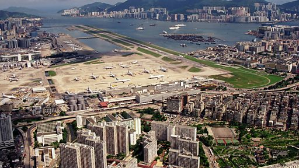

# [Chinese] 启德机场关闭25周年：最后载客航班机长回忆香港那惊险万分的空港

#  启德机场关闭25周年：最后载客航班机长回忆香港那惊险万分的空港

**启德机场关闭25周年：最后载客航班机长回忆香港那惊险万分的空港**

1998年7月6日凌晨，随着国泰航空CX251航班出发往伦敦，空载飞机全数转场后，香港启德国际机场跑道最后一次关上导航灯，这座有超过60年历史，引领香港经济腾飞的城市机场功成身退。

启德机场常用的降落航路惊险万分，多年来给乘客带来无数难忘旅程，也在不断挑战飞行员技术。现实中的启德已重新开发，但模拟飞行世界一直保留着这座机场，以示致敬。

启德机场关闭25周年之际，BBC国际台（BBC World Service）栏目《历史见证》（Witness History）采访执飞最后一趟启德始发CX251航班的机长金·沙曼（Capt Kim Sharman），回顾他的启德岁月。

