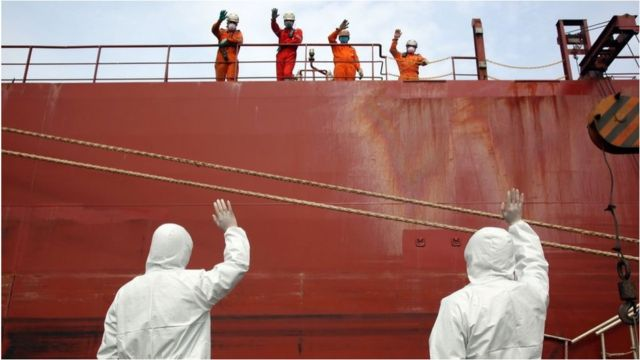
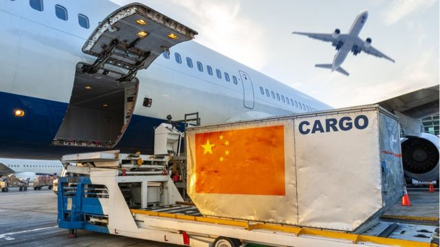
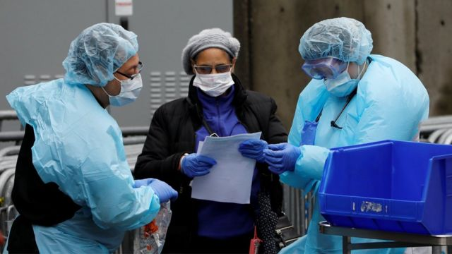
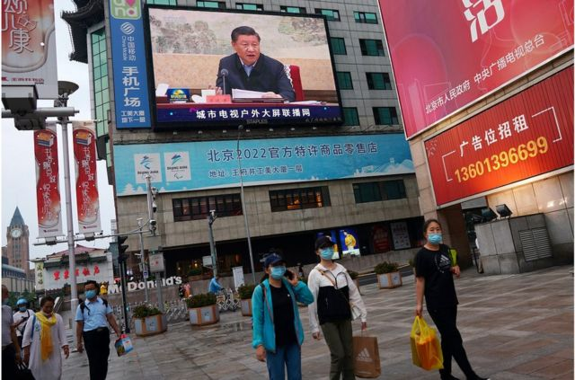
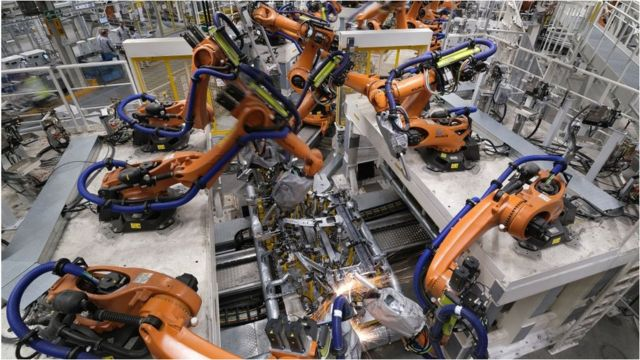

# [Chinese] 美欧对华政策：从“脱钩”到“去风险” 战略转向还是凝聚共识？

#  美欧对华政策：从“脱钩”到“去风险” 战略转向还是凝聚共识？

> 图像来源，  Getty Image
>
> 图像加注文字，疫情过后，跨国企业出于分散风险的考虑，把部分产能迁出中国。

**过去三个月，“去风险”（De-risking）无疑是社交媒体的一大热词，风头盖过之前特朗普治下美国对华政策中的“脱钩”之说。**

据信，“去风险”这一概念由欧盟委员会主席乌尔苏拉·冯德莱恩3月份第一次提出，到5月份G7峰会上写入公报，再到六、七月份的外交出访中被反复提及，“去风险”成为主导西方对华关系的最新共识。

从“脱钩”到“去风险”，这是否代表欧美对中国的战略转向？还是战略细化？更重要的是，“去风险”背后到底有哪些考量，中国又为何反对？BBC中文梳理、采访，进行深入剖析。

##  “去风险”共识

在3月底的一次演讲中，冯德莱恩为自己即将展开的中国之行定下基调。

一方面，她强调与中国“脱钩”既不可行，也不符合欧洲利益，因此欧洲当时没有响应特朗普提出的与中国“脱钩”的倡议。话锋一转，她说，这也就是为什么我们将专注于“去风险”。

换言之，“去风险”就是相对于“脱钩”一词而言的。

“脱钩”则是特朗普的演讲中的常用词。比如在2020年8月的一次采访中，特朗普表示，中美经济有可能脱钩。他表示，“我们没必要”和中国做生意。后来他又谈及脱钩说：“就是说，如果我确定他们没有以正确的方式对待我们，我肯定会那样做。”

过去三个月， 从拜登到马克龙，欧美领导人快速接受了“去风险”这个新词。

4月27日，美国国家安全顾问杰克·沙利文在一次政策讲话中用了这个词，“我们追求去风险，而不是脱钩……去风险从根本上意味着有弹性、有实效的供应链，确保我们不会被任何一个国家所胁迫。”

然后，在5月份的日本的G7峰会上，“去风险”被七国集团整体接纳，正式写入公报之中。

7月6日到9日，美国财政部长耶伦访华。行前在一次国会众议院听证会上，她还在继续阐释这个词，她表示，尽管需要提出中国那些侵犯人权的报告，但与中国脱钩将是“一个巨大的错误”，美国人购买在中国可以更廉价地生产的商品从而“大大获益”，而中国也同样从美国出口产品中获益，而这也有利于美国经济，“这就是为什么停止跟中国进行贸易将是灾难性的。去风险？很好。脱钩？绝对不行。”

> 图像来源，  Getty Images

“这个词爆火，我都可以想象，要么是大家苦思冥想，然后一个总统跟另一个总理打电话说，大家协调好，最近几个月哈，多提提这个词。要么就是，冯德莱恩一说‘去风险’，其他领导人一拍桌子说，这个词好，我们也用，”一位长期在内地和香港商学院授课的学者向BBC中文表示。他说， 这个词最主要的作用是跟特朗普的无底线外交划清界限，显得理性、负责任，又不得罪已经仇视中国的选民。

##  欧州版和美国版“去风险”

细究下，欧美对待“去风险”的出发点不一样。

德国媒体《商报》解释，俄乌战争让欧洲警醒，经济上依赖对手，将会使欧洲陷入受人胁迫的境地，所以要“去风险”。与“脱钩”不同的是，“去风险”的目的并不是要在经济上孤立中国，而是要增强欧洲自身的经济抗压能力。

美国国家安全顾问沙利文则称，去风险聚焦在高技术，特别是半导体领域，以阻止中国超越西方。美国事实上已经在做了，在芯片等领域筑起“小院高墙”。而且似乎效果显著——根据全球行业协会 SEMI 的最新数据，在美国的贸易制裁下，中国芯片设备销售额在今年第一季度同比下降23%，而全球芯片设备销售额却增长9%。

换句话说，欧洲出于自身抗风险的能力，加强自己的产业链安全，从而转移部分产业链，达到对华“去风险”的目的。美国则在战略竞争的高度，通过关键领域的严格限制，以去除中国作为主要战略竞争对手超过乃至威胁自身的风险。

> 图像来源，  Reuters

疫情爆发后，各个国家发现在药物、医疗用品上不能过于依赖单一市场，否则在极端情况下，会危及自身安全。因此提出供应链多元化和“近岸外包”（near- shoring）。长期以来，发达国家依靠离岸外包（off-shoring）降低成本，把订单转移到中国等地，而近岸外包可以以降低供应链的脆弱程度。

在疫情前后，欧美与中国的地缘政治关系也急剧恶化，在新疆、香港、台湾、俄乌等问题上分歧加剧。美国又推出友岸外包（friend- shoring），号召供应链转移到“有共同价值观的国家”。

上述学者称，“去风险”就是两个趋势合流之后的产物，它有足够的模糊性，因为欧美日在面对中国时可以定义自己的“风险”。

香港大学中国商业学院院长刘宁荣撰文称，对欧美日等国家来说，尽管“去风险”所代表的含义并不相同，但可以成为他们在后新冠时代对华政策的最大公约数。欧盟的主流看法是强调“去风险”不同于“脱钩”，不是孤立中国，而是要增强欧洲自身的经济抗压能力。对美国而言，与“脱钩”相比，这个词较为中性，比较容易让世人接受，但美国并不会因此改变在高科技领域与中国脱钩的战略，也不会放弃围堵和孤立中国的既定方针。

##  中国的“去风险”

西方舆论普遍认为，从“脱钩”转向“去风险”，这是欧美日在“松口”，试图淡化与中国紧张关系和阵营划分。

但中国在官方层面则回应没那么积极。

不久前，总理李强访问德国，他对商界喊话称，世界经济你中有我、我中有你，应该辩证看待依赖问题，不能人为夸大“依赖”，甚至把相互依存与不安全简单画等号，“不合作才是最大的风险，不发展才是最大的不安全”。

新华社的报道则更强硬地指出，提出“去风险”，目的就是要把中国与“风险”划上等号，诱拉盟友从过去因美国施压与中国“脱钩”的被迫状态，转为主动“去风险”进而“去中国化”的自发状态，为美国实现其整体对华“脱钩”遏制战略打助攻。

“虽然中国反应很大，但其实一定程度上中国该庆幸，这是对中国重要性的认可而做出的妥协。”上述学者称，而在西方民主整体下，不可能做出180度改变，尤其是中国威胁成为西方社会难得的共识之时，只能用“去风险”作为一种务实的态度，虽然还在强调中国是个“风险”，但也承认了，与中国脱钩，脱不起。在这个语境下，中国就和西方有博弈的空间。

> 图像来源，  Reuters

实际上，中国也在“去风险”。

2020年7月，中国也提出了以“国内大循环”为主体，“国内国际双循环”相互促进的“新发展格局”——这一说法刚提出时，从媒体到舆论，多以“内循环”来概括。这一政策标志着中国的战略重心将转向本地需求和技术发展。

当时就有观点提出，是在降低对外经济依赖性，以便在极端情况下，比如台海战争，面对欧美日的经济制裁，保持一个正常运转的经济。俄乌战争爆发后，这种观点更加甚嚣尘上。

##  贸易碎片化的后果

即便不像冷战时期美苏那样经济完全脱钩，“去风险”的思维指导下，同样会导致全球贸易的“碎片化”，尽管在很多学者看来，在疫情期间，这种碎片化的趋势已经形成。

新加坡副总理黄循财称，“一个碎片化的全球经济将把世界分裂为相互竞争的区域集团。贸易、投资、思想的传播将会减少——而这些都曾是帮助我们实现经济进步的关键因素”。

上述学者则表示，经济学上讲，凡歧视必有代价。把中国的某些领域当作风险，而去风险，就是一种歧视，那么不得不承担代价，比如价格更高、品质更差的商品。

“但这并不是什么新鲜事，同样的事情也在中国发生。比如电信行业，三大国企垄断，没有开放给外部市场，那么竞争就不充分。几年前有人把中国移动在香港的套餐发到网上，大家发现比他们在内地的套餐优惠得多，从而忿忿不平。其实就是因为香港的电信市场，没有设置壁垒，充分竞争下效率更高。”

> 图像来源，  Getty Image

贸易碎片化带来的后果有前车之鉴。一战后，美国议员科德尔·赫尔认为，德国和英法开战，就是因为贸易不够自由，而自由贸易能促进国际和平。

他在国会演讲中称，“对我来说，与不受阻碍的贸易相伴的是和平；而与高关税、贸易壁垒和不公平经济竞争相伴的则是战争。在我看来，我们需要鼓起勇气，在当前的严重危机中发挥领导作用，因为历史的命运指针现在指向我们。”

但当时赫尔的观点过于匪夷所思而被边缘化。

直到全世界经历了二战的苦痛之后，人们在迷茫中想起赫尔的观点，此时已是国务卿的赫尔趁势促成关税和贸易总协定（General Agreement on Tariffs and Trade，简称GATT），之后演化为WTO，他因此获得诺贝尔和平奖。70年过去，全世界经历空前的自由贸易程度，以及大致和平的国际局势。

