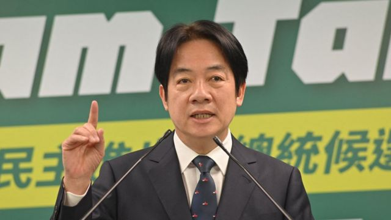
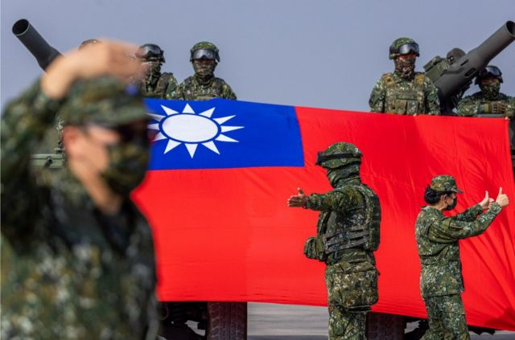
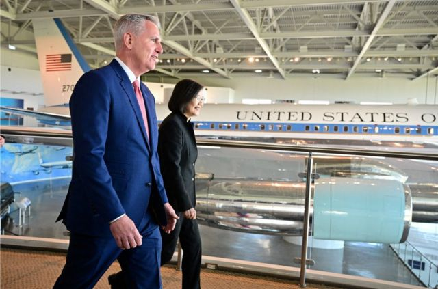
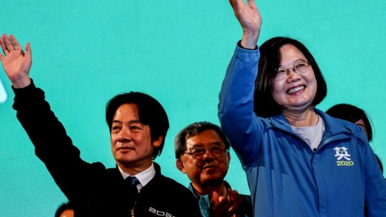

# [Chinese] 台湾2024总统大选：赖清德抛“四大支柱”向美国“交心”，两岸立场是“蔡英文2.0”版？

#  台湾2024总统大选：赖清德抛“四大支柱”向美国“交心”，两岸立场是“蔡英文2.0”版？

  * 李澄欣 
  * BBC中文记者 

> 图像来源，  Getty Images

**台湾总统大选明年初举行，民进党参选人、现任副总统赖清德7月5日在《华尔街日报》（Wall Street Journal）发表署名文章，提出台海和平的“四大支柱”（Four-pillar plan for peace），强调要加强台湾国防，两岸问题维持现状。**

这被视为他赴美“面试”前对华府的“交心”。台湾官方或赖清德的竞选总部尚未公布有关行程，但此前传出他下月参加巴拉圭总统就职典礼时或过境美国。

多名学者对BBC中文分析指，赖清德务求减弱其“台独”形象争取美国信任，预料他在国际和两岸政策上将延续蔡英文的路线。

##  “四大支柱”是什么？

> 图像来源，  Getty Images

赖清德在署名文章指，27年前的台海危机看到飞弹威胁，让他决心弃医从政，当今北京军事实力比过往强大，企图升高台海军事冲突，“没有人乐见一个具威胁性的中国，但这是我们面临的现实”。

他表示，有决心捍卫台湾的民主及两岸和平现状，若当选总统会加强四方面的工作。

第一是强化国防威慑力，将延续蔡英文总统的计划加速国防转型，加强具成本效益、机动性的非对称战力，并在部队训练、民防、资讯交换等方面寻求与盟友进一步交流。这会使北京动武成本增加，从而降低军事冲突的风险。

第二是提升经济安全，减低对中国贸易的依赖，巩固台湾的供应链安全，通过新贸易协定促成贸易多元化，并支持国内新创产业，减少不必要的监管措施。

第三是与全球民主国家建立伙伴关系，寻求与盟友间更进一步交流。

第四是有“稳定且具有原则的两岸领导力”，首要任务是维持务实及一致性的两岸政策，不排除在基于互利、尊严且没有先决条件下，与对岸展开对话。

他表明，将支持维持两岸现状，“这符合中华民国——台湾的正式名字——与国际社会的最佳利益”。

##  表态的时机

> 图像来源，  AFP via Getty Images
>
> 图像加注文字，2023年4月5日，美国众议院议长麦卡锡（左）和台湾总统蔡英文在加利福尼亚州里根总统图书馆举行两党会议后向新闻界发表讲话。

赖清德刊文时机，是在国民党参选人侯友宜7月3日首次就“九二共识”表态之后。侯友宜的说法是“接受合乎中华民国宪法的九二共识”，并指当选后可能恢复四个月兵役，有消息传出此说法引起美方不满。

美国德州山姆休士顿州立大学政治系副教授翁履中对BBC中文表示，赖清德此时公布立场，是要强调民进党对于强化国防守护台湾的立场较坚定，同时也是为了他八月可能过境美国做铺垫。

“投书《华尔街日报》，是喊话美国华府保守派，争取鹰派支持。”翁履中说。

他认为，“四大支柱”的重点是第一点，因为美国对台政策目前最重视国防，而正在讨论的年度国防授权法也必会强调台美军事合作，尤其是对台湾军事训练的协助。 “这一点，赖副总统显然掌握到华府风向，强调国防和建立台湾威慑力，已经可以让美国很多人，尤其是《华尔街日报》的读者认同了。”

这个时机也被指与美中关系有关，美国正寻求与中国稳定关系，国务卿布林肯和财长耶伦先后访问北京。

澳洲国立大学亚太学院讲师宋文笛告诉BBC中文，赖清德要让华府放心，无论政府如何变化，台湾对中国的姿态仍将是可预测和务实的，并不会阻碍美中关系的发展，也不会对美中再接触（re- engagement）表示反对或反应过度。

“表达出对美台关系有足够信心，相信改善美中关系并不会以牺牲美台关系为代价。在美国对中国‘去风险化’（de- risk）之际，台湾要在概念上把美中关系与美台关系脱钩（de-link），确保前者不会以后者为代价。 ”

> 图像来源，  Getty Images
>
> 图像加注文字，台湾军演坦克在行进中。

##  两岸立场是“蔡英文2.0”版？

> 图像来源，  Getty Images

赖清德曾表示自己是“务实的台独工作者”，认为台湾已经是主权独立国家，不用另行宣布“台湾独立”，他的两岸位置因此备受关注。

国民党参选人侯友宜就质疑，赖清德的“四大支柱”方案建构在“务实台独”的根基上，仍有濒临战争风险，恐让台湾很快倒塌。

学者宋文笛形容赖清德的方案是“蔡英文2.0”版，其两岸论述没有新意，但指他强调维持两岸现状将是首要任务，是向华盛顿和北京保证他在“台独”问题上的立场。“他明确说是为‘中华民国’的最佳利益服务，无意单方面改变台湾的政治地位。”

学者翁履中也指出，赖清德要说服美国他会维持现状、不会“台独”，以降低美方疑虑。“虽然华府长期涉台人士恐怕不会因此改变对赖的疑虑，但只要更多人相信民进党执政与‘台湾独立’无关，加上在野两党没有展现足够守护台湾的决心来劝说美国，民进党的路线对不少美国政治人物来说，还是更符合美方利益。”

他预料，赖清德将延续蔡英文“亲美抗中”的基调。 “蔡被美国认为是务实理性的代表，延续她的路线是最佳选择。当然，也因为赖副总统本身没有国际政治的背景，接续现有的安全路线，不让美国担心，必然是选战过程甚至未来如果执政后，对美政策的主轴。 ”

##  民主价值 vs 民族主义

新加坡国立大学政治学系副教授、卡耐基中国项目研究员庄嘉颖对BBC中文表示，赖清德表态的对象不只美国，还有国际社会其他民主国家。 “台湾近年与欧盟、日本、韩国、澳洲等的关系也有明显的正面发展，赖应该希望维持这样的趋势，然后建立自己的政绩。”

他指出，中国领导人习近平经常强调“中华民族伟大复兴”，而中共中央政治局委员、中央外事工作委员会办公室主任王毅日前呼吁中日韩合作时称，“无论头发染得再黄，鼻子修得再尖，也变不成西方人，要知道自己的根在什么地方”。

庄教授说：“蔡英文和赖清德都是以民主价值作为政策主轴之一，这与习近平和王毅以种族、族群出发的观点，形成了强烈对比。 ”

他指出，中共决策层除了台湾妥协以外，其他都不怎么放在眼里，尽管美国在台海问题上扮演重要角色，但最关键还是北京的态度。

“中国要怎么看待美国及可能当选的赖清德，并不是台北可以影响的事情。毕竟台海关系还是要看北京如何决定，假如现况不变的话，然后赖又持续蔡的政策，那么至少造成不稳定的因素，不会来自台湾。 ”

