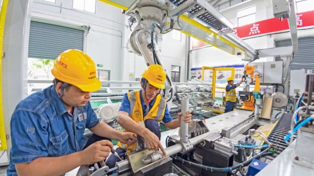

# [Chinese] 中国经济：二季度GDP增幅6.3%被指复苏乏力，青年失业率再创新高

#  中国经济：二季度GDP增幅6.3%被指复苏乏力，青年失业率再创新高

> 图像来源，  EPA-EFE/REX/Shutterstock

**7月17日，中国统计局公布二季度及上半年的经济数据——二季度GDP同比增速达到6.3%，是过去两年来增幅最高的季度。**

但是该数据高企被认为主要因为受到低基数效应影响——去年二季度中国经济受到疫情及上海等地封城影响，GDP仅增长0.4%，由于今年二季度是以去年同期GDP为基数计算，因此使当期数据看起来偏高。

如果跟今年一季度比较，二季度仅增长了0.8%，不过整个上半年GDP同比增速达到5.5%，超过3月份“两会”时定下的全年5%左右的增长目标。

值得一提的是，同时公布的青年失业率达到21.3%，创下2018年有该统计项以来的最高纪录。

##  增长6.3%为何还低于预期？

如前所述，虽然今年二季度同比增长达到6.3%，是过去8个季度以来的最高值，但因为去年二季度较低的增长率，扭曲了该读数。

6.3%低于市场的预期。来自美国、中国、英国的三家媒体机构——彭博社、财新传媒、路透社——分别对机构或经济学家进行调查并取均值，三者对二季度的增长率预测分别为7.1％、7%、7.3％。实际数据显著低于这三个预测值。

如果按照环比算，二季度仅增长0.8%，而第一季度环比增长为2.2%，体现出经济复苏放缓的趋势。

“数据表明，中国在疫情放开后的繁荣显然已经结束。”澳大利亚联邦银行外汇策略师卡罗尔·孔（Carol Kong）表示，数据描绘出一幅暗淡且步履蹒跚的复苏景象，尤其是青年失业率正创下历史新高。

经济学人智库（EIU）中国区首席分析师苏月向BBC中文表示，数据反映出疫情对中国经济的影响仍在持续，而恢复到疫情前的增长轨迹需要比预期更长的时间。

穆迪分析公司（Moody's Analytics）的哈利·墨菲·克鲁斯（Harry Murphy Cruise）表示，中国经济复苏的情况低于预期，在经历了2023年开局几个月的一剂猛药之后，疫情的宿醉效应正困扰着中国的复苏。

> 图像来源，  Getty Images

对此，克鲁斯列出了四个涵盖中国国内和国际环境的因素：

  * 首先，消费者对经济复苏仍持怀疑态度，对就业和收入增长的预期已转为负面，加剧了人们的担忧，一方面使得储蓄率居高不下，另一方面抑制了消费。 
  * 其次，经济步履蹒跚，企业对扩大生产或投资犹豫不决而采取观望态度；直到更广泛的需求回升，他们才会寻求扩大业务。这体现在民营企业固定资产投资在今年上半年出现下滑。 
  * 第三，中国房地产市场的问题几乎没有好转的迹象——上半年住宅投资同比下降7.9%。而需求疲弱继续压抑房地产价格。 
  * 最后，全球经济疲软压抑了国际市场对中国产品的需求，5月份中国出口同比下降7.5%，6月份下降12.4%。全球消费广泛转向服务业，这给中国的出口导向型企业，尤其是电子产品制造商带来了额外的痛苦。 

##  青年失业率为何再创新高？

颇受瞩目的一个数据是青年人失业率。6月16—24岁劳动力调查失业率录得21.3%，高于5月0.5个百分点，连续三个月创2018年有统计以来的新高。

不仅如此，毕业季之后今年将有创纪录的1158万大学毕业生进入就业市场。当局也承认，未来几个月青年失业率可能会继续上升，8月份左右将达到峰值。

恒生银行（Hang Seng Bank China）的首席经济学家王丹估计，失业的年轻人只占中国城市地区潜在劳动力的1.4%。

然而，她告诉BBC，青年失业问题“需要更直接的政策回应，因为这部分人群在网上的声量很大”。

她补充说，“他们对当前形势表达不满可能会使更多人对经济丧失信心。”

中国在2018年开始发布青年失业率，但并未发布农村地区的失业率情况。

今年3月份，中国两会上，前总理李克强在自己最后一次政府工作报告中提出今年5%左右的增速目标，以及1200万人的新增就业目标。

李克强在他十年的总理生涯中，多次谈过就业和增速的关系。在2013年11月的一次讲话中，李克强表示，关注GDP，其实关注的是就业。过去GDP每增长1个百分点会拉动100万人就业，这几年产业结构调整，尤其是服务业发展后，目前GDP增长1个百分点，能够拉动130万、甚至150万人就业。反复测算后认为要保证新增就业1000万人，需要7.2%的经济增长。

他当时说，“之所以要稳增长，说到底就是为了保就业”。这句话在随后十年在政府和经济界被引用。

十年过去了，中国当前保就业的压力更大，按照今年的经济增长和新增就业目标，GDP每增长1个百分点，需要拉动240万新增就业。

##  中国政府会推出刺激政策吗？

要回答这个问题，所有的目光都集中在本月晚些时候召开的政治局会议上，届时中共最高领导人将制订今年下半年的政策路线。

> 图像来源，  Ed Lawrence/BBC

新加坡的加拿大皇家银行资本市场公司（RBC Capital Markets）亚洲外汇策略主管Alvin Tan表示，6.3%令人失望，显然增长势头正在放缓。这种放缓幅度下，实际上存在着增长目标可能无法实现的风险，“因此我认为，这的确提高了尽快提供更多政策支持的紧迫性”。

苏月也持相似观点。她认为，这些数据支持了那些加大经济刺激力度的呼声，尤其是在财政方面。

“我们预计即将于7月底召开的政治局会议上，将出现更多有利于经济增长的措辞，届时政府将回顾上半年的经济表现，并为今年下半年的政策定调。”苏月认为，推出任何积极的财政刺激计划仍值得怀疑，政府仍将实施支持性的、谨慎的财政政策。因为，中国刚经历过充满挑战的去杠杆化进程，政府更希望确保公共开支的效率，而不是简单地夸大增长数字。

穆迪分析的克鲁斯则预计未来几个月货币政策将有所放松，并对包括房地产和建筑业在内的关键行业提供有针对性的财政支持。“但这些额外的支持并不是灵丹妙药。越来越多的人认为，2023年将是中国难以忘怀的一年。”

