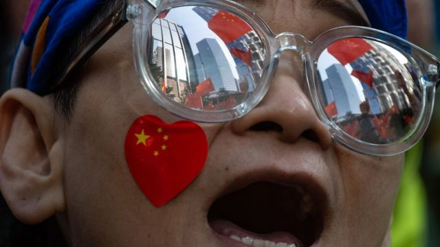
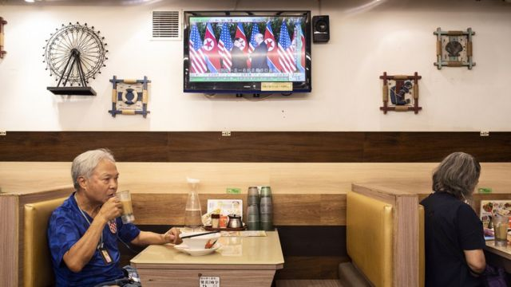
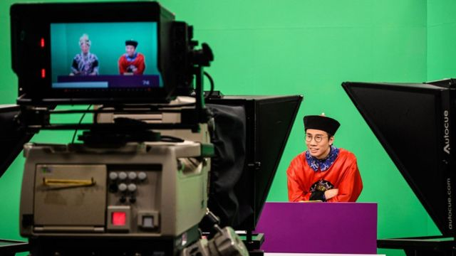
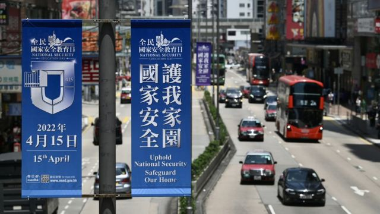
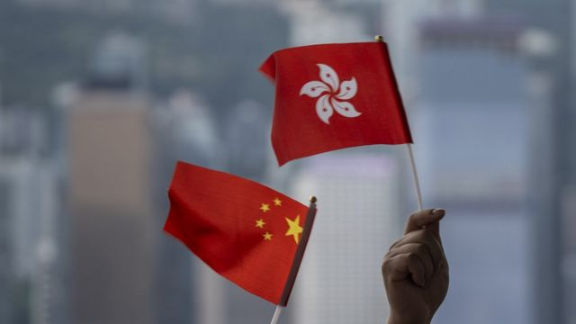
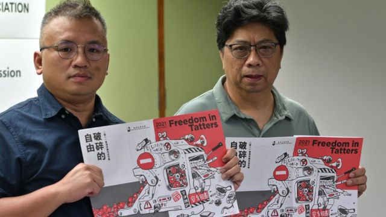

# [Chinese] 香港国安法：广播电视国安节目或取消“持平”要求引发的争议

#  香港国安法：广播电视国安节目或取消“持平”要求引发的争议

  * 李澄欣 
  * BBC中文记者 

> 图像来源，  Getty Images
>
> 图像加注文字，港府自今年起要求本地免费电视台及电台，每周播放最少30分钟有关国民教育、国民身份认同和正确认识《港区国安法》的节目。

**香港通讯事务管理局（下称通讯局）近日提出修例建议，核心内容是，广播机构制作涉及国安法及国民教育节目时，不须遵守“持平要求”，因为“持平”可能违反《港区国安法》。**

相关建议引起广泛社会争议，不少人疑惑为何“国安就不用持平”。新闻界担心此举开启坏先例，进一步收窄言论空间。

有学者批评当局做法违反媒体专业，也反映香港越来越靠拢中国大陆“媒体是党国喉舌”的广播理念。

##  修例的缘由

通讯局公布的有关建议，源于《港区国安法》实施后的一项新规。

今年2月，该局要求本地免费电视台和电台，除此前规定每周播放时事节目的时数外，须额外每周播放最少30分钟有关国民教育、国民身份认同和正确认识《港区国安法》的节目，此规定列入各机构12年牌照的中期审核内容。

受影响媒体包括三家“免费电视持牌机构”无线电视（TVB）、香港电视娱乐（ViuTV）、奇妙电视（HOY TV），以及两家“声音广播持牌机构”香港商业电台和新城电台。

时隔5个月，香港通讯局发布最新咨询文件指，持牌机构可能忧虑这类节目或被指无包含对立观点而衍生投诉，或只为恪守节目须“持平”的规定，而加入反对《港区国安法》言论，可能令持牌机构承受触犯相关法例的风险。

因此，当局认为应在《电视节目守则》和《电台节目守则》中明确，“持平”的规定并不适用于这类节目，豁免“持平”要求可以便利持牌机构的营运。

香港通讯局目前正就有关建议展开公众咨询，至8月16日结束，为期一个月。

##  规则中的特例？

> 图像来源，  Getty Images
>
> 图像加注文字，现行的广电节目监管准则强调“恰当地持平”，是指节目在报道不同的言论时，必须以公正不偏的态度处理；应尽量反映所有主要而又关乎宏旨的观点，以便求取平衡；不应隐瞒事实而有所偏倚，或轻重倒置而误导观众。

香港通讯局的文件一出，旋即引起大量讨论。在香港的社交平台及讨论区上，有网民质疑“不用持平，即是承认洗脑？”、“官方认证偏颇”、“一面倒，只可以唱好”、“政府要的不是传媒是要宣传机器”。

香港中文大学新闻与传播学院教授李立峯对BBC中文表示，“持平”一词在语言上是正面的，也是社会对媒体的基本期望，“国安节目不用持平”从字面上产生很多疑惑。

“为什么国家安全就不用持平？如果不持平，那些节目是在做什么？站在政府的立场也不合理，如果你要推广国安法和国民身份认同，但又讲明是不持平，要怎样说服公众那是一件好事呢？”

他续指，通讯局的文件显示当局混淆了基本概念，把“持平”（impartial）机械化地理解为“平衡”（balanced）。

“持平不是纯粹平衡，持平固然有立场不偏不倚的意味，但也要看事件本身，视乎各方意见的成熟程度和根据，去作出恰当、专业的处理，不一定是五十比五十。”

事实上，《电视节目守则》和《电台节目守则》已就“恰当地持平”(due impartiality）有明确定义，是指节目在报道不同的言论时，必须以公正不偏的态度处理；应尽量反映所有主要而又关乎宏旨的观点，以便求取平衡；不应隐瞒事实而有所偏倚，或轻重倒置而误导观众。

现行守则指出，“恰当地持平”并非要每一方意见占用相等时间，或每一方的意见长短相等，亦非要求节目对每个富争议问题保持绝对中立。作决定时，持牌人应以专业判断为考虑标准。节目主持人应尽量鼓励各方表达意见。

过去，通讯局曾多次以“持平规定”作为裁定投诉是否成立的标准，包括指2020年至2021年间香港电台时事节目《左右红蓝绿》、《头条新闻》在评论警方时言论有欠持平，没有让警方及时回应。2013年裁定无线电视节目《东张西望》制作的《电视牌照风云》“未能恰当地持平，报道各方意见时没有尽量求取平衡”，因而罚款5万港元。

李立峯教授说：“现在通讯局不是否定持平作为基本原则，也不是说所有节目都不用持平，它只是豁免了两三样（如国安节目）。这说明它在一定程度上仍保持着持平原则，认为有其重要性。既然是这样，为什么那两三样不用持平？坦白讲，这讲不通。”

> 图像来源，  AFP
>
> 图像加注文字，香港唯一公营广播机构香港电台的节目《头条新闻》在国安法颁布前夕被停播。

##  “国安”是否凌驾“持平”？

中国全国政协委员、香港《巴士的报》社长卢永雄日前撰文指，持平准则只适用于新闻报道，教育等节目并不适用，而在西方社会，“国家安全观”也有凌驾性，例如美国和其他国家发生战争，美媒在关键时刻会完全站在国家立场上报道，以免挫伤士气。

卢永雄又认为不应“泛化持平原则”，因为这在客观上助长“逢政府做事必反”的声音，成为鼓吹“港独”的温床，“持平是有界线的，在国民教育和国安教育上，不应纠缠于所谓‘持平’的争拗”。

不过，翻查现行的《电视节目守则》和《电台节目守则》，“恰当地持平”原则不仅适用于新闻节目，也适用于“有关香港公共政策或备受香港公众关注而又具争议的真实题材节目”。

> 图像来源，  Getty Images
>
> 图像加注文字，国安节目豁免持平原则，被舆论质疑是双重标准。

李立峯表示，国民教育及国安节目属于“社会事务”，须符合持平原则。他续指，“国家安全很重要”是一个抽象概念，也许跟“人命很宝贵”一样被认为不需讨论，但实际上如何理解和分析国家安全，则没有必然对错。

“什么叫国家安全？什么情况下可以凌驾一切？国家安全受到多严重的威胁，政府才有权限制言论自由甚至人身自由？——争议点不是在于国家安全作为一个抽象概念本身，而是在于要懂得轻重之别（sense of proportion），是细节和执行的问题，以及随着时间转变是否需要修正。这些具体问题是应该有讨论空间的，而涉及到讨论就必须持平。”

##  公众利益VS政权喉舌

> 图像来源，  Getty Images

李立峯进一步指出，当局“不用持平”的建议，不符合香港的广播传统，反而靠近中国大陆的制度。

他说，香港自上世纪六十年代末跟随英国和欧洲式的公共广播传统，传媒被视为是“公共服务广播”（public service broadcasting），除了公营的香港电台，私营商业机构的发牌条件也加入公共服务要求，例如必须播放香港电台节目、植入式广告等商业元素受规限等。

“这套制度在历史上源自西方，但重点不是东方西方，而是建基于的传统理念是一个自由社会，而自由社会有专业、独立的媒体，不受政治及经济力量操控，根据的是一套专业原则，去服务公众利益和提供公共服务，这是自由社会最基本的想法。”

中国大陆的社会主义制度下，大量媒体为国营机构，有“党和政府喉舌”的功能，负责宣传工作。

《习近平新时代中国特色社会主义思想学习问答》就写道，“党性原则”是党的新闻舆论工作的根本原则，新闻事业作为党的事业的组成部分，必须无条件接受党的领导，要自觉抵制西方新闻观等错误观点的影响，包括标榜媒体是“社会公器”、“第四权力”。

该文指，新闻舆论工作是“意识形态阵地的最前沿”，舆论导向正确能凝聚人心，舆论导向错误就会动摇人心、瓦解斗志，危害党和人民事业，“新闻舆论工作的领导权、管理权、话语权，任何时候都不能旁落，否则就要犯无可挽回的历史性错误”。

对此，李立峯说：“两地对于舆论的看法不同，香港是持平报道，然后让舆论自然发酵和形成。大陆是强调要正确地引导舆论，所以在他们的语境下，（持平）的确讲得少。两种看法和社会的运作方式完全不同，这也是为什么一开始要有‘一国两制’。”

##  新闻界的忧虑

> 图像来源，  Getty Images
>
> 图像加注文字，香港记协现任主席陈朗昇（左）和前主席杨健兴（右）

资深新闻工作者、前香港记协主席杨健兴对BBC中文表示，自2020年《港区国安法》实施后，反对声音基本上已在广播媒体绝迹，还在运作的电子传媒都立场“亲政府”，制作的节目“本身已经很不持平，没有多元声音”。

“如果现在连这些亲建制的机构都担心持平会违法，令通讯局索性要明文写出来‘豁免持平’，这正正反映出国安法的红线有多难掌握。”

他批评，有关建议恐开启坏先例，担心言论空间进一步收窄。 “所谓国民教育和国家安全节目，并没有清楚的定义，文化艺术也有可能触及到国民身份认同和国民教育，如果这个范围越来越阔，言论空间就越来越窄。”

前香港《信报》总编辑、香港浸会大学传理学院新闻系专业应用教授陈景祥也表示，后续要留意的是这种“国安就不用持平”的规定，会否延伸到新闻及公共事务节目。

李立峯则指出，当局发放一个讯息，就是关乎国家安全就不用持平，但在法规上“不用持平”不等于“不准持平”。

“无论是新闻还是时事节目，最终还是看传媒机构是否愿意持平。这已经不是规矩条文的问题，而是香港新闻界在这个政治气氛下自我审查很严重，即使有值得讨论、有空间讨论的议题，也为了避免麻烦而不愿进入讨论。”

