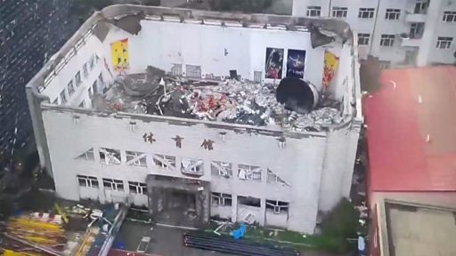

# [Chinese] 中国齐齐哈尔一中学体育馆坍塌 11名死者包括女排队员

#  中国齐齐哈尔一中学体育馆坍塌 11名死者包括女排队员

**中国齐齐哈尔一中学体育馆坍塌 11名死者包括女排队员**

中国东北部齐齐哈尔市一座中学的体育馆的屋顶周日（7月23日）发生坍塌，目前已导致11人死亡。

据官方媒体报道，这座体育馆位于齐齐哈尔市第三十四中学内。官方尚未公布死者的具体身份，但有媒体报道称，遇难者均为该校女子排球队的学生，事发时该排球队正在体育馆内训练。

现场画面显示，这座体育馆整个屋顶倒塌，仅剩四周的墙体，馆内一片废墟。

据报道，事故发生时，体育馆内有19人，四人自行逃脱。

事发后，有近160名消防人员和39辆消防车赶往搜救。

对倒塌事件的初步调查发现，体育馆旁边一栋在建教学楼的施工商把珍珠岩（一种用于建筑的保温隔音材料）放在该馆屋顶上。

新华社的报道补充说，大雨导致珍珠岩膨胀增重，致使屋顶不堪重负倒塌。

广为流传的一段视频显示，有遇难者家长质疑，当局在事发后并未及时向家长告知孩子的情况，而是派出大量警察和官员到现场维稳。

据官方报道，现场搜救工作在周一（7月24日）上午结束，相关责任人已被警方拘留。

