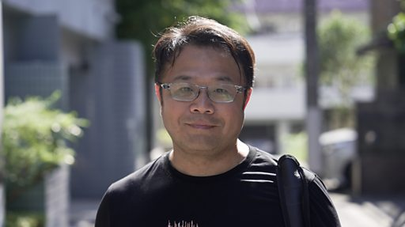

# [Chinese] 李孟居案：台商香港示威期间深圳被捕判刑，获释离境后回忆四年意外经历

#  李孟居案：台商香港示威期间深圳被捕判刑，获释离境后回忆四年意外经历

**李孟居案：台商香港示威期间深圳被捕判刑，获释离境后回忆四年意外经历**

台湾商人李孟居于2019年8月从香港入境深圳后失去联络，时值香港反修例抗议示威活动高峰，他的失踪引起台湾社会担忧。

中国国台办当年9月确认李孟居因涉嫌“从事危害国家安全”活动被扣留并依法审查；隔年，中国官媒央视的一段节目指他被控“涉嫌为境外刺探、非法提供国家秘密罪”遭深圳市国家安全局逮捕，判刑一年十个月与两年“剥夺政治权利”附加刑。

李孟居在出狱前一个月被告知，附加刑期代表他在此后两年内不得离开中国大陆。

BBC 中文记录了李孟居被困中国的经历以及服刑期满后离开中国的时刻。他在专访中详述被捕过程、监禁情况以及被禁止出境两年的意外人生。

制作、剪辑：张友慈

