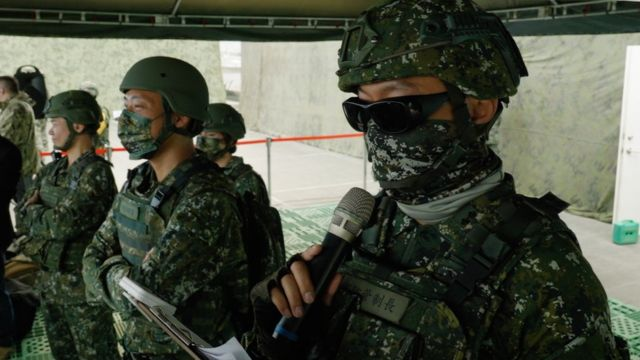
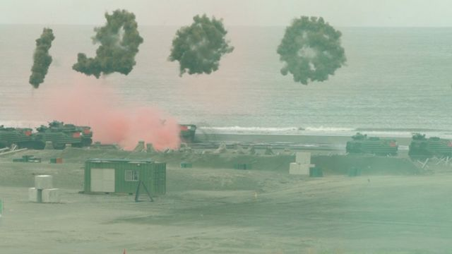
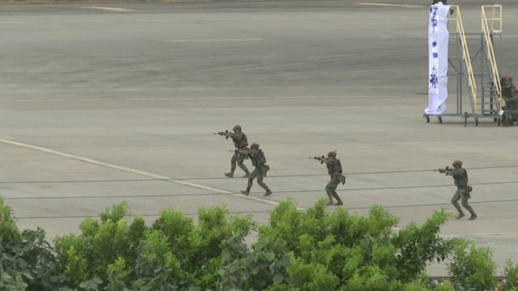

# [Chinese] 台湾汉光演习：台北演示如何抵御解放军入侵

#  台湾汉光演习：台北演示如何抵御解放军入侵

  * 傅东飞（Rupert Wingfield-Hayes） 
  * 发自台北 

**第一波入侵，是一群攻击直升机低空穿越台湾北部海岸。紧随其后的是一大群载着军队的深绿色突击直升机。接着，从低矮的沙丘后面，一批又一批的两栖突击车辆以惊人的速度沿着宽阔的海滩前进，车队的履带搅动着沙土。很快，车队中冒出大批士兵。**

短短几分钟内，防卫的台湾方似乎陷入了被动局面。

但随后一声警报响起，全副武装的台湾士兵沿着战壕奔跑出来，沉重的机枪声响起。战车和装甲车从附近的树林里驶出，随后炮声隆隆作响。

阿帕奇攻击直升机隆隆飞过山丘，对准人侵敌军扫射。海滩上爆发出巨大的爆炸声。入侵者被困，然后被逼退，台湾安全了。

这一切只用了约20分钟的时间。

台方指挥官对着一群站在屋顶上目睹这一切的记者们说：“今天我们展示了我们将尽最大努力保卫和守护我们的国家。我们有信心通过这些演习，准备好应对任何情况。”

真的吗？

> 图像加注文字，帕塔拉诺教授强调，乌克兰还起到另一重要作用，打破了台湾认为对中国永远不会攻台的自满信念。

对一个在场目击，且心存挑剔的人可能会说这场战斗并不是非常逼真，入侵一方规模微小，防守者早已严阵以待。这一切完全是预先设计好的，胜利来得太快、也太容易了。

但是这挑剔种可能有点不公平。

我还记得25年前作为年轻记者参观当年的汉光军事演习。当时，演习真的是为了摄影机而上演的。

“我会说这是一个转折点，” 伦敦大学国王学院战争研究所亚历西欧·帕塔拉诺（Alessio Patalano）教授告诉我说。“国际上有一种看法，认为台湾对自己的军事有些自满。但本周你真的能感觉到他们开始严肃地面对重大的变革。”

显然台湾从乌克兰汲取了教训。

在乌克兰战争的第一天，俄罗斯军队占领了基辅边缘的一个机场，并以此为基地侵入该国首都，结果失败了。

所以现在台湾专注于自己最脆弱的点 — 如果中国成功入侵该岛，那些中国将需要控制的地方，包括台湾北部的海滩，还有主要的国际机场和主要港口。

帕塔拉诺教授强调，乌克兰起还到了另一关键作用，打破了台湾人认为对中国永远不会打过来的自满信念。

“乌克兰战争打破了战争已经过去的基本假设：即战争不再会再发生。一旦这种神话被打破，其他一切就开始被重新评估，”他告诉记者。

对于关注台海局势人来说，中国国家主席习近平已经多年来明确表示，武力攻打台湾绝对是一个选项。

而且中国正在建设足以实现这一目标的空军和海军力量。

习近平有明确的时间表。到2027年，中国应该具备在该区域军事冲突中打胜仗的能力；到2035年，中国应该成为世界一流的军事强国。到2049年，“祖国复兴”应该完成。

对于台湾来说，时钟在滴答作响。

在民用机场进行军事演习，以测试防卫战术，抵御中国的入侵。

“所以我们知道中国有这个最后期限，”帕塔拉诺教授解释。

> 图像加注文字，蔡英文政府计划将兵役期增加到1年，而不是目前的4个月。台北正在重整其军事战略。

“然而，使用武力不是（北京）的第一选项。它只是在其他一切失败后的选项。目标不是使用武力本身，而是使台湾屈服，让台湾明白所谓回归祖国是不可避免的。”

这就是所谓的压迫性外交，其目的是使台湾人和政府相信抵抗北京是徒劳的。

压迫已经开始。今年上半年，解放军军机进入台湾领空的次数比去年同期增加了60%以上。北京现在不断地挑战极限，创造一种“新常态”。

台湾还有很多事要做。

蔡英文政府计划将兵役期增加到1年，而不是目前的4个月。台北正在重整其军事战略，使台湾更能抵抗网路攻击和实际的军事攻击。

> 图像加注文字，台湾正在效仿乌克兰，购买大量较小但更灵活的导弹系统，可用于对付坦克、船只和飞机

台湾正在效仿乌克兰，购买大量较小但更灵活的导弹系统，可用于对付坦克、船只和飞机，并且即将推出首艘“国造潜舰”。但是台湾的士兵仍然训练不足，其武器系统和军事战术被认为陈旧且过时。

但有一点格外引人瞩目：尽管北京在经济和军事实力上远远超过台北，但前者给台湾人的心理压力似乎还不是太成功。有超过7成的台湾人现在表示他们将为保卫家园而战。到目前为止，台湾人不认为抵抗将会是徒劳无功。

