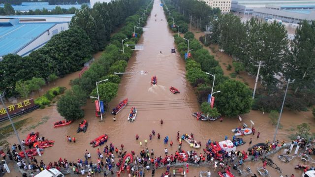
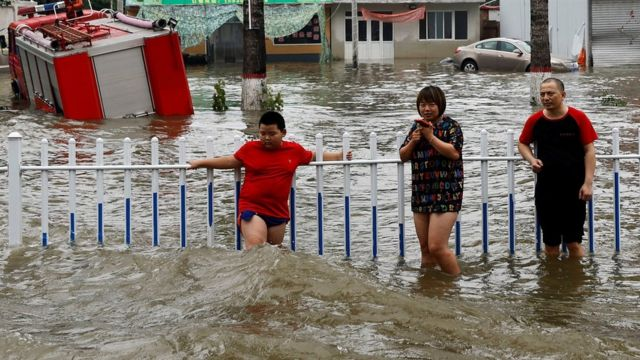

# [Chinese] 台风卡努：东亚地区遭遇近期第三个台风，吹袭冲绳后迫近台湾

#  台风卡努：东亚地区遭遇近期第三个台风，吹袭冲绳后迫近台湾

> 图像来源，  Getty Images
>
> 图像加注文字，"杜苏芮"导致的洪水，让北京近郊的河北涿州道路变成了河流，水面已经逼近了交通指示牌。

**台风“卡努”（Khanun）横扫日本南部，在冲绳县造成至少两死、近60人受伤，逾16万户、即四分之一家庭停电。**

“卡努”逼近台湾，多个县市停工停课，包括北部的台北、新北、基隆，以及东部的宜兰、台东县兰屿乡以及绿岛乡，几十架次航班取消。

这个数周内吹袭东亚的第三个台风，恐加剧北京一个多世纪以来最严重的降雨。迄今，这场暴雨在中国造成至少34人死亡。

专家指在全球暖化下，这类极端天气将越趋频繁。

日本气象厅预测，“卡努”8月4日往东北方向移动，下周可能登陆日本九州、四国与本州等地区。

台湾中央气象局表示，“卡努”因导引气流不明显，龟速慢行甚至有滞留现象，预估离台湾较近的时间点将是3日深夜到4日凌晨，靠近的过程中风雨都会逐渐增加。

中国中央气象台则在8月3日发布台风蓝色预警，预计“卡努”3日夜间至4日上午在浙江南部近海海面回旋少动，之后向东偏北方向移动，趋向日本以南洋面，强度逐渐减弱，但对中国沿海地方仍有影响。

“卡努”是继“泰利”（Talim）及“杜苏芮”（Doksuri）之后的又一个台风。此前，超强台风“杜苏芮”（Doksuri）侵袭菲律宾和台湾，造成30多人死亡。

> 图像来源，  Reuters
>
> 图像加注文字，中国北方多个城市受到了台风杜苏芮的影响。

“卡努”周三首先吹袭日本冲绳县，中心风力每小时180公里，阵风高达每小时252公里。当局疏散70万人并关闭那霸机场，近900班航班取消。

现时正值冲绳暑假旅游旺季，往年的这个时候，如此强烈的风暴在日本并不多见。

但科学家早就警告，全球暖化将增加风暴和热浪的强度及频率，而这两种天气在上个月都袭击了亚洲部分地区。

新加坡管理大学城市气候学教授周祥龙（Winston Chow）将极端天气比作轮盘赌博游戏，人们在红黑色方格上下注。他说由于气候变化，极端天气事件——即球落在红色方格上——发生的几率增加了。

他说：“我们排放的废气越多，黑色方格变成红色的就越多，所以我们每年都会更频繁地把球打在红色方格上。”

自上周末以来，在三场暴风雨的共同影响下，中国京津冀的部分地区沦为泽国。

据中国官媒报道，北京遭遇140年来最大降雨，打破了1891年创下的记录。北京、河北等地疏散近百万人，暴雨至今造成上述两地至少20人丧生。

位于北京西南方的河北涿州市为重灾区，该地汇聚多条河道，许多民房的低楼层遭淹没，多人受困。截至8月1日上午，该市受灾人数已达到全部人口的五分之一。

在菲律宾，首都马尼拉的大片郊区仍被洪水淹没，约30万人流离失所，水坝因河流暴涨而有可能决堤。

上周，“杜苏芮”导致马尼拉东南部海面一艘渡轮倾覆，船上26名乘客丧生。台风还摧毁了当地基础设施，引发火灾和洪水，学校和企业要关闭。

在台风吹袭前夕，东亚大部分地区受热浪侵袭。

7月中旬，日本全国有9000多人因中暑入院，中国新疆一个气象站甚至录得摄氏52度高温，创下该国高温纪录。

《地球科学前沿》杂志（Frontiers in Earth Science） 2021年曾发表一项研究，调查了1979年至2016年间台风的影响，预计到21世纪末，台风对陆地的破坏力恐增强一倍。

