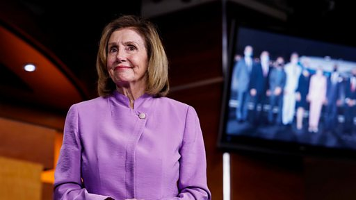

# [Chinese] 佩洛西访台一周年专访：北京恫吓台湾之行是“懦弱表现”

#  佩洛西访台一周年专访：北京恫吓台湾之行是“懦弱表现”

**佩洛西访台一周年专访：北京恫吓台湾之行是“懦弱表现”**

5 小时前

2022年的8月2日，时任美国众议院议长佩洛西（Nancy Pelosi）不顾北京警告高调访问台湾，并与台湾总统蔡英文见面。在她访问台北的消息宣佈后，即引发全球舆论激烈辩论，有分析称她的到访可能激化紧绷的台海关係，甚至引发战争。佩洛西旋风式地在台北访问20小时之后，中国解放军进行规模破纪录、为期数日的“围台”军演，作为报復。

佩洛西在访台湾一週年之际接受BBC中文专访，她表示其访问是表达美国愿意与民主台湾站在一起。她也表示，自己当时面对北京的威胁并没有感到害怕。针对当时一些认爲她的访台之行严重恶化美中关係的批评，她捍卫自己的政治选择，称自己从未在意那些声音，访问台北前也与美国行政及情报部门有良好沟通。

佩洛西回忆了自己1991年的北京之行，当时她来到天安门广场，其后目睹了中国30年间的变化，她认为习近平向独裁和专制更加靠拢、使政治与人权情况变得更糟糕：“我热爱中国人民，不爱中国政府”。

