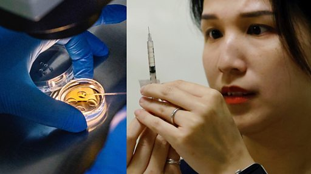

# [Chinese] 台湾单身女生冻卵的故事：“为自己的未来买个保险”

#  台湾单身女生冻卵的故事：“为自己的未来买个保险”

**台湾单身女生冻卵的故事：“为自己的未来买个保险”**

“为自己的未来买个保险，怕年纪越来越大，可能不好生或者生不出来。”在为期两周的冻卵疗程中，33岁的台湾人薇薇安每天都需要给自己注射荷尔蒙药物。

“台湾许多女性都很独立，以事业为重，并不只是为了生孩子而找一个丈夫。”

与禁止冻卵的中国大陆不同，台湾的单身女性可以冷冻卵子。但只有在异性婚姻中使用卵子才是合法的，意味着这项政策不适用于未婚女性和同性夫妇。

整个周期中取卵、药物和门诊费用合计约为8至12万新台币（3770美元；2.72万元人民币）。

由于未婚女性不可以使用冻卵，这一限制导致只有约 8% 的妇女在冻卵后使用卵子，而在美国，这一比例约为 38%。

在台湾，只有约 4% 的儿童是非婚生子女，而在美国，非婚生子女的比例约为 40%。

台湾卫生福利部表示，人工生殖技术涉及复杂的伦理、医学和法律问题，扩大人工生殖受众范围之前需要进行全面评估。

