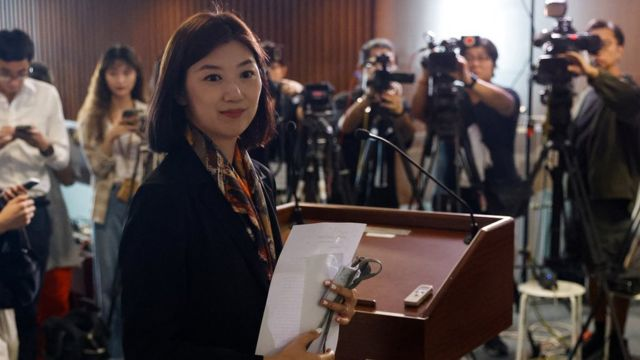
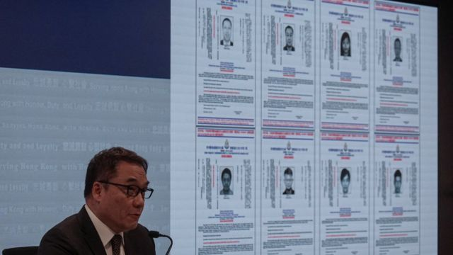
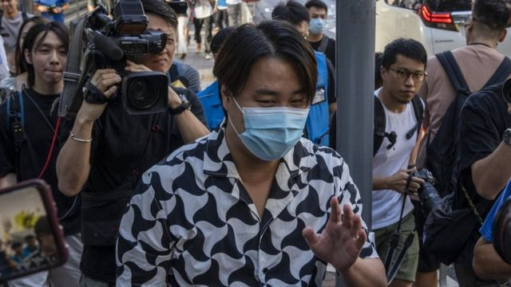
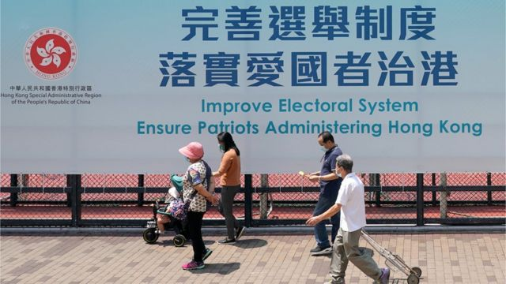

# [Chinese] 容海恩现象：国安法下香港议员的“大义灭亲”与家庭关系变迁

#  容海恩现象：国安法下香港议员的“大义灭亲”与家庭关系变迁

  * 李澄欣 
  * BBC中文记者 

> 图像来源，  Reuters
>
> 图像加注文字，容海恩指若知悉家翁袁弓夷的行踪“必定毫无疑惑”向警方举报

**最近一个多月，香港社会很关心一位女性公众人物的家庭婚姻状况，甚至不时传出她离婚的假消息。**

她并不是娱乐圈明星，而是“爱国者治港”下的两届立法会议员、现年42岁的建制派新民党副主席容海恩。

7月24日清晨，她和丈夫、政治学者袁弥昌仍在睡梦中，十多名警员突击登门搜查，检取寓所内的电脑和手机，并带两人到警署问话，历时三小时。

这是因为她身在海外的家翁（公公）、现年74岁的“香港议会”发起人袁弓夷，7月初被香港警方国安处悬红100万港元通缉。

袁弓夷被指计划发起公投推翻中央及港府，勾结海外反华政客组织，在不同场合要求外国制裁中国和香港等，涉嫌干犯国安法的“颠覆国家政权”和“勾结外国或者境外势力”罪行。

对此，立场亲北京的容海恩早于去年8月就曾登报宣告“脱离爷媳（翁媳）关系”，她指“作为流着伟大祖国之血的中国人，在国之大义的前提下”，因袁弓夷涉违《港区国安法》而作出该决定。

袁弓夷被悬红通缉后，容海恩随即在电台节目公开呼吁家翁“回港自首”，并说已提醒正在海外的丈夫袁弥昌在法律或钱银方面要小心。而她被带到警署问话后召开记者会，表示自己是清白，全力配合警方调查，若知悉家翁行踪“必定毫无疑惑举报”。

她多次强调，与家翁“道不同不相为谋”，撇清关系是为了“保护家人”。

“这种做法让人相当疑惑，很戏剧化，以前也没听过香港人会这样子的。” 研究中國問題的新加坡国立大学政治学副教授庄嘉颖对BBC中文说。“这正正反映了国安法过度模糊、范围过广，触法的原因不清楚，导致牵扯在内的人会用各种手法，来表达自己跟案件没有太大的关系。”

而容海恩作为建制派政治人物，也多了一层复杂性。“她可能是出于恐惧，也可能是出于计算，想用这么绝的行为去表示对北京的忠诚度，作为一种政治筹码。”

##  袁弓夷：生气就中计

> 图像来源，  Reuters
>
> 图像加注文字，香港警方国安处7月3日高调宣布悬红通缉8名海外港人，包括任建峰、袁弓夷、郭凤仪、郭荣铿、许智峰、蒙兆达、刘祖廸、罗冠聪。

容海恩的言论每次都引起香港舆论哗然，甚至让 网络音乐人“晴天林”的相关恶搞歌曲《大义地灭亲》  在YouTube冲破百万点击。歌词讽刺“这个政治朋友为大局至上，牺牲屋企（家庭）妄想可得到赞赏，个个断绝来往变作了污点，大义大国当前以后别来电”，又质疑她“若是断六亲又为何不离婚”。

日前网上流传图片称容海恩“不排除离婚”并会争取两名女儿抚养权，她公开澄清是假消息，已报警处理，并强调夫妻关系没受影响。

BBC中文记者多次以电话及短讯方式联系容海恩，查询其家庭婚姻状况及这些事件对她政治前途的影响，她表示没有补充。她的丈夫袁弥昌亦婉拒受访。

身在英国的袁弓夷则对本台表示谅解儿媳的行为，认为被迫表态是强权下的常态。“我同情所有被压制的中国人，她要生存、要吃饭、要保护家人就只能表态。如果我因此而生气，就中了中共的奸计，因为他们就是擅长让人互相监管和告发，用人民鬥人民。”

袁弓夷近期曾与袁弥昌在海外见面，袁父强调与子女联系是亲情关系的平常事，不应被污名化，“中共搞到好像跟家人见面都有罪，其实就算我在坐牢，见家人也是正当合法的，更何况我是清白的。违反一国两制、《中英联合声明》的是中共，有罪的是他不是我。”

被问到是否担心身在香港的子女时，他说子女已是成年人，相信他们懂得保护自己。“我劝每一个子女离开香港，直至中国共产党消失，但他们也有他们的信仰自由、政治自由、行动自由，我一直为香港争取自由，当然也要尊重他们的自由。婚姻是他（袁弥昌）选的，留在香港也是他选的。”

他又指，容海恩去年宣布脱离关系后，他和两名孙女也没有太多联络，只是传照片了解近况。被问到身为祖父是否感到可惜时，他称这是“为了香港民主”的必要牺牲。“家庭重要还是整个香港重要？民主自由是要付出代价的，如果连个人安全和利益都不敢冒险，那我们活该被中共压制。”

##  国安六度针对家属行动

> 图像来源，  Getty Images
>
> 图像加注文字，袁家至今共有6人被带走问话，图为7月24日袁弥昌离开湾仔警察总部，他没有接受在场传媒访问。

除了容海恩和袁弥昌夫妇，袁弓夷的长女袁弥望也在美国返港后被带走调查。此外，袁弓夷的第二任前妻Stephanie Downs丶四子袁弥满及五女袁弥淑在相隔数天的另一次行动中受查。

港警也针对另外7名被悬红通缉的流亡港人，带走其在港家属调查，包括“香港民主委员会”执行总监郭凤仪的双亲、前立法会议员郭荣铿的父母兄嫂4人、前职工盟总干事蒙兆达的兄嫂侄子3人、前立法会议员罗冠聪的父母兄长3人。

换言之，当局在过去一个多月内6次针对被通缉8人的家属展开行动，带走至少18人，但暂时未有家属被捕。

香港特首李家超被问到警方行动是否制造“白色恐怖”，他回应指危害国家安全是严重罪行，除个人之外，也涉及协助教唆及金钱资助行动，当局调查时会抽丝剥茧搜集证据，他又重申国安法“只是针对一小撮人、保护绝大部分市民”。

行政会议成员、资深大律师汤家骅则在电台节目表示，香港没有“牵连罪”，意图只要不涉及支持”港独”就不构成违法。

但学者认为，港府的做法已造成寒蝉效应。政治学副教授庄嘉颖说：“在正常法治国家，是否有亲情关系、友情关系是不相干的，重点是你有没有犯罪。现在扯到家人，就有点文革的味道，好像回到法治不那么完善的时候。”

时事评论员刘锐绍也对BBC中文指出，当局制造一种气氛，好像谁跟被通缉者接触都有问题，藉此让民众顺应寒蝉效应，不与相关人士联系。

但他强调，寒蝉效应放在每个人身上都有不同反应，并非必然会牺牲人际关系，不能一概而论。“就算在文革时期刘少奇被批斗，他太太王光美也没有跟他离婚，矢志不渝。”

##  “袁氏这一家”的政治光谱

> 图像来源，  Getty Images
>
> 图像加注文字，律师出身的容海恩（右）在2016年踏足政坛，加入叶刘淑仪牵头成立的新民党并赢得立法会议席，其父亲容仁彪曾经是央企华润集团旗下公司高层。

回到容海恩，她2018年嫁入家庭成员都是政界中人的袁家，但彼此政见南辕北辙。

尽管如此，他们三年前还愿意上同一个节目受访。

香港电台《铿锵集》2020年10月曾制作 “袁氏这一家”  特辑，介绍袁家的四种政治路线：父亲袁弓夷踊跃呼吁美国消灭中共，女儿袁弥明为人民力量前主席，属“激进民主派”，儿子袁弥昌自诩中间派，儿媳容海恩则是亲北京的“深蓝”建制派。

节目中，容海恩与袁弥明隔空对骂，又说曾叫丈夫袁弥昌劝导父亲袁弓夷不要“反共”，“我先生是他儿子，会不会令人担心呢？”袁弓夷当时越洋受访表示尊重容的政治立场，又预言：“她迟早同我撇清关系，正常的，我一点都不会怪她。”

夹在父亲与妻子中间的袁弥昌也早于2020年6月受访时指，他的家庭是香港政治光谱的缩影，国安法实施后他父亲的行动可能触犯法例，令家庭不再容易团圆，形容是悲剧。

袁弥昌过去几年以中间派学者的姿态，先后加入三个政治组织，包括汤家骅有份成立的民主思路、前财政司长曾俊华的特首竞选团队，以及在叶刘淑仪创立的新民党任职政策总裁。

他与建制派关系密切，但在反修例示威前夕强烈表态反对政府修订《逃犯条例》，甚至在社交媒体上载游行照片指“香港再觉醒”。他其后与叶刘淑仪政见不合，认为对方不再有开明建制、专业理性的形象，越走越“深蓝”，“支持她，等同支持中央对香港更多操控”，因而脱离新民党。

袁弥昌的政治立场经常被指是“骑墙派”，但他多次表示相信对话，希望香港社会不同光谱的人和而不同。他今年7月中旬就在《明报》撰文，评论内地知名博客靖海侯论国安法被“泛化利用”的文章，指“国安法治港”在中美关系缓和后不可持续，质疑目前的“治港方程式出问题”。

文章出炉几天之后，他就被警察带走问话。

庄嘉颖认为，袁家曾经象征着香港社会的多元性，不同立场的人都有他们的声音和位置，国安法下却越来越单一。

“当政府可以使用法律的范围非常广也非常模糊，往往会把社会推向更不能容忍异议的地步，更鼓励社会排除异己。这是威权体制的特色，在中国文革时期、台湾及南韩的戒严时期也是类似。”

##  如何影响人伦关系？

> 图像来源，  Getty Images

尽管容海恩单方面与袁弓夷切割，但他和袁弥昌仍维持夫妻关系，她7月也承认离婚不能解决所有问题，“是他儿子的太太，这个是不争事实，他亦是我家里小朋友的爷爷”。

当“通缉犯儿媳”与“爱国者治港”的身份重叠，容海恩的政治前途会否受阻，甚至拖累她所属的新民党？行政会议召集人、新民党主席叶刘淑仪向BBC中文表示，容海恩早已划清界限，被带走问话也只是“协助调查”，认为事件对其仕途及家庭均完全无影响。

叶刘淑仪还强调，容海恩是新民党很重要的成员，“容议员现在落区一样很受市民欢迎”。

现居英国的香港公共政策学者锺剑华则对BBC中文分析指，容海恩并非港澳办、中联办重点栽培的对象，2020年9月立法会选举北京甚至安排李梓敬取代她，其后港府以疫情为由推迟选举一年，北京主导“爱国者治港”的选举制度改革，让立法会变成90席，容海恩才能连任。

“所以她更想划清界线表现忠诚，现时建制派人物争逐北京分派的政治资源，这是其中一个重要的自保之道，如果因为这一点（家庭关系）令她失去议席，她未必很甘心。”

锺剑华续指，人伦关系中互相举报的“文革遗风”不限于政界，包括在教育界鼓励学生举报老师，警务处处长萧泽颐甚至说家长若发现子女有异常应报警。“只要大家认定了北京权势所指的政治正确的话，亲情也没得讲，这些风气是政府刻意制造和鼓励的。”

政治学者庄嘉颖也说，国安法制造了“对党国的忠诚度凌驾一切”的氛围，在威权体制下，人们为了表忠，家庭或其他人际关系都可能成为牺牲品。

“政权想要破坏人与人之间的关系和信任，消弱社会的组织能力，从而强化自己的政治地位，使得社会和政治制度更依赖自上而下的权力。短期来説，政权的确可以稳固权力，但长期来説，当社会失去了信任，就没有弹性去应对突发状况，这时就会凸显政权的脆弱，很快崩坏。”

“容海恩事件是最前端的案例，这只是香港变化的开端，我们还不晓得程度会到哪。”

