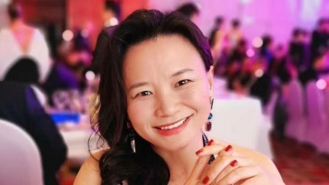

# [Chinese] 成蕾案：在华被关押三年后首次公开发声称“怀念阳光”

#  成蕾案：在华被关押三年后首次公开发声称“怀念阳光”

  * 麦笛文（Stephen McDonell） 
  * BBC驻中国记者 

9 小时前

> 图像来源，  Nick Coyle
>
> 图像加注文字，成蕾自2020年起一直被扣押。

**一名将在本周末被中国关押满三年的澳大利亚记者首次公开发言。**

成蕾在一封致澳大利亚人民的公开信中说：“我怀念阳光。在牢房里，阳光透过窗户照进来，但我一年只有10个小时能站在它底下。”信函经由获准每月探视她的外交官笔录。

“我实在难以相信，当我还在澳大利亚居住的时候，总在躲避阳光。”

她说：“我已有三年没见过一棵树。”

这位财经记者被抓捕前给官方英语电视台中国环球电视网（CGTN）工作，最初六个月在未被起诉下，接受了单独囚禁。
 去年3月  ，成蕾接受秘密审理，等候判决至今已有一年又四个月。

澳大利亚驻华大使傅关汉（Graham Fletcher）尝试进入法院旁听审理过程，无功而还。

就连其家属也不清楚她被起诉什么罪，只知道涉及提供“国家秘密”。

中国对何谓国家秘密定义含糊，可以牵涉任何让政府觉得敏感的信息。

今天发布的信函中充满了她对在澳大利亚生活的憧憬。当她只有10岁时，她举家从湖南省移民到澳大利亚这个国家。

她说：“1987年，我记得第一次跟家人露营，爸爸开着一辆700元（澳元；459美元；3300元人民币）的车。”

“我总在重温每一次丛林远足、河川、湖泊，到海滩游泳、野餐和欣赏醉人日落，满天星星，还有丛林宁静而神秘的交响乐。”

这位前电视主播说，她在狱中总会“悄悄地念诵我（在澳大利亚）到过、开车路过的地名”。

在这封被形容为“给2500万人的情书”的信函中，成蕾称她忆起陌生人与朋友给予的友爱，而这些记忆“再次回到我身上，让我（在狱中）重拾信心”。

她说自己想念海盐、黑色幽默、昆士兰（Queensland）的热带地区，和西澳洲无穷无尽的蓝天，还有脚趾间的细沙。

有人推测，推迟对成蕾判刑，是中国政府要以此作为跟澳大利亚谈判的筹码。

澳大利亚总理阿尔巴尼斯（Anthony Albanese，又译艾巴尼斯）此前受邀访华会晤习近平，然而，他并未宣示要等到成蕾与 另一澳大利亚公民杨恒均  获释之后再访华，因此在国内承受着相当压力。

信函最后似乎包含着最重要的信息：“最重要的是，我想念孩子们。”

