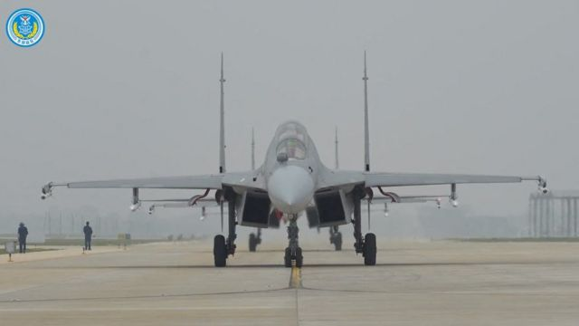

# [Chinese] 台海军演：台湾称42架次中国战机进入防空识别区，26架次飞越中线

#  台海军演：台湾称42架次中国战机进入防空识别区，26架次飞越中线

> 图像来源，  Reuters

**周六（8月19日），中国解放军的一场军事演习中有超过40架次战机进入台湾防空识别区，台湾方面形容为“不理性的挑衅行为”。**

台湾国防部表示，其中约有26架次中国大陆飞机越过了台湾海峡中线，并称北京方面正在试图影响台湾即将举行的选举。

中国官方媒体报道称，该演习旨在“检验战区部队联合作战实战能力”。

新华社引述中国人民解放军东部战区新闻发言人施毅陆军大校指，解放军东部战区在台岛周边组织“海空联合战备警巡”。

他表示，此次演练是“对‘台独’分裂势力与外部势力勾连挑衅的严重警告”。

此次军事演习前，北京方面对于台湾副总统赖清德出访期间过境美国表示不满。中国在去年美国时任众议院议长佩洛西访问台湾之后，以及在蔡英文总统与美国众议院少数派领袖凯文·麦卡锡在加州会面之后，均曾进行大规模军事演习。

赖清德是明年1月台湾总统选举的热门人选，他在出访巴拉圭期间完成了两次过境美国的行程。

中国大陆方面形容赖清德是“损害台湾民众利益的‘麻烦制造者’”，称将采取“坚决措施”维护“国家主权和领土完整”。

中国政府将台湾视为其主权下的一个省级行政区，终将回归成为中国的一部分。不过，台湾自视为一个独立政体，有自己的宪法和通过民选产生的领导人。

台湾国防部对中国大陆军事演习的“不理性的挑衅行为”表达“强烈谴责”，并称将以“适切兵力”应对，“以实际行动守护自由民主”。

台湾表示将派遣“适当力量”以实际行动予以回应，并补充称国家军队正在使用侦察手段“严格控制”局势。

“此次借故发动军事演习，不仅无助台海和平稳定，更凸显其穷兵黩武心态，坐实军事扩张霸道本质，”台湾国防部在回应中这样表示。

台湾外交部则称，中国大陆的军演是旨在左右台湾大选。

台湾外交部长吴钊燮在社交媒体X（此前為推特）上表示：“中华人民共和国已经明确想要影响台湾即将举行的全国大选。”

“但选举应取决于我们的人民，而非恶霸邻居，”他接着写道，“看吧，中国应该举行自己的选举，我相信他们人民会很兴奋。”

在台北，民众表示对中国的举动并不过于担心。

“我认为（这次演习）更多是一场表演，（中国）不太可能真的发动进攻。虽然可能性是有，但应该会很难发生，”黄崇恩（音）向BBC表示。

周玉瑄（音）则表示她“不怕”，因为她不认为战争会发生。

“（中国）已经这么说了好长时间。我的感觉是，如果真的开战，会有很多问题。而且还有美国在，”她说。

