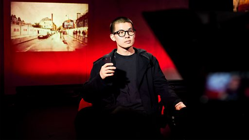

# [Chinese] 伦敦涂鸦风波主创BBC专访：否认中国政府授意 借作品“测试西方民主自由”

#  伦敦涂鸦风波主创BBC专访：否认中国政府授意 借作品“测试西方民主自由”

**伦敦涂鸦风波主创BBC专访：否认中国政府授意 借作品“测试西方民主自由”**

2023年8月5日深夜，一群来自中国的留学生在伦敦东部的红砖巷，先是用白漆复盖了一整面涂鸦牆上的作品，再以红色喷漆写上“社会主义核心价值观”的24个中文大字。该标语在中国大陆随处可见，被认为是中国共产党的意识形态宣传。标语涂鸦在中国及海外的互联网上引发巨大的舆论争议，众人纷纷猜测其行为背后的立场及用意。

自称是涂鸦行动策划和主创的“一鹊”，本名王汉铮。他在事件发酵后接受了BBC中文的独家视像专访。访谈中他讲述了这次涂鸦创作的初衷和对其作品质疑的回应，并称其作品是用“社会主义的构建方式”和涂鸦精神来“反殖民和测试西方的民主自由”。

拍摄：黄奕聪

策划、剪辑：李洛

