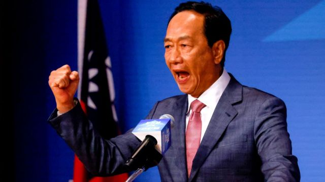
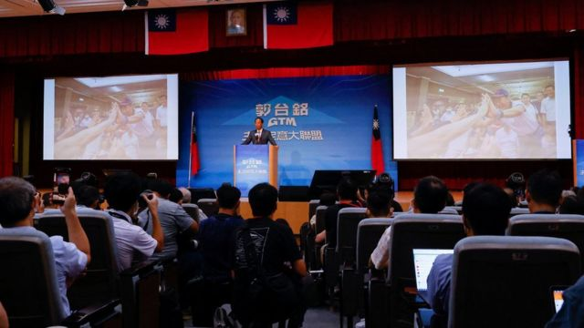
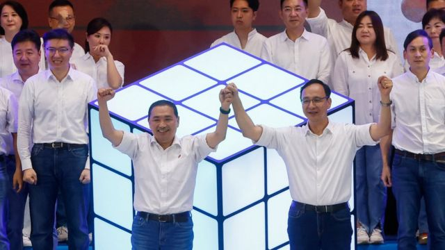
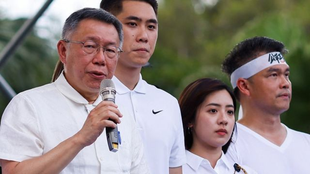
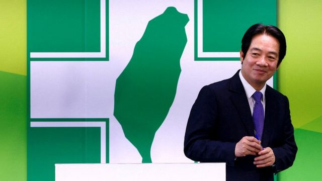
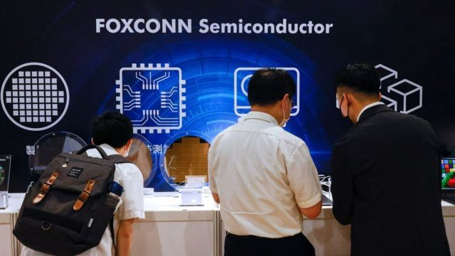

# [Chinese] 郭台铭宣布独立参选台湾2024总统大选，是“整合蓝白”还是“便宜赖清德”？

#  郭台铭宣布独立参选台湾2024总统大选，是“整合蓝白”还是“便宜赖清德”？

  * 李澄欣 
  * BBC中文记者 

> 图像来源，  Reuters
>
> 图像加注文字，郭台铭宣称总统人选“舍我其谁”。

**距离台湾总统选举不到半年之际，72岁的知名电子产品代工商鸿海—富士康创办人郭台铭宣布独立参选。**

郭台铭星期一（8月28日）在台北公布其参选意愿后，大选正式进入“四脚督”局面，即在野蓝白陣營的中国国民党参选人侯友宜、民众党参选人柯文哲、无党籍的郭台铭三人，挑战绿营的执政民进党参选人、现任副总统赖清德一人。

曾公开承诺支援侯友宜的郭台铭在记者会上强调，自己参选是为了扮演主导角色推动蓝白在野阵营整合，称“在野不整合，便宜賴清德”。

但此举已造成泛蓝阵营进一步分裂，国民党批评郭台铭没有诚信，警告党内人士若替郭助选将有涉党纪会严肃处理。

多名政治学者向BBC中文分析，若郭台铭执意参选到底，只会让民进党参选人赖清德“躺赢”，對北京而言也並不乐见。

##  郭台铭自述的参选缘起

> 图像来源，  Reuters
>
> 图像加注文字，学者认为，郭台铭选择在限期前最后一刻宣布参选，可见他此前一直在等待蓝白整合。

郭台铭在台北市总统府正对面、过去是国民党党部的张荣发基金会，以“主流民意大联盟”名义举行记者会，他表示“企业家治国的时代来临了”，自己是几位总统候选人当中，唯一具备经营管理能力、拥有近50年实务经验的企业家，“放眼台湾政坛，舍我其谁？”。

他提到，民进党执政七年多来，政治、经济、国防、外交都走到悬崖边上，去年九合一大选民意很清晰表达不满，这次总统选举必须“下架民进党”并推动政党轮替，但遗憾过去三个多月来，在野力量仍各有计算，整合工作完全没进展，恐怕将“便宜赖清德”，因此决定扮演“主导改变”的角色，让陷入僵局的在野力量启动整合，“民意永遠大於黨意，公益永遠大於私利”。

他自称，“本来没必要选，但是郭台铭所代表的中间声音却不能缺席”，他期许能成为团结的最大公约数，也将继续邀请在野阵营另外两名参选人侯友宜和柯文哲一起坐下来，“你喝咖啡，我喝奶茶，一起好好商谈国家大事”。

郭台铭还说：“恳请台湾人民给我四年的时间。我保证，我会为台海带来未来50年的和平，奠定两岸最深厚的互信根基。”

“我也绝对不会让台湾成为下一个乌克兰。”

被问到会否参选到底时，郭台铭仅回应指，现在最重要是在野到底要不要赢、如何赢，如果要赢就一定要整合。有媒体追问，若在野整合是否愿意当副手，郭只说目前当务之急是蓝白两党的总统参选人跟他坐下来，说出各自的治国理念和胜选方程式。

郭台铭必须在11月2日收集约29万名选民的连署签名，才合资格成为独立候选人。根据台湾中央选举委员会公布日程，9月13日至9月17日受理申请为总统、副总统选举“被连署人”，9月19日至11月2日受理连署书件。

台湾东海大学政治学系教授张峻豪对BBC中文指出，现在距离9月17日只余下两个多星期，郭台铭选择在限期前最后一刻宣布参选，可见他此前一直在等待蓝白整合。

“等不到，只好再最后一刻出来施压，要看未来两个礼拜柯文哲或国民党有什么动作。”

美国圣汤玛斯大学国际研究讲座教授叶耀元也对BBC中文分析，郭台铭现在参选，就是希望柯文哲或是侯友宜愿意让出总统的位子给他选，用自己的声势来要求这两党跟他合作，让他可以代表这两个政党其中之一来选总统。

叶耀元说：“就是一种20%+20%就有机会跟赖清德（支持度40%）拼的概念。”

##  泛蓝分裂恐加剧

> 图像来源，  Reuters
>
> 图像加注文字，郭台铭曾承诺会尽最大努力支援侯友宜（前左）胜选。

尽管郭台铭标榜团结在野阵营，但他宣布参选后，随即扩大了泛蓝阵营的分裂。

国民党发声明表达高度遗憾，指郭台铭是关公的信徒，“关公具忠义精神，忠於国家、义薄云天、重诚信重然诺……只有遵守自己提过的承诺才是真正一言九鼎，相信作为关公信徒的郭台铭不会不了解”，又表示相信郭“最后仍然会归队与下架民进党的主流民意团结在一起，支援国民党及侯友宜一起下架民进党，而非亲痛仇快的保送民进党、保送赖清德”。

国民党另外强调，党内人士若为郭台铭公开站台、动员扫街及其他公开助选之行为，都违反“党员行为规范”，将由权责单位严肃处理。

台湾大学政治学系教授左正东对BBC中文说，外界早已料到郭台铭会参选，但他正式宣布后，泛蓝选民的网上群组还是立刻“哀鸿遍野”，纷纷表示非常失望和愤概，甚至说大选不会投票。他指，若泛蓝选民投票意愿持续低迷，民进党参选人赖清德会以不错的票数“躺赢”当选，蓝营期待的政党轮替将不会实现。

左正东教授说：“对蓝营来讲，选民不愿投票是变相保送赖清德，这是最悲观的情况。”

“而最乐观的情况则是选民投票意愿低落，反而刺激侯友宜、柯文哲合作，郭台铭面对被边缘化的危机，为了自保而在最后归队——这个可能性不高，但不是不可能发生，还是要看当事者的智慧与大环境的条件。”

郭台铭 2019年  在国民党总统初选 败给韩国瑜后退党  ，今年4月再参加国民党2024年总统大选初选，但未获提名。国民党党最终征召新北市市长侯友宜参选。

郭台铭5月17日公开宣告将尽最大努力支援侯友宜胜选，但他8月初自美国返台后陆续在各地举办造势活动，被指准备独立参选，让他的诚信备受质疑。

国民党参选人侯友宜被传媒追问是否认为郭不守承诺、两人是否谈过，侯友宜回应指，“郭董事长”和他约定过不对外说。

被问及是否觉得郭台铭以战逼和，侯友宜说自己是国民党征召的总统参选人，经过全国代表大会都通过，其参选态度从未改变，会扛起责任勇往直前。

##  侯、柯会否与郭整合？

> 图像来源，  Reuters
>
> 图像加注文字，民调显示柯文哲总体排名第二。

根据近期民调，赖清德支持率稳定向上并持续领先，柯文哲总体排名第二，侯友宜排名第三，郭台铭支持率最低。

东海大学张峻豪教授向BBC中文分析说，赖清德支持率最近突破40%，“剩下的六成三个人分，三个和尚一定不够水喝，再怎么选都不会选上”，而郭台铭选上的机会更是微乎其微，即使选上，他背后也没有任何政党或国会资源，“那怎么政党轮替？”

张教授研判，国民党与郭台铭整合的机会很小，因为党主席朱立伦的心不在总统大选，而是在同期举行的国会选举，“就算泛蓝选民投给郭台铭，但立委回过头还是会投给国民党，这符合朱立伦原本的盘算，他整合的动机不大”。

相较之下，张峻豪认为柯文哲的态度或更友好，“郭柯配”可能性更大，“民调显示四脚笃情况下，柯会因郭流失7%至8%支持度，如果现在郭宣布参选后再做民调，可能柯会流失10%，所以相对来讲柯更有动机与郭整合。”

澳洲国立大学亚太学院讲师宋文笛也分析指，由于柯文哲与郭台铭不少支持者重叠，假如侯友宜的选战策略处理得好，长远而言侯或许能够坐收渔人之利。“如果郭台铭参选最终是伤了柯文哲，那侯就会成为唯一有望的在野阵营候选人。”

民众党发言人表示，民主社会尊重郭台铭参选的权利，但注意到记者会中许多媒体抛出不同的疑问，这些疑问也都是目前民众所关心的，所以接下来郭台铭势必要持续说服选民。

民众党又强调，党主席柯文哲依旧是目前民调最高最具实力的在野参选人，也一直都有非常稳定的支援力量，“所以我们还是持续努力，尽力地整合”。

> 图像来源，  Reuters
>
> 图像加注文字，民进党参选人赖清德约有40%支持率。

美国圣汤玛斯大学叶耀元教授告诉BBC中文，他认为侯、柯退让的可能性不高，首先国民党党中央不会让郭台铭一个外人，破坏党内权力结构分配和运作方式。

至于与郭台铭关系不错的柯文哲，也碍于背负政党利益而难以妥协：“民众党是一人政党，因为有柯文哲才有民众党，如果郭要取代柯，民众党就失去了精神领袖，加上以柯文哲的个性，他会愿意屈居副手吗？我觉得很难。”

叶耀元直言，若郭台铭执意参选到底，而侯、柯都不退让，“现在已经有结论是赖清德赢了”。

事实上，星期一上午郭台铭参选的消息一出，大批网民已留言指“恭喜赖清德”、“躺着选也赢”、“赖：马上开香槟”。

民进党发言人张志豪表示，这是国民党的家务事，民进党没有特别的评论，又指台湾是民主国家，只要符合资格条件，每位国民都可以参选，也尊重他的决定。但民进党也希望，各方阵营能聚焦政策理性思辩。

张志豪称：“毫无事实根据的造谣抹黑攻击、一味的政治口水批评，甚至操弄战争恐惧威胁国人，只是更加裂解社会，完全没有必要。”

##  郭台铭的中国利益与“一中”立场

> 图像来源，  Reuters
>
> 图像加注文字，富士康让郭台铭成为中国大陆其中一位知名度甚高的台商。

郭台铭1950年出生於台北板桥，祖籍山西。他1974年以10万元新台币（相当于今天的39.39万元新台币；9.68万美元）创建鸿海公司，最初加工生产塑料成品，后来进入电脑科技产业，1985年创立旗下品牌富士康（Foxconn），进入中国大陆设厂，十多年间扩展成为全球最大的代工厂，高峰期在大陆拥有130多万员工，客户包括苹果（Apple）、惠普（HP）等科技巨企。

鸿海目前在大陆设有多达45间工厂，郭台铭在星期一的记者会上被问及一旦当选总统，集团在对岸的投资会否受到威胁，他回应称，“如果牺牲我的财产能换得他不打台湾，我愿意牺牲”，并强调自己从来不受中共控制，“我不会受威胁”。

鸿海随后发声明指，鸿海於1991年在台湾证券交易所上市以来，目前有逾80万名股东，公司本身是属於海内外全体投资大众所共同拥有，又指郭创办人四年前交棒，未再参与公司日常管理。

郭台铭上月在美国《华盛顿邮报》撰文指，北京、华盛顿、台北三方都对当前两岸紧张局势负有共同责任，批评民进党及其总统候选人赖清德对“九二共识”必除之以后快。他主张台湾需在“一中框架”的基础上直接与北京谈判，才可真正缓解紧张局势。

政治学者张峻豪表示，郭台铭与中国有很强的连结，代表着中国的影响力，“这是大家心中的秘密，现在慢慢变成公开的秘密”。但他认为，与其说中共授意郭参选，不如说是中共乘其参选之机，来验证“一中”市场在台湾社会有多大。

台大教授左正东则认为，在两岸立场上更投北京所好的大有其人，惟重点并非主张什么，而是能否当选。“对中共来讲，民进党长期执政绝对不是乐见的事，但郭台铭参选，只会有利民进党继续执政。”

他续指，中共对台湾总统大选个别候选人表达偏好，往往会有反效果，也不是多数选民希望看到的情况。

