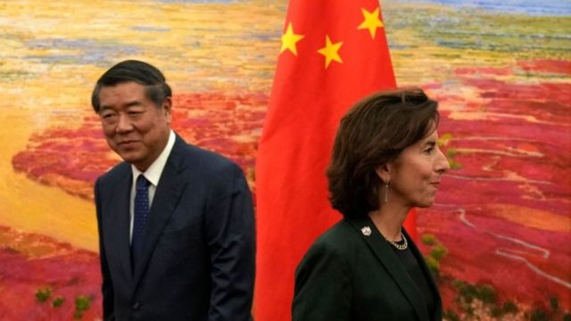
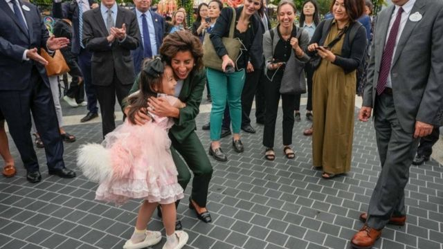
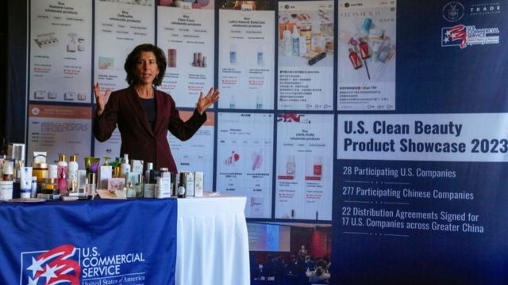

# [Chinese] 美国商务部长雷蒙多首次访华释放三个信号：示好、担忧和不妥协

#  美国商务部长雷蒙多首次访华释放三个信号：示好、担忧和不妥协

8 小时前

> 图像来源，  Getty Image
>
> 图像加注文字，雷蒙多和何立峰

**8月27日到30日，美国商务部长雷蒙多（Gina Raimondo）访问中国，为七年来首位访华的美国商务部长。也是继国务卿布林肯、财长耶伦，以及总统气候问题特使克里后， 又一位近期访华的美国高官。**

雷蒙多会见了包括中国总理李强、副总理及中美经贸中方牵头人何立峰、中国商务部部长王文涛、中国文化和旅游部部长胡和平。

不同于之前美国高官的访华之行，雷蒙多执行达成多项具体成果，比如中美双方同意在两国商务部之间建立新的沟通渠道，以及启动了出口管制信息交流机制。

> 图像来源，  Getty Image
>
> 图像加注文字，在上海迪士尼乐园，雷蒙多拥抱了一个小姑娘。

##  示好、担忧、不妥协

雷蒙多访华释放的信号，可以总结为：示好，担忧、不妥协。

她的表态，基本在重复耶伦在7月访华的论调。

在与中国总理李强的会谈中，雷蒙多称，拜登政府支持中国发展经济、改善民生，无意遏制中国发展，不寻求同中国脱钩，也愿同中方加强在人工智能、气候变化、打击芬太尼等领域合作。

在与何立峰的会谈中，她表示，美中商业关系的全球意义极为重大，负责任地处理这一关系对两国乃至整个世界都至关重要。她还表示：“虽然在保护国家安全的问题上我们决不妥协，但我想明确一点，我们并不寻求脱钩或阻碍中国经济发展。”

这与雷蒙多的一贯态度吻合。

在特朗普时代，中美就大部分商品相互间实施了高额关税，在拜登时代并未取消。

在美国政府内部，支持废除对华关税的主要是雷蒙多和财政部长耶伦，她们赞成废除关税，并反对在经贸上与中国“脱钩”的论调。

雷蒙多也表达了自己的担忧，主要集中美国企业在中国面临不断恶化的营商环境，不少美国企业向她抱怨中国已变得“无法投资”，并指出罚款、突击检查和其他行动使得它们在全球第二大经济体开展业务变得风险重重。

她表示：“我从美国商界听到越来越多的人说中国不适合投资，因为风险变得太大了。”

雷蒙多表示，美国商家中有强烈的愿望让美中关系运行起来。尽管中国政府的一些行动是积极的，但实际操作层面需要与言辞相匹配。

但在一些关键制裁和限制方面，雷蒙多发出“不妥协”的信号。

她称，中国要求美国减少对先进技术的出口管制，并撤销关于对中国先进技术进行新投资的行政命令。雷蒙多称，她拒绝了这些要求。 “我们不就国家安全问题进行谈判。”

不过她也表示，大部分美中贸易与国家安全无关，而要尽可能缩小出口管制和投资限制范围，增加非国安相关的产品出口中国，并希望“商业关系维护得好，能稳定政治关系”。

##  建立机制

2017年1月，特朗普上任后，再没有美国商务部长访华，期间中美爆发贸易战，全球爆发疫情，以及俄乌战争等导致地缘政治环境和全球贸易环境巨变。

雷蒙多在记者会上表示，此次中国行的最大成就是与中方建立了定期沟通的机制，是向前迈出的一大步。

双方确认，两国商务部将成立一个工作组，由中美副部长级和司局级的政府官员组成，并有企业代表参加的磋商机制，以寻求贸易和投资问题的解决方案。

双方同意，工作组每年召开两次副部长级会议，两位商务部长则同意经常性沟通，每年至少会见一次。

此外，两国还启动了出口管制信息交流机制，作为解释各自出口管制制度和改善沟通的机制。双方将按照各自法律，就出口管制信息进行交流。

但雷蒙多表示，在出口管制问题上，美方不会做出让步，建立有关出口管制的信息交流机制并不是让中方寻求让步，而是分享信息和增加透明度，是一个减少对“国家安全政策误解的平台”。

“雷蒙多访华可以看出，中美两国都明确表达了加强经贸沟通与合作的意愿。”安邦智库（ANBOUND）高级研究员贺军向BBC中文表示，中美双方在相对安全的经贸领域有加强合作的愿望，这不仅是美国的需要，更是当前经济困境下中国的需要。

> 图像来源，  Getty Image
>
> 图像加注文字，雷蒙多称，不寻求同中国脱钩。

##  下次“习拜会”？

中美关系在特朗普时代开始走向低谷，在拜登上台后缓慢修复，但去年8月美国众议院议长裴洛西（Nancy Pelosi）访问台湾，中国方面反映强烈，终止了几乎所有与美国的官方交流渠道。

到去年11月巴厘岛G20峰会，拜登与习近平会面后，再次开启修复的过程，并且有了后来国务卿布林肯的访华安排。

然而，今年2月中国“间谍”气球事件，使中美关系修复过程再次中断。数月后，布林肯访华得以重启。

然而布林肯前脚刚走，拜登在公开活动中称习近平为“独裁者”，招致中方反对。7月耶伦访华被认为是继续这一修复过程的尝试。

再加上气候特使克里，以及雷蒙多此次来访，三个月间四位部级官员来华访问。

贺军认为，她的访华既是在寻求与中国减少经济摩擦、保护既有的商业关系，又是一次对中国经济现状、挑战和风险的“前线火力侦察”。中国需要推动两国关系的有限改善，并在经贸范围内推动实现“合作均衡”。

值得注意的是，雷蒙多访问前后，双方都在释放友好信号：

8月21日，美国商务部下属的工业和安全局（BIS）发布公告，将27个中国实体从“未经核实清单”（UVL）中删除。

8月28日，中国财政部、税务总局发布公告，将外籍个人有关津补贴个人所得税免税优惠政策，继续延长实施4年。

8月29日，习近平回信美国史迪威将军外孙称，中美关系的基础在民间，力量源泉是人民友好，两国人民应该加强交流、增进理解、扩大合作。

外界猜测，这些访问和信号，都是在为下一次“习拜会”铺路，时机则是9月9日在印度举行的G20峰会上。但8月31日，路透社援引消息人士称，习近平有可能不会出席此次G20峰会。

