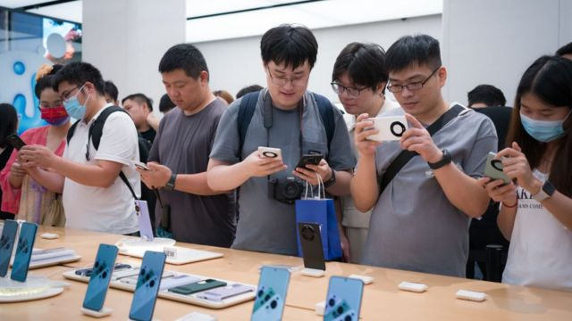
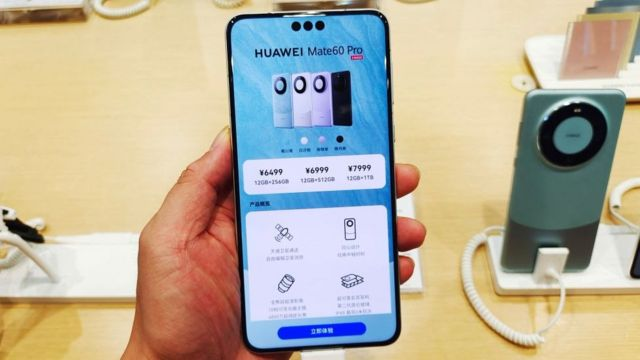
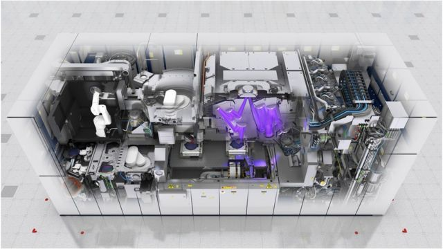
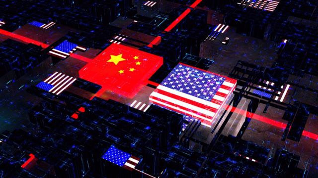

# [Chinese] 华为：新款5G手机横空出世 中国半导体突破美国封锁？

#  华为：新款5G手机横空出世 中国半导体突破美国封锁？

  * 吕嘉鸿 
  * BBC中文 

> 图像来源，  Getty Images
>
> 图像加注文字，华为无预警发售此款手机，分析称北京似乎在告诉负责执行拜登制裁中企的雷蒙多，中国半导体不会被美国制裁打垮。

**中国电子巨擘华为在8月底无预警“低调”发售新5G智慧型手机Mate 60 Pro ，在全球半导体高科技界引发高度关注。**

目前各国科技公私单位，都在华为没有正式宣布手机零件细节前“拆机解谜”。多数结果发现，华为新机除了使用了中国半导体龙头中芯科技研发的麒麟9000S七奈米晶片（芯片）之外，许多测试结果也显示Mate 60 Pro运作速度可以与最新款的iPhone 5G手机一样快。该机被认为是迄今为止中国本土技术生产的最先进版本。

许多中国网民及若干官媒认为，该手机从配载的高科技7奈米晶片，到成为首款能与高轨卫星通讯的手机，是华为能够突围美国一系列制裁的证明，更象征着中国半导体“创新自主”的未来指日可待。各地实体门市大排长龙，手机销售一空。一些分析指，过去因受制裁而备受打击的华为“起死回生”，为当下不安的中国经济，注射了一剂爱国主义的强心针。

但是，专家告诉BBC中文，华为此次与中芯国际合作生产的七奈米晶片，距离其他世界前沿晶片设计及代工的对手仍有一段距离。

更重要的是，有专家认为，华为此次在美国商务部长雷蒙多拜访北京的时机点上推出新机，政治信号浓厚，预计美国将对中国半导体祭出更强烈的制裁，并扩大审查与中国半导体及有关产业链。

新加坡国立大学商学院高级讲师卡普里（Alex Capri）接受BBC中文采访时说，此次华为手机在没有发布会和广告的情况下低调销售，又不公布手机零件细节且限量发布，充满“神秘氛围”，“让我感觉这是一场精心策划的宣传活动，也是中国广泛的论述战的一部分。”

华为公关部通过邮件回复BBC中文的查询，称目前为止没有太多声明，并附上华为Mate 60 Pro新机发布时的新闻稿，强调该手机是为全球消费者提供更高端及便捷的通讯。

> 图像来源，  Getty Images
>
> 图像加注文字，目前各国都在华为没有正式宣布手机零件细节时时“拆机解谜”

卡普里说，无论如何，华为此次推出新机表明了中国在半导体行业上正全面性地加倍努力，以确保自己的国产晶片在设计和制造能力上朝着自主创新的方向前进。但他也强调，现在将华为Mate 60 Pro视为白宫对中国半导体制裁和出口管制的失败还为时过早。

##  美国将扩大施压？

9月5日，美国白宫国家安全顾问苏利文（Jake Sullivan；沙利文）在记者会上回应说，在获得有关华为新手机技术的组成资料前，不会对特定晶片和问题发表评论。

但是，各方已经开始关注，美国在雷蒙多访问之行意外收到中国来的“大礼”之后，美国是否会加大制裁范畴。根据《华盛顿邮报》，华为新机的推出在华府已造成担忧，批评者称，拜登对中国半导体的钳制成效如何值得重新检讨。

9月8日，彭博社报导美国商务部表示，将对华为新机的晶片及装配展开调查。中国外交部发言人毛宁在同日回应此事称，美国将商业行为政治化，但其“制裁、遏制、打压阻止不了中国发展，只会增强中国自立自强、科技创新”的脚步。

卡普里告诉BBC，他预期白宫将更仔细地审查中芯国际对较老一代的美国或他国机器设备的使用情况，以及其他关键的产品输入。

台湾半导体评论者许美华说，接下来美国可能会对与美国有关的全球半导体产业链审查的越来越细，彻底盘整这些含有美国技术的全球半导体公司与中国的关系为何。她以台湾为例说，近日当地业界传出有些台湾厂商，将半导体设备“提前报销”之后，再转售给中国厂商获取利润，这可能会是美方未来的关注方向之一。

> 图像来源，  Weibo
>
> 图像加注文字，中国网民在微博将雷蒙多的照片恶搞成华为手机代言人。

位于台北的智库，台湾经济研究院产经资料库总监刘佩真则告诉BBC说，她预见美国对于中国将会更加防备，不论是去风险或是脱钩的战略，将持续浮上台面。“而中国受到华为此次事件的激励，更将全力冲刺半导体国产化的进程，对于突破美国科技的封锁线也有所寄托与信心，并视华为麒麟9000S晶片为中国反攻的滩头堡”。在中美持续在半导体战场上激战下，全球半导体产业的“不确定性”（uncertainty），将持续存在。

事实上，美中在半导体产业链上还有许多交集。美国科技谘询公司（Moor Insights & Strategy） 高级分析师赛格（Ahsel Sag）告诉BBC说，譬如华为一直是美国科技大厂高通（Qualcomm）的大客户，后者也曾经销售5G技术给华为，直到今年初美国禁卖令发出后停止。华为与高通之间的技术关系，未来可能备受关注。

无论如何，华为新机引发的国际关注，似乎证实了一个已经分裂和高度区域化的全球半导体贸易格局到来。卡普里告诉记者，在半导体领域的脱钩时代已经来临了，“并将更广泛地影响美中之间复杂的经贸关系。”

##  华为Mate 60 Pro 横空出世

赛格解释，此次华为新机最大的亮点该是5G数据机（modem；调制解调器)。这是考虑到华为已经近3年没有在其手机中配备5G数据机了。

此外，刘佩真分析，根据各单位拆解Mate 60 Pro手机及麒麟9000S晶片，此次华为供应链该是以中芯国际以DUV机台利用多重曝光达到七奈米制程来为其代工。电源方面则有圣邦、南芯半导体，无线充电则是美芯晟与封测技术的长电科技：“整体而言，华为主要是透过迂回的采购与生产。”

台湾南台科技大学朱岳中助理教授则告诉BBC，此次华为新机的最大卖点其实是卫星通讯。他表示，Mate 60 Pro是全球首款支援卫星通话的智慧型手机，这带出两个意义。首先是华为摆脱4G或5G的框架，采用卫星通讯，实测通讯速度更胜5G。他说，卫星通讯适用的电话并不稀罕，也不算贵，但体积通常较一般手机大，华为此款新机在于可以用标准手机尺寸加入卫星电话功能 **。**

再者，有关卫星网路（如SpaceX公司的星链网路）目前为止都还要有额外接收器才能使用，但华为在手机中直接内建接收器是智慧型手机的一大突破。马斯克（Elon Musk）去年曾说2023年定要开发一款手机可以直接连结星链，但迄今未实现，华为反而抢先做到。

> 图像来源，  ASML
>
> 图像加注文字，ASML公司EUV机的出口限制已影响到中国先进制程的发展。

确实，在中国经济动荡之际，华为推出的七奈米手机给许多中国民众打了一剂爱国主义强心剂。在上海及深圳等大城华为实体门市，排起了人龙抢购Mate 60 Pro手机。要价近7000元人民币（约955美元）的新机销售一空。

中国官媒《环球时报》在8月底便在社论称，华为在雷蒙多访问期间开卖，被很多中国网民赋予了“在美国打压之下昂起头来”的更深层次含义，这些声音应当被雷蒙多以及更多美国人听到，并对华盛顿形成触动力量。

多家中国电商网站上出现背后印有雷蒙多头像的新款手机外壳，微博则有网友后制的讽刺图片，雷蒙多成为华为手机代言人，标题“我是雷蒙多，这次我为华为代言”。

北京邮电大学经济管理学院教授吕廷杰接受官媒央视采访时就称，从目前全球各机构对华为新机的拆解观察，华为装配的“麒麟9000s”七奈米晶片和其他该手机内的一万多种零组件，基本上已实现了“国产化”。这意味着5G智能手机领域突破“卡脖子”问题。

> 图像来源，  Getty Images
>
> 图像加注文字，华为否认其通讯技术会对任何国家造成风险。

##  挑战仍在

赛格（Ahsel Sag）认为，中芯国际自去年以来一直在谈论7奈米和5奈米技术，所以此次与华为合作推出配载7奈米晶片手机，并不是一个太大的惊喜。他告诉BBC中文，随着现在半导体晶片，挑战更精微的制程，需要依赖EUV进行光刻，但该机台目前无法销售到中国，因此这个半导体面临的挑战只会变得更大。没有它，中国将不得不发明新的光刻技术并研发自己的解决方案。

刘佩真则强调，华为新机后续实际的成效则待观察。她认为，中芯国际以DUV机台能冲刺的制程极限至多到七奈米制程，有关晶片的良率对一直晶片代工的一大挑战，要大幅量产的成本也很高。

许多分析师都强调，有关EUV光刻机机台的技术缺乏，仍然是中国半导体发展的一大软肋。

朱岳中就告诉BBC中文，在华为的新机中，由中芯代工制作的CPU系统，可能还是使用荷商艾司摩尔（ASML）生产的DUV光刻机，而非中国自制的光刻机。现在中国最先进的光刻机大概就属上海微电子正在研发的28nm机台，虽然该机台预计2023年底出货，但距离艾司摩尔生产的光刻机，至少有10年以上的技术差距。 雪上加霜的是，目前中芯在禁令下，也已买不到新的艾司摩尔光刻机了，现有的机台能撑多久是大挑战。

中国开发出5G或更高阶的晶片”一直只是时间的问题，因为中国的科技实力本来就不弱。此次华为新机，中国自制率据估计约90%，但还是用了台湾大立光、稳懋，以及日本村田等公司的零组件“，朱岳中强调。 刘佩真也认为，高阶的艾司摩尔EUV光刻机，在白宫要求下现在无法出售给中企，换言之，目前麒麟9000S 7奈米晶片，该是中芯国际在未来5至10年内能做到的最好制程技术。

> 图像来源，  Getty Images
>
> 图像加注文字，中国受到华为此次事件的激励，更将全力冲刺半导体国产化的进程，并视华为麒麟9000S晶片为中国反攻的滩头堡

