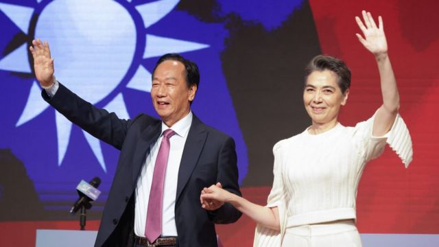
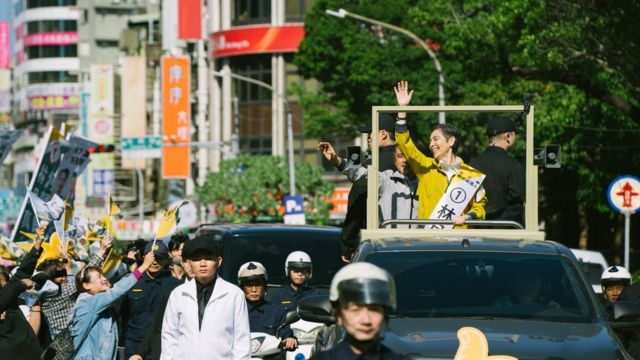
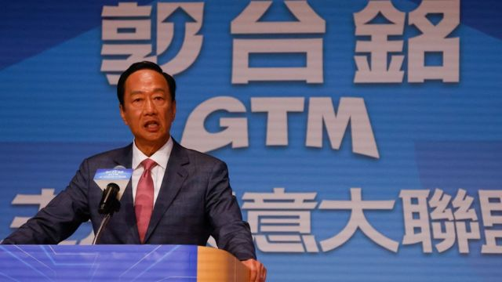
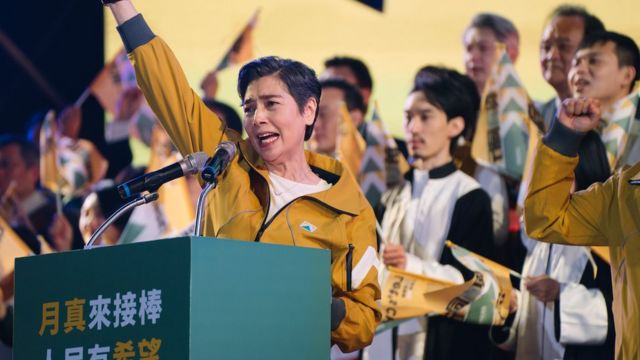

# [Chinese] 郭台铭宣布委任艺人赖佩霞为竞选副手，分析指其长期颓势恐难逆转

#  郭台铭宣布委任艺人赖佩霞为竞选副手，分析指其长期颓势恐难逆转

  * 李澄欣 
  * BBC中文记者 

> 图像来源，  EPA

**参加2024台湾总统大选的鸿海创办人郭台铭，周四（9月14日）宣布委任资深艺人赖佩霞为竞选伙伴，让其成为投身台湾大选的首位演艺圈人士，消息一出，震撼各界。**

赖佩霞在Netflix数月前播出的热门台剧《人选之人－造浪者》中饰演总统候选人林月真，并在剧情尾声当选。

台湾网友纷纷留言称， “郭董（郭台铭）想体会人生如戏”、“第二季改以真人秀的形式开播”、“政治新闻瞬间成为娱乐新闻”，也有人指“佩霞当正的我才会投”、“请大家不要用演员这个身份来标注她”。

现年60岁的赖佩霞除了是演员，也是心理学学者和作家。专家分析指，郭台铭选她为副手是“好棋”，其知名度及亲和力短期内有助提升郭的声势，但长远而言选情难以逆转。

72岁的郭台铭8月28日宣布独立参选，他至今在各项民调中均落后另外三名候选人，包括民进党的赖清德、民众党的柯文哲及国民党的侯友宜。

##  “万中选一”

> 图像来源，  DAMOU Entertainment
>
> 图像加注文字，赖佩霞在Netflix台剧《人选之人－造浪者》饰演总统候选人林月真，图为剧照。

郭台铭是首位宣布副手人选的总统参选人，他在记者会上表示，赖佩霞是他选择竞选搭档时的唯一人选，也是“万中选一”的最佳人选。

他说，赖佩霞不仅是《人选之人》里的林月真，也是女性运动提倡者与推动者，更是追求和平的“身心灵工作者”，并有丰富学经历，对政治领域毫不陌生。

他表示，将依赖佩霞的女性视角，为台湾打造更公平对等的两性文化；借重赖佩霞对身心灵（身体、心理与灵性结合）研究专业能力，为台湾打造充满爱、慈悲的平和社会；藉由赖佩霞的沟通技巧，凝聚台湾社会的集体共识，“让台湾不再充满内耗与冲突，而是走向团结，因此更加茁壮”。

赖佩霞则表示，其任务是落实郭台铭“整合在野”的心愿，指自己研究了40年心理学，专长是沟通协调，“我要先做的是内部沟通、媒体沟通、在野党沟通，最重要的是和全国民众沟通”。

她坦言，在9月前并不清楚政治走向，收到郭台铭邀请后上网查资料，“真的很难想像，怎么会有人这么不讨喜？明明善良，聪明绝顶，能干有实力又有钱，怎么会把民调弄成这么低”。她说，如今郭台铭已经不是鸿海董事长，“我在这恳请郭董，请你先跟以前的竞争对手喝喝咖啡吧（避免树敌太多）”。

她提到另一个参选理由，是自2016年蔡英文政府推出“一例一休”政策（即每周一天例假日和一天休息日），看到原本生意兴隆的老店一家一家休业。她说作为心理学学者，“知道为了身心健康，必须关心台湾的经济，经济一旦下滑，人的精神会受影响，接着可能是家庭破碎，甚至一蹶不振”。

值得留意的是，赖佩霞17岁曾随母亲移居美国一年并拥有美国国籍，外界质疑她不符合《总统副总统选举罢免法》“具有外国国籍者不得登记”为候选人的规定。她透过经纪人发声明回应指，会尽快安排进行放弃美国国籍程序，“今天就会联络相关律师协助”。

##  分析：短期是好棋，长期难逆转

> 图像来源，  Reuters

根据民主文教基金会13日发布的民调结果，民进党参选人赖清德的支持度约33%居首，民众党主席柯文哲约20%居次，国民党参选人侯友宜约16%排第三，独立参选人郭台铭约10%垫底。

美国德州山姆休士顿州立大学政治系副教授翁履中对BBC中文说，以赖佩霞为副手是一步“好棋”，演员参政有新鲜感，相信短期内会为郭台铭加分，但长远而言选情难逆转。

“赖佩霞是政治素人，她在《人选之人》表现好，但观众以年轻人居多，而年轻人支持的不是郭台铭——主帅已经决定了大部分的基本受众，赖只是副手，如果赖真能拉抬郭，人民就可以合理提问：为什么不是赖正郭副？”

新加坡国立大学政治学系副教授、卡耐基中国项目研究员庄嘉颖告诉BBC中文，赖佩霞在《人选之人》的演出有知名度，会让民众更关注郭台铭的选举活动及政见，但也要看郭赖二人如何平衡。

“一般来说，副手没有特别重要的正式角色，所以赖的专长是否能派上用场，就要看郭愿意给她多少空间。副手和正候选人之间的关系有时候不好拿捏。副手要给正候选人加分，但又不能过度吸引注意力，使焦点从正候选人身上转移。”

台湾东吴大学政治学系助理教授陈方隅表示，艺人的好处是形象正面、会表演和表达，对选举相当重要，国外也有不少演员参政的案例，不过从赖佩霞在记者会的发言内容来看，“情感上有做足，但实际上每一个段落与政策相关评论的逻辑连结仍然是不足的”。

陈方隅又质疑，郭台铭向来以“霸气总裁”着称，赖佩霞在郭的团队里会有多少影响力，可以左右政策制定过程，都是未知数。

##  赖佩霞是谁？

> 图像来源，  DAMOU Entertainment
>
> 图像加注文字，赖佩霞凭着《人选之人》的演出入围金钟奖，图为剧照。

赖佩霞1963年6月8日生於台北市，16岁开始在餐厅自弹自唱表演，18岁成为歌手出道，1984年发行首张专辑，此后参与多部电视剧、电影及舞台剧演出。

就在宣布担任郭台铭副手的同一天，她凭Netflix剧集《人选之人》入围第58届金钟奖女配角奖。该剧月前开播后大受欢迎，当中有关政治圈性骚扰的情节引爆了台湾#MeToo运动。

除了演艺事业，她也长期研究心理学，拥有暨南大学国际关系硕士学位、美国哈佛大学甘乃迪政府学院菁英领导及暨南大学法学博士学位，在阳明交通大学兼任教授，擅长领域包括研究非暴力沟通丶谈判与协商丶公共领导及国际关系等。

其着作包括《回家》、《我要心动一辈子》、《想跟你好好说话》、《转念的力量》等，她是女性杂志《魅丽杂志》发行人，并曾担任企业培训师、心理谘询师。

赖佩霞长期研究心理学与其身世有关，她父亲是越战期间派驻台湾的美国军人，其母亲在一名美国将军家中担任保母，认识其父，未婚怀孕，父亲被派往越南后才知道赖佩霞的存在。越战结束后其父返美，母亲独立抚养她。

她的童年并不快乐，母女关系纠结。她在《今周刊》访问中形容两人“相爱相杀”，母亲经常情绪勒索她。她在自传《回家》中分享，母亲在保守年代未婚生女相当辛苦，常露出心不在焉的神情，彷佛在哀悼从未获得的爱情，即使母亲曾交往过几个男友也没有真正快乐过，这让赖佩霞一度认为，若没有自己，妈妈会过得更好。

在另一个专访中，赖佩霞对《镜周刊》说，父亲的缺席感一直都在，20岁时她带相本与母亲赴美国南方寻找生父，当年40岁的生父已经有妻小，她的心情复杂又忐忑，担心、迷惑、兴奋、兴师问罪都有，只记得看到他的第一眼，就有很多眼泪。

赖佩霞有过两段婚姻，1988年与设计师吕向荣结婚，生下两个女儿，1996年离婚，2000年与现任丈夫、丰康微流体晶片公司董事长谢志鸿结婚。其大女儿为艺人谢沛恩，继子Tony娶了台湾知名女星隋棠。

