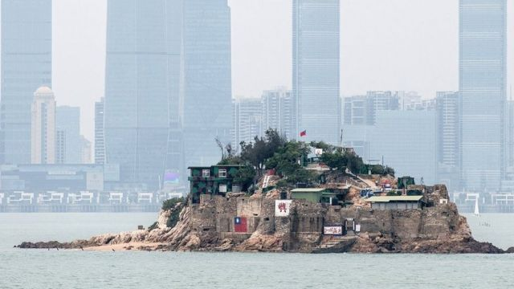
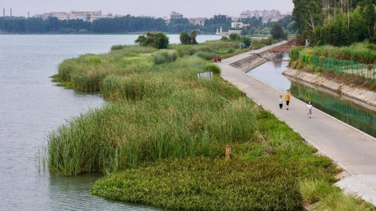

# [Chinese] 中国推出“福建示范区”推动两岸统一 金门与马祖为何成为统战前线?

#  中国推出“福建示范区”推动两岸统一 金门与马祖为何成为统战前线?

> 图像来源，  Getty Images
>
> 图像加注文字，台湾金门离岛小岛——狮屿。岛上插有中华民国国旗，对面高楼大厦是福建厦门市（2018年4月20日资料照片）。

**距离台湾选出下一届总统还有四个月，北京统战工作又有动作。本周初，中国国务院颁布新的统战政策文件，宣布以福建作为“示范区”并提出21项措施，强调以厦门及福州为基地，分别与台湾金门、马祖两岛接轨。**

中国国家发改委副主任丛亮周四（9月14日）表示，近年来中国政府积极推动福建交通基础设施规划和建设，建成综合立体的交通网络，已经具备连接闽台两地高速通道的工程技术能力，为提升海峡两岸基础设施联通打下基础。“我们要共同努力， 争取早日实现两岸民众坐着高铁轻松跨过台湾海峡的梦想，促进更多台湾地区的商品搭乘中欧班列等畅达欧亚市场，更好惠及两岸同胞，”他说。

有分析称，在中共近年来推出的新统战架构下，金门及马祖特殊的政治地理角色一直是重中之重，此次又再成焦点。

伦敦政经学院博士，台湾智库“国防安全研究”钟志东向BBC中文分析称，此次中共颁布的福建示范区方案，该是呼应去年习近平颁布的《台湾问题与新时代中国统一事业》的统战方针。他表示，此次中国以“融合”等字词作为新的认知战略，借着金门、马祖两岛作为统战样板，以“地方包围中央”的战略施压台湾政府。

“北京对台经济政策，其实也是一硬一软的两手策略，从传言称要废除ECFA（两岸经济合作架构协议）到福建、金马融合示范区，就是要以重点突破方式，将金马打造成对陆经贸对口区，从地方包围中央，”钟志东说。

ECFA是2010年台湾前总统马英九任内与北京签订的经贸合作架构。在台北承认“九二共识”及当年美国奥巴马政府鼓励下，签订ECFA主要目的是为了促进两岸货品与服务贸易进一步自由化，强化经济合作，再谈政治。2016年蔡英文上台之后，北京多次批评台湾违反ECFA协议倾销产品到大陆市场，因此发出有关凤梨、石斑鱼等货品进口禁令。此外，ECFA下的“服贸协议”条款，在2014于台湾立法院进行表决时，意外引起台湾年轻族群抗议，引爆太阳花学运。

2023年8月，有传中国商务部 研拟取消  ECFA惠台条款，有分析称，此为北京对在台湾明年大选前，对台政商施压的策略。

虽然，台湾大众对此方案反应平淡，但此方案再次将敏感的金门、马祖两岛的战略地位端上台面。

台湾陆委会9月14日发表新闻稿说：“当前中国大陆经济景气低迷、消费不振、青年失业率飙升，陆方若无法有效改善其内部经济问题，相关融台惠台措施，均属不切实际；陆方需要回归两岸既有对话协商机制进行协调沟通，并做妥善安排，方能保障民众权益，促进两岸良性互动。”

> 图像来源，  AFP
>
> 图像加注文字，2018年台湾当局举行仪式，悼念八二三炮战60年。

##  福建示范区是什么

9月12日，中共和中国国务院发布名为《关于支持福建探索海峡两岸融合发展新路建设两岸融合发展示范区的意见》，宣称意在在推进两岸统一。这份共计4000多字的宣言，洋洋洒洒提出了共21项措施，包括“促进闽台经贸深度融合和深化闽台社会人文交流。”

细项包含台湾优惠渔民、青少年、加强鼓励宗教人士交流（以道教妈祖宫庙为主），扩大台湾教师或商人前往福建教学、投资房地产的机会等。

但事实上，由于此方案的架构在今年6月就由中国全国政协主席王沪宁在福建海峡论坛提出，对此台湾民间及舆论反应冷淡。有分析称，原因是，台湾社会对于北京不断释出琳琅满目的统战战略感到疲乏。

##  金门、马祖再成焦点

> 图像来源，  Xinhua
>
> 图像加注文字，这是福建向金门供水工程取水地——福建晋江龙湖。

该方案特别提到“支持厦门与金门加快融合发展”。报告称，打造厦金“同城生活圈”，探索“厦金合作”共建基础设施模式，譬如通电、通气、通桥等。方案又强调支持马祖居民在福州同等享受当地居民待遇，并支持福州新区与平潭综合实验区建立“对台融合协同机制。”

习近平则曾在2019年《告台湾同胞书》提到：“两岸要应通尽通，提升经贸合作畅通、基础设施联通、能源资源互通、行业标准共通，可以率先实现金门、马祖同福建沿海地区通水、通电、通气、通桥。”

事实上，方案中有关金门与厦门两地“造桥”的说法，与台湾民众党主席柯文哲曾呼吁两地搭建“金厦大桥”的说法呼应。台湾富商，鸿海集团创办人郭台铭几个月前，也到金门发表“和平宣言”表示台北应与北京谈判，维系台海和平。柯、郭两人都宣布参选2024台湾总统大选。执政民进党中央则批评柯、郭二人上述的提案，斥为伤害台湾主权。

近年来，金门一直中国统战的首要目标。2001年，陈水扁当选总统一年，时任台湾陆委会主委的蔡英文规划了金厦航海线，也就是“小三通”之后，金门与中国的货贸关系越来紧密。

根据金门县政府 统计  ，小三通在2001开航以来，了2010年累积到了1000万人次出入境，截至到2019年6月，累计入境人次达到2000万，但2020年新冠疫情爆发后，旅客人数骤降。

研究马祖多年的台湾大学人类学系教授林玮嫔接受台湾媒体《阅读志》 专访  时分析说，马祖因为没有耕地，资源也不多，与外界保持往来因之很重要。她说，马祖人自认无法独立存活，渔获要送往福州贩售，所以他们认为要与中国大陆共生才能存活。

不过，林教授说，马祖人生活在两个政权之间，一直是很弹性、灵活的调控风险：“他们有没有要成为中国的一部分？没有。他们只是认为要跟中国做生意才有活路，或对台湾政府与政党有点情绪，认同上仍是心向中华民国，”她说。

钟志东则向BBC分析，由于马祖、金门两岛地理位置特殊，现在中国当局以福建为示范省，擘画金门与马祖之间“融合”成一个经贸与生活共同圈的构想，与策划在广东南方策划“大湾区”，将香港划入的作法相似。

他估计，借着不断多样的“融合”金门与马祖。若最后此计划成功，不仅会带给台湾中央政府十分棘手的难题，在国际间舆论也会造成政治效应。

他说，无论如何，这是习近平统一白皮书的一个实践方案。在此情况下，无论任何政党赢得台湾大选，北京都将会加强民族主义及经济功利主义的战略，来策动金门及马祖“香港化”的计划。

钟志东认为，第一步即是透过金马地方想要与与大陆加深经贸往来的渴望，以地方包围中央，造成台北政府困扰之后，再顺水推舟，持续“两岸一家亲”的“融合统战”战略，吸引台湾民众接受北京的和平统一方案。相关的统战工作，预计在明年大选前定会继续。

