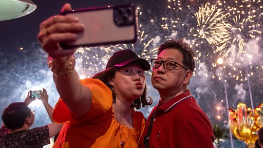

# [Chinese] 香港“十一黄金周”：百万大陆游客到访，但消费力不及疫情前

#  香港“十一黄金周”：百万大陆游客到访，但消费力不及疫情前

**香港“十一黄金周”：百万大陆游客到访，但消费力不及疫情前**

2023年中国大陆的中秋加国庆假期由9月29日开始放假八天，被称为"超级黄金周"，估计超过100万大陆旅客到访香港。

BBC中文记者在不同景点采访多名大陸旅客，发现他们的旅游模式已改变。

很多人追捧社交媒体“小紅書”上的攻略，到网红店和小众景点“打卡”，另一方面，旅客消费力也不如疫情前。

来自北京的王女士对记者说，“不像过去老说咱们香港是购物天堂，说要到这里买，现在到这儿来也就是看一看”，并表示来港九天都沒有购物。

也有来自广东的游客表示香港酒店太贵，因此选择当天来回，两个人的车费连景点门票，一天只花了600人民币（83美元）。

香港旅游促进会总干事崔定邦表示，“黄金周”旅游业已恢复至2018年的七成，但香港未来要“配合大陆旅客口味转变”。

采访、拍摄：李洛

