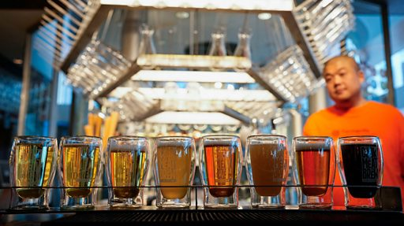

# [Chinese] 澳大利亚大麦重返中国 对精酿啤酒市场有何影响？

#  澳大利亚大麦重返中国 对精酿啤酒市场有何影响？

**澳大利亚大麦重返中国 对精酿啤酒市场有何影响？**

中国商务部宣布2023年8月5日起，终止对澳大利亚大麦征收反倾销税和反补贴税。

这对於中国精酿啤酒行业来説是一个喜讯。

大麦芽是酿造啤酒的关键原料，澳大利亚大麦芽一直占中国需求量的一半以上，北京三年前开征关税，重创精酿啤酒行业。

一位资深酿酒师说，没有了澳大利亚大麦，他只能用相对更高的价格去采购其它麦芽，而啤酒生产价格被拉高，最终还是由消费者买单。

中国市场研究集团（CMR）董事总经理雷小山表示，北京解除澳大利亚大麦关税，意味着中澳贸易正在改善，他预计未来几个月到几年内会有更多的关税取消。

中国是全球最大的啤酒市场，今年市值料达1250亿美元。其中在新兴的精酿啤酒市场，目前有1.3万多家相关企业，业界都期待关税解除后能降低成本，吸引更多消费者。

