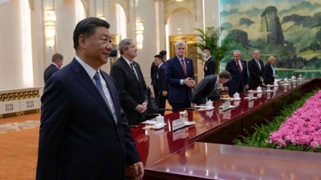
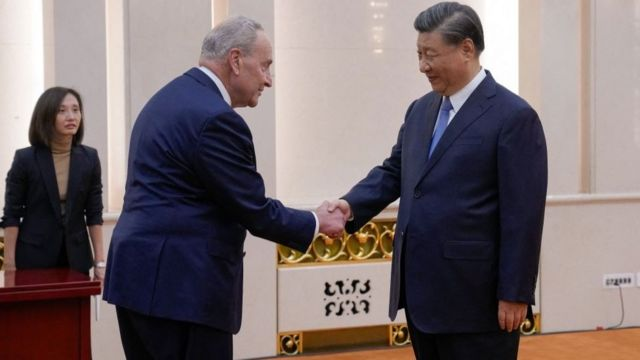
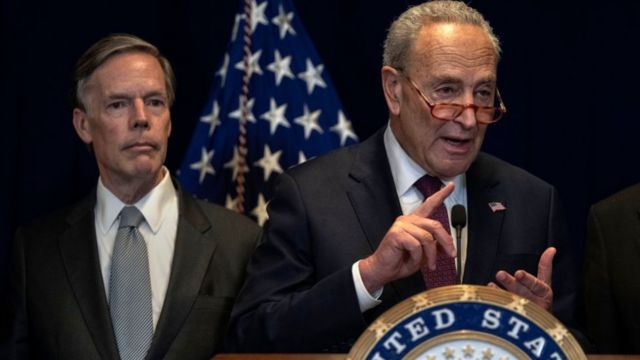

# [Chinese] 习近平晤美国参议院代表团 称“修昔底德陷阱”并非必然

#  习近平晤美国参议院代表团 称“修昔底德陷阱”并非必然

> 图像来源，  Getty Image
>
> 图像加注文字，习近平在北京会见美国国会代表团

**10月9日，中国国家主席习近平在北京会见了美国国会参议院多数党领袖舒默（Chuck Schumer）率领的美国国会参议院两党代表团。**

该代表团由六位参议员组成，民主党籍的参议员除舒默外，还有玛吉·哈桑（Maggie Hassan）和乔恩·奥索夫（Jon Ossoff），以及共和党籍的迈克·克拉波（Mike Crapo）、比尔·卡西迪（Bill Cassidy）和约翰·肯尼迪（John Kennedy）。

这是将近四年来，首次有来自美国国会的代表团访问中国。今年以来，美国国务卿布林肯（Antony Blinken）、财长耶伦（Janet Yellen），以及总统气候问题特使克里（John Kerry）、美国商务部长雷蒙多（Gina Raimondo）。

外界认为密集的来访是为下一次“习拜会”铺路。在上述代表团抵达中国当天，美国总统拜登表示，在11月于旧金山举行的亚太经济合作会议（APEC）期间他与习近平会面是“有可能的”，但尚未敲定。

##  信号

与此前多次美国高官访华类似，此次访问团到访，有积极信号，也在重申立场。

据中国外交部的信息，习近平会见舒默时称，中方始终认为中美共同利益远远大于分歧，中美各自取得成功对彼此是机遇而非挑战；“修昔底德陷阱”并非必然，宽广的地球完全容得下中美各自发展、共同繁荣；中美两国经济深度融合，你中有我，我中有你，可以从对方的发展中获益。

“修昔底德陷阱”（Thucydides' Trap）是古希腊历史学家提出的理论，指一个新崛起的大国挑战既有强权，必然会引发冲突。2012年，美国国际关系学者艾利森（Graham Allison）套用这个理论形容美中两国的竞争。

> 图像来源，  Getty Image
>
> 图像加注文字，舒默是民主党籍的参议院多数党领袖。

外界从会面后的记者会获悉，美国国会参议院代表团与习近平的见面时间达到80分钟。

对此，舒默评价：“我们此前预想的时间更短，甚至只有这个时间的一半。”

这体现出中国对此次会面的重视。

美国驻华大使伯恩斯（Nicholas Burns）表示，双方对话是“坦率、坦诚、详尽且具有实质性”，是“一次进步”（a step forward）。

当前美国正值选举季，舒默表示他与习近平会面时，表示希望在华美国企业可以享有公平竞争的环境、负责任的竞争以及对等互惠性；同时重申希望中国采取积极行动，阻止芬太尼（fentanyl）等毒品流入美国。

“气氛烘托到位了。”一位长期旅居美国的中国智库学者表示，如果把年初布林肯到访时的气氛和舒默访华对比，就能看出区别，这次中方的态度明显友善，沟通也更趋细致。

上述学者称，这长达半年的频繁到访，逐步为11月潜在的“习拜会”搭建框架，如果拜登连任，“习拜会”的成果将主导未来五年，如果特朗普再上任，一切推倒重来。“拜登也想借此向选民展现他在外交上的成熟、可控。”

##  插曲

舒默访华正值多事之秋。

10月6日，舒默抵达上海当天，美国商务部宣布把42家中国公司列入出口管制名单，原因是它们支持莫斯科军事和国防工业，其中包括向俄罗斯供应原产于美国的集成电路。

对此，外交部在记者会上并没有直接回应。外界猜测中国希望淡化处理，背后原因也可能是10月6日正值中国国庆假期，而10月9日的记者会已经几乎被以巴冲突的提问占据。

10月7日是犹太安息日，巴勒斯坦哈马斯（Hamas）武装血腥突袭以色列并劫持人质，随即以色列彻夜轰炸加沙（Gaza）哈马斯目标。

在美领馆的记者会上，舒默说代表团与习近平会面时提到了以巴冲突，希望中国能利用其对伊朗的影响力，阻止伊朗在扩大以巴冲突方面扮演角色。舒默称，中方对此回应道，将向伊朗转达。

在外交部记者会上，发言人毛宁表示：中方高度关注近来巴以冲突持续升级，对巴以冲突造成平民伤亡感到十分痛心，反对和谴责伤害平民的行为。中方反对扩大冲突、破坏地区稳定的行动，希望尽快停火止战，恢复和平。国际社会应切实发挥作用，共同推动局势降温。

10月9日，一辆汽车冲撞中国驻旧金山总领馆大楼，司机被警方开枪击中。

对此，中国驻旧金山总领馆发言人表示，目前犯罪嫌疑人已被警方控制，“我馆严厉谴责这起暴力袭击事件，保留追究事件相关责任的权利。我馆已向美方提出严正交涉，要求迅速查明真相，依法严肃处置”。

> 图像来源，  Getty Image
>
> 图像加注文字，舒默称，有代表向习近平提出，希望中国能利用其对伊朗的影响力，阻止伊朗在扩大以巴冲突方面扮演角色。

##  波折的中美关系

在美国民主体系下，美国选民由535名议员代表，他们被称为国会议员。国会由两院组成——参议院和众议院。参众两院共同制定法律。

参议院是上议院，有100个席位，美国50个州，无论大小，各有两名参议员代表本州。参议员任期六年，每两年有三分之一的参议院议员面临竞选连任。

众议院有435个议席，每位众议员代表各自所在州的一个特定选区，任期两年。

此次到访的舒默是参议院的多数党领袖。去年8月到访台湾的佩洛西是众议院议长。后者访台时，中国方面反映强烈，终止了几乎所有与美国的官方交流渠道。

去年11月，共和党以微弱优势翻盘，成为众议院的多数党，佩洛西告别议长之位。在同一个月巴厘岛G20峰会，拜登与习近平会面后，中美关系再次开启修复的过程，并且有了后来国务卿布林肯的访华安排。

然而，今年2月中国“间谍”气球事件，使中美关系修复过程再次中断。数月后，布林肯访华得以重启。

但布林肯前脚刚走，拜登在公开活动中称习近平为“独裁者”，招致中方反对。7月耶伦访华被认为是继续这一修复过程的尝试。

再加上气候特使克里，雷蒙多，以及国会代表团来访，密度和广度都较为少见。外界猜测，这些访问都是在为下一次“习拜会”铺路。

