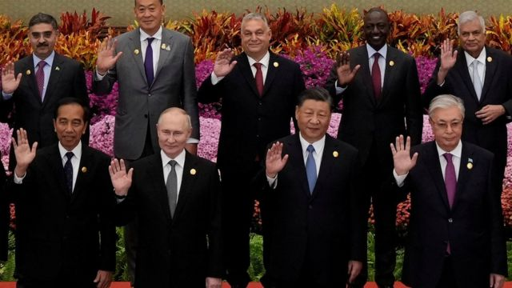
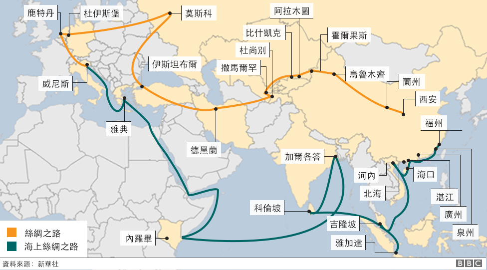
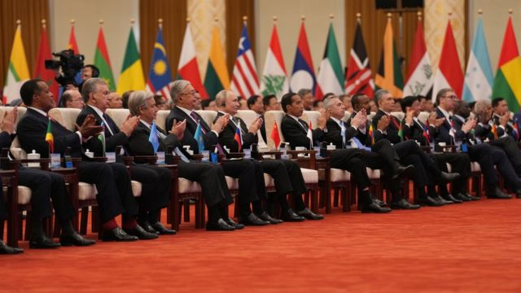
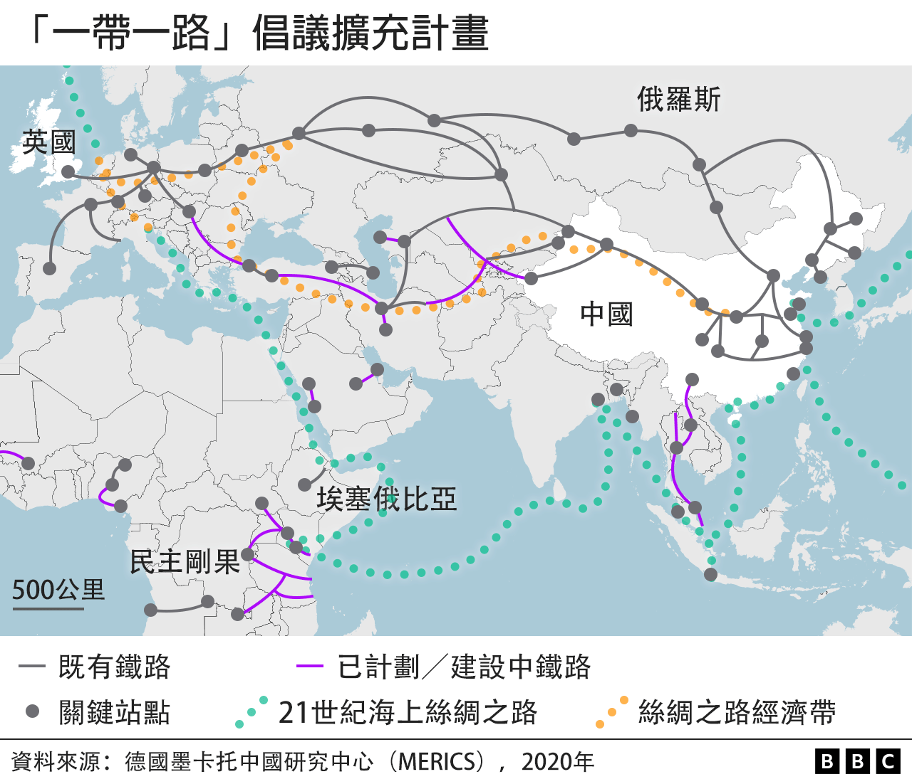
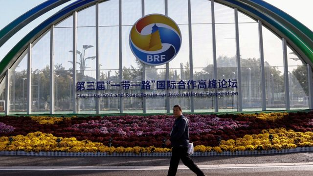

# [Chinese] “一带一路”论坛：习近平会晤“老朋友” 普京称“共同威胁只会加强中俄关系”

#  “一带一路”论坛：习近平会晤“老朋友” 普京称“共同威胁只会加强中俄关系”

> 图像来源，  Reuters
>
> 图像加注文字，这是普京（前中左）自俄罗斯入侵乌克兰以来首次到中国会晤习近平（前中右）。

**中国国家主席习近平与来华参加第三届“一带一路”国际合作高峰论坛的俄罗斯总统普京（Vladimir Putin）会晤，习近平称中国愿与俄国“维护国际公平正义”，普京称两国面对共同外部威胁，而这只会加强彼此关系。**

普京表示，星期三（10月18日）的会晤持续了三个小时。会上，习近平赞扬“老朋友”普京对他所提出的“一带一路”倡议的支持，又称“两国政治互信不断深化”。普京说，在“当前的艰难环境”下，俄中两国密切协调外交政策尤其必要。

这是普京下令军事入侵乌克兰，并被国际刑事法院 以战争罪罪嫌下达拘捕令  以来，首次访问中国。中国并非《国际刑事法院罗马规约》缔约国，该法院通缉令在中国无法执行。

两国元首在会晤前先后在“一带一路”论坛开幕式上发言，习近平不点名批评美国等西方国家称，中国“反对单边制裁，反对经济胁迫，也反对‘脱钩断链’”。普京称“一带一路”倡议与俄罗斯关于形成大欧亚空间的理念相契合，又邀请世界各国参与穿越北冰洋的北方海路开发。

据路透社报道，一些参与开幕式的西方国家代表在普京发言前离场，当中包括法国前总理拉法兰（Jean-Pierre Raffarin）。

出席此次高峰论坛的130多国代表主要来自非洲、南亚与拉丁美洲。

##  习近平利用“一带一路”论坛声援盟友普京

**BBC驻北京记者麦笛文（Stephen McDonell）**

习近平利用了一次各国政府声援其“一带一路”倡议的聚会来反对全球经济“脱钩”概念，并声援其关键盟友普京——俄罗斯在入侵乌克兰后，在国际舞台上遭到孤立。

面对着包括普京在内的观众，习近平说其国家反对“单边制裁”与“经济胁迫”，同时将“一带一路”倡议描绘成对立的一方。

他说其全球运输基础建设倡议已经“把规划图转化为实景图”，以刺激世界货物流通。

对于俄国领导人来说，自从他被指控非法递解乌克兰儿童出国，遭颁令国际通缉之后，甚少展开外访旅程。

因此，他充分利用出席这场论坛的机会，会晤至少九位外国领袖，这包括泰国、越南、巴基斯坦、匈牙利，当然还少不了中国的习近平。

##  “一带一路”倡议

以美国为首的西方国家近年提倡减少其自身经济对中国的依赖，与中国“脱钩断链”成为行动焦点。与此同时，在俄罗斯因乌克兰战争而遭西方国家孤立的背景下， 中俄两国越走越近  ，引起了西方国家警惕。

双边会晤上，习近平说，中俄双边贸易额“正不断朝着我们共同确定的2000亿美元目标迈进”。普京回应说：“我们昨晚分析，从一年前的今天开始，2000亿已经达到了。对于今年年底来说，这个肯定会被超越。”

国营俄罗斯卫星社引述普京说，习近平十年前提出的“一带一路”倡议发展得“非常好”。“中国在您的领导下，你们做到了。我们为你们感到高兴，为所有参与这一广泛协作的人感到高兴，因为所有人都从中受益。”
 官方中国中央电视台其后报道  ，习近平对普京说，“中方支持俄罗斯人民走自主选择的民族复兴道路，维护国家主权、安全、发展利益”，“中方支持俄方明年办好金砖国家领导人喀山会晤，愿同俄方继续加强在联合国、上海合作组织、二十国集团等多边框架内的沟通协作，为维护粮食安全、能源安全以及全球产业链供应链稳定发挥更大作用，维护中俄两国以及地区和发展中国家的共同利益”。

习近平还说，“中俄东线天然气管道等重大基础设施项目投入运营，为两国人民带来了实打实的好处”，“希望中蒙俄天然气管道项目尽早取得实质性进展……把中蒙俄经济走廊打造成一条高质量联通发展之路”。

普京总统在会晤后会见媒体记者时说，中国与俄国各自面对的外部因素和冲突“都是共同的威胁，它们将强化俄中协作”。

普京说他与习近平讨论了广泛议题，“我们还颇为详细地讨论了中东局势，我也向主席通报了乌克兰的局势发展”。

习近平 在会晤前的演说中  重申：“我们深刻认识到，人类是相互依存的命运共同体。世界好，中国才会好；中国好，世界会更好。”

“十年的历程证明，共建‘一带一路’站在了历史正确一边，符合时代进步的逻辑，走的是人间正道。”

“我们要有乱云飞渡仍从容的定力，本着对历史、对人民、对世界负责的态度，携手应对各种全球性风险和挑战，为子孙后代创造和平、发展、合作、共赢的美好未来。”

##  北京的万亿美元实验生成了强大工具

**BBC亚洲数字记者黄晓恩（Tessa Wong）**

> 图像来源，  Getty Images
>
> 图像加注文字，以“全球南方”为主的全球130多个国家首长出席了北京“一带一路”论坛。

中国在 本月发表的一份白皮书中  详细罗列其在“一带一路”倡议和另外三大“全球倡议”下的愿景。北京争辩说，有别于“寡头”西方列强领导，寻求“零和游戏”的全球化，世界将会变得更公平、更包容、更少意识形态分歧。

白皮书说：“共建‘一带一路’是大家携手前行的阳光大道，不是某一方面的私家小路。”远远有别于批评人士所称的寻求主导地位，中国宣称其在“立己达人”。

专门研究“一带一路”倡议的中国教授王义桅告诉我，中国的看法是，“全球化受到了威胁，西方以‘去风险’为名，实际上在搞‘去中国风险化’”。

北京的万亿美元实验生成了一件强大的工具，用以发挥影响力。问题是，世界是否希望看见中国人为首的世界秩序。

##  “一带一路”十年成败

习近平2013年提出“一带一路”倡议时，其一大目的是联通中国与西方。然而欧盟的高层代表缺席了这次十周年“一带一路”论坛，匈牙利民粹主义总理维克多·欧尔班（Viktor Orban）成了整个欧盟唯一参加的国家元首。其他引人注目的与会代表还有阿富汗塔利班政权代理工商部长阿齐兹（Haji Nooruddin Azizi）。

西方对“一带一路”倡议有所猜忌。国际货币基金组织（IMF）亚太部中国处前任处长，美国康奈尔大学经济学教授普拉萨德（Prof Eswar Prasad）接受BBC采访时指出，“一带一路”倡议是中国试图利用其经济实力来争取地缘政治与经济影响力，并同时透过给不同国家提供投资机会来拓宽其经济延伸。

> 图像来源，  Reuters
>
> 图像加注文字，2023年是习近平提出“一带一路”倡议的十周年。

观察人士也批评，在推进该倡议的过程中，中国向沿线国家提供的基建贷款反而导致好些发展中国家债台高筑。例如，肯尼亚为了建设标准轨铁路项目， 已贷款约47亿美元  ，且主要来自中国金融机构，然而铁路通车后效益欠佳，也影响到其收益。

肯尼亚政府希望能在这次论坛期间与中方探讨如何融资兴建新铁路的余下部分。肯尼亚交通部内阁秘书基普丘巴·穆尔科曼（Kipchumba Murkomen）告诉BBC：“继续实施该项目将更有成效，但融资问题实际上是我们面临的挑战。”
 印尼刚开通了中国参建的雅万高铁  ，同时因各类基建对华欠债超过200亿美元。印尼总统佐科（Joko Widodo）星期三在“一带一路”论坛上发言时便说，“一带一路”建设项目”决不能让（有关国家的）财政复杂化“。

普拉萨德教授认为，习近平希望透过本届论坛，让“一带一路”倡议重回正轨，让北京重新收获他所期盼的经济与地缘政治好处。

“我想更大的课题是如何再三保证‘一带一路’倡议的伙伴，中国有在照顾他们的利益，而非只在照顾自身利益。”

“习近平希望重启‘一带一路’倡议，让其他伙伴觉得更加吸引。”

前英属香港政府高级政务官，评论人士简何巧云（Rachel Cartland）在BBC国际台（BBC World Service）节目上说：“我想但凡谈到中国，总会遇到‘鸭兔错觉'——一方认为他们看到了鸭子，另一方认为看到了兔子。西方包括美国倾向相信中国崩盘论，中国相信的则是大国崛起。”

“这（一带一路）是很庞大的项目，很难说，‘是，这很成功’，或者说‘是，这是一场灾难’。但说它的象征意义、政治意义，我想最重要的是大家口中的全球南方（Global South）在历史上怨恨西方，认为西方有其不轨企图。簇拥在中国周围，对世界的未来或有其好处。”

