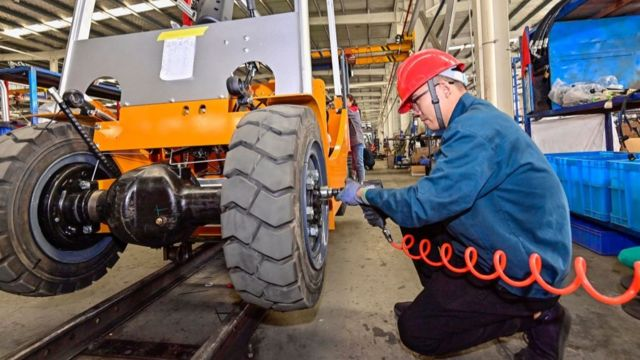
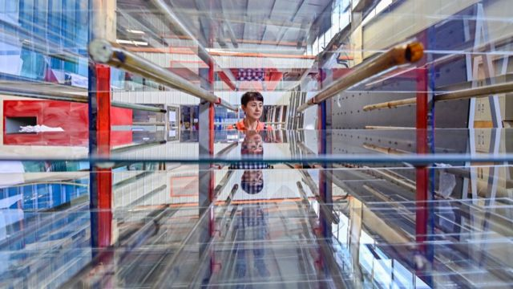

# [Chinese] 中国前三季度经济因消费显著复苏获超预期增长 但地产风险犹存

#  中国前三季度经济因消费显著复苏获超预期增长 但地产风险犹存

> 图像来源，  Getty Image
>
> 图像加注文字，专家预计中国今年完成全年经济增长目标问题不大。

**10月18日上午，中国国家统计局公布了三季度GDP同比增长4.9%，超过市场预期。 有分析将其主要归功于服务业的快速复苏。**

中国媒体财新此前进行的调查中，预测均值为4.5%；路透社的预测均值为4.4%。
 中国经济会陷入“停滞的十年”吗？ 
 疫后半年，中国经济“三驾马车”表现孰优孰劣 

> 图像来源，  Getty Image
>
> 图像加注文字，由于去年中国基本都处于严格的封城之中，今年的GDP数据大幅收到基数效应的影响。

##  基数效应

二季度GDP增幅6.3%，三季度GDP增幅4.9%，看起来三季度增幅下降了，其实背后有基数效应的影响。

去年二季度中国经济受到疫情及上海等地封城影响，GDP仅增长0.4%，由于今年二季度是以去年同期GDP为基数计算，因此使当期数据看起来偏高。

同理，去年三季度增速回升至3.9%，因此推高了今年三季度GDP增速的计算基数，因此看起来较低。

实际上，如果按照环比计算，三季度比二季度GDP增加1.3%，高于二季度比一季度的0.5%的增幅（修正后），也高于市场预期的1%。

##  有望实现全年目标

中国国家统计局副局长盛来运称，四季度GDP只要同比增长4.4%以上，就可以实现全年GDP增长5%左右的目标。

经济学人智库（EIU）经济分析师徐天辰向BBC中文表示，他们智库始终认为中国能够实现今年 5%的增长目标——这是新一届政府建立公信力的需要。

“而且第三季度的读数略高于经济学人智库的预期，这意味着全年目标应该可以安全实现。”

> 图像来源，  Getty Image
>
> 图像加注文字，房地产市场的低迷仍然是明年最大的下行风险。

##  复苏与风险并存

从供给端来说，三季度经济回升，主要归功于服务业的快速复苏。前三季度，中国的农业、工业、服务业中，只有服务业增加值增速快于GDP总体增长，同比增长6%，前两者增加值同比增长分别为4%和4.4%。

从需求端来说，消费强、投资弱的局面依旧。前三季度，社会消费品零售总额342107亿元，同比增长6.8%。尤其是汽车消费，9月份中国汽车产销分别达到285万辆和285.8万辆，同比分别增长6.6%和9.5%，产销量均创历史同期新高。

然而，固定资产投资（不含农户），同比增长3.1%，其中，基础设施投资同比增长6.2%，制造业投资增长6.2%，房地产开发投资下降9.1%。

徐天辰分析，中国经济的“顺风”之势正在增强，包括工业部门强劲发展、消费支出持续复苏以及全球贸易的触底反弹。这些积极信号预示着来年中国经济的韧性，经济学人智库预测明年中国经济将增长 4.8%。

“尽管如此，政策制定者也不应坐享其成。房地产行业的硬着陆并没有得到有效的应对，这意味着它仍将是 2024 年最大的下行风险，”他说。

