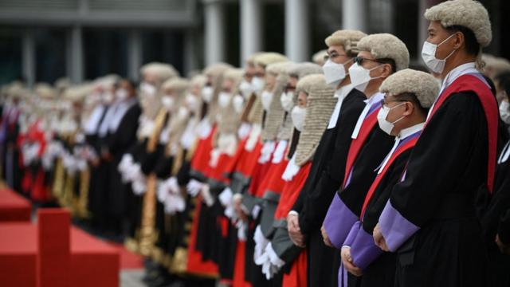

# [Chinese] 香港“反送中”示威：学者研究审判数据称司法制度被“武器化”

#  香港“反送中”示威：学者研究审判数据称司法制度被“武器化”

> 图像来源，  AFP
>
> 图像加注文字，超过1万人因“反送中”示威而被捕，其中超过2900人接受刑事审判。

**香港2019年“反送中”示威过去已四年，一份海外香港法律学者分析相关刑事审判数据的报告认为，香港检控机关将司法制度“武器化”。**

美国乔治城大学亚洲法中心（Georgetown Center for Asian Law）星期四（10月26日）公布的这份报告，比较了香港近年两次大型的示威后的检控和定罪情况。

报告表示，从2019年香港示威起的首两年，被定罪者遭判监禁的比率显著高于2014年”雨伞运动”，平均候审时间将近一年，拒绝保释候审情况亦比其他案件普遍，损害被告人的人权。

与此同时，美国组织世界正义工程（World Justice Project）发表《2023年世界法治指数》，香港在142个国家和地区中排名23，比去年下跌一位，但“秩序和安全”分项全球排名第六。

中国香港特区政府评论称，香港排名持续处于高位，“并领先于一些不时无理批评香港法治和人权状况的欧美国家”，显示中国《香港国安法》对维护香港秩序和安全上起着重要角色，有利于法治建设和人权保障。

在《2023年世界法治指数》排名中，英国排名第15位、美国26位、新西兰第8位、加拿大第12位、澳大利亚第13位、日本第14位、新加坡第17位、法国21位、中国大陆第97位、俄罗斯第113位。

BBC中文就乔治城大学报告内容向香港特区政府律政司寻求评论，尚待对方答复。

##  “反送中”刑罚“比雨伞运动严苛”

2019年反对《逃犯条例》修订案示威被俗称为“反送中”示威，香港特区政府则惯称为“反修例示威”。BBC中文稍早前向中国香港警察索取的数字显示，由2019年6月9日至2022年12月31日，共有10,279人因这场示威而被捕。

特区警务处指出，被捕或被检控的罪名包括参与暴动、非法集结、纵火、刑事毁坏、袭警等。

被捕人士当中有2,928人已经或正在司法程序处理，有1,789人被判罚，有387人经审讯后获释，尚有670人的司法程序仍在进行中。
 乔治城大学亚洲法中心的这份报告  分析了自示威爆发起至2021年7月31日止的2,684例相关刑事案件的数据，认为香港特区政府将刑事司法制度“武器化”。这些案件当中，1,527例已完成司法程序。

报告作者之一，乔治城大学亚洲法中心研究员黎恩灏博士向BBC中文表示，报告主要探讨的是政府如何在示威者身上扩大运用《公安条例》和某些刑事罪行，以及法庭如何运用香港的普通法制度处理相关案件。

黎恩灏说：“整个研究发现，大部分被裁定罪成的反修例示威者，尽管参与非暴力的示威行动，往往被判处监禁式刑罚，不符国际人权标准；更令人忧虑的是，从公平审讯的角度看，不少被告被拒保释的同时，法庭要处理大规模检控，候审时间远超过司法机构设定的指标，令被告长期候审甚至未审先囚，造成审讯不公。”

“再加上律政司乐于在法庭裁决后提出上诉和刑期覆核，令即便判处较轻刑罚或无罪释放的被告继续处于案件的阴霾，令被告构成各种形式的压力。”

报告指出，英式普通法与国际人权法律的一大原则，是被告人直到被判有罪前应被视为无辜，“反送中”案件“令人震惊”的还押候审数字说明此原则在香港“受到压力”。

示威爆发近一年后，中国全国人大常委会于2020年6月颁布了《香港国安法》。乔治城大学的报告确认，其分析所涉及案件均非以《香港国安法》起诉，而主要是引据《公安条例》与《刑事罪行条例》罪行提控。

检控数字方面，报告指出，截至2021年7月已完成处理的約1,600例“反送中”示威案件中，60.7%被判有罪。相比之下，原称“占领中环”示威的2014年“雨伞运动”有130例案件被起诉，73.1%被判有罪。

虽然“反送中”案件的有罪判决比率低于“雨伞运动”案件，但罪成人士被判监禁的比例则较高。

“反送中”有514次判决的被告人被判监，比率55%；雨伞运动案件有30次判决的被告人被判监，占比31.6%。“反送中”案件的判监率比“雨伞运动”案件高23.4个百分点。

“雨伞运动”案件中，被判有罪的示威者多数获判缓刑，或是社会服务令、罚款、感化令这类非监禁刑罚。

报告又指出，在其中811例能找到数据的案件中，从被起诉到正式受审的等候时间平均需343天（11个月9日），最长的更达768天（2年1个月7日）。

这与特区律政司2022年4月答复立法会查询时公布的数字相吻合。律政司当时称，“反送中”案件候审时间比一般刑事案件长30%。

报告也分析了被告人年龄：在被分析案件所涉及的1,017人当中，138人为18岁以下，而其中19人为16岁以下——最小的只有12岁；16岁至25岁达642人，属最多数。

在香港刑事诉讼程序中，法律将14岁以上16岁以下人士定义为少年人，除非犯杀人罪，否则少年人嫌犯均送交少年法庭审理，媒体可报道的案件内容甚为受限。报告承认这影响到数据的搜集。

报告也特别分析了部分案件类型。其中，有关《公安条例》下的“藏有攻击性武器”罪和《刑事罪行条例》下的“管有任何物品意图摧毁或损坏财产”罪，研究团队统计了所涉及“武器”类型。在112件涉案“武器”中，54件为镭射笔。

这份报告排名首位的作者并未使用真实姓名，报告指是一位身处香港的研究员。对于此举会否影响到报告的可信度，黎恩灏对BBC中文解释说，这位作者“考虑过自身安全理由选择采用别名，我们尊重和理解他的分辨”。他并未说明这是否与担忧触犯《香港国安法》罪行有关。

黎恩灏指出，此前也有参与其他报告的研究员选择以别名参与，而此报告已接受相关领域学者评审。

##  “23条”国安立法带来“疑问”

乔治城大学报告发表前夕，香港特区行政长官李家超星期三（25日）发表施政报告时，宣布将在2024年内完成香港《基本法》第23条所规定之国家安全立法。

中国全国人大常委会订立的《香港国安法》将“分裂国家”和“颠覆国家”列为刑事罪行，并增加了“勾结境外势力危害国家安全”罪和“恐怖活动”罪，但该法也同时规定特区政府必须完成“23条”立法，将余下行为列为国安犯罪行为。这包括“叛国”、“煽动叛乱”、外国政治性组织在香港进行政治活动，以及香港政治性组织与外国同类组织建立联系。

黎恩灏对BBC中文说：“当局运用本地公安法律和刑事程序如此，可见将来即使《基本法》第23条立法属本地立法，现有普通法制度能否制约政府滥用刑法作打压异己，的确是一大疑问。”

“我们在报告结论的建议，亦是和应香港一些社会人士和社群的呼吁，当局应特赦反修例运动被告，尤其是纯粹因非暴力行动而被起诉者，才能真切回应司法机构面对大量检控案件的压力，以及扭转当局继续以严刑峻法对付支持民主运动的香港人。”

李家超星期三晚出席施政报告媒体联播论坛时说：“做‘23条’的本地立法必须符合人权、自由保障，这我们会确保。”

“我们经历过2019年‘黑暴’和‘颜色革命’之后，社会整体所受的伤害和苦痛，我觉得大家历历在目。‘23条’立法可确保整体国家安全保障的完整性和前瞻性。”

