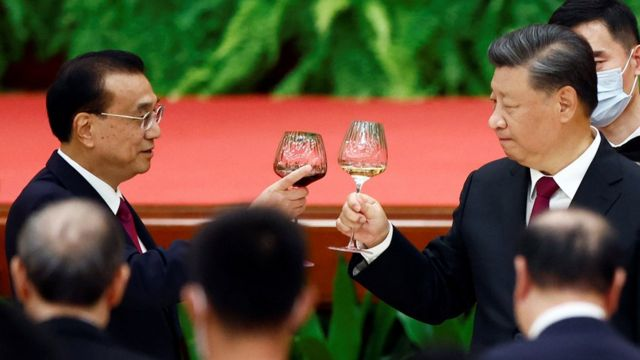
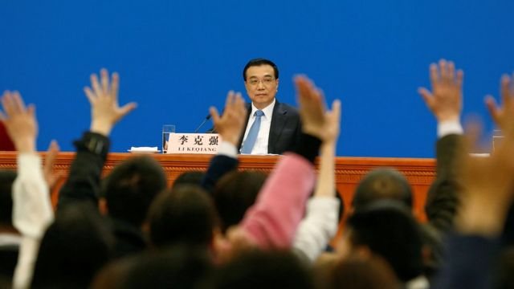
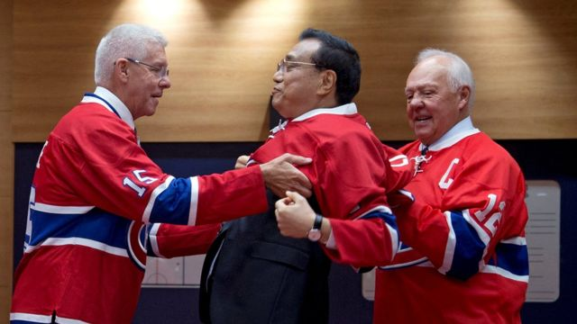

# [Chinese] 李克强逝世为何可能给习近平带来一场危机？

#  李克强逝世为何可能给习近平带来一场危机？

  * By 麥笛文（Stephen McDonell） 
  * BBC驻中国记者 

7 小时前

> 图像来源，  Reuters

**在中国，一位领导人的去世可能会造成巨大的影响：毛泽东的去世引发了政局突变，而1989年对胡耀邦的哀悼演化成了天安门广场的抗议。**

因此，在前总理李克强逝世后，中国当局已采取各种措施来维持稳定。

当局对用于“翻墙”的VPN加强了打击，以减少中国公民访问不受共产党控制的网络。

中共不希望对一位受到欢迎的自由派前二号人物的悼念活动，发酵成为对习近平领导的现任政府更广泛的批评。

这不仅是因为李克强在卸任后仅几个月就突发心脏病猝逝，还因为他所代表的东西：一种可能与总书记习近平并不契合的治国理政方式。

李克强是一位聪明的实用主义者，似乎并不那么关注意识形态。这也是他在上一届中共中央政治局常务委员会（中国最有权力的决策机构）的七人之中，显得形单影只的原因之一。

被称为“李克强指数”的概念广为流传，它源自一份知名的美国国务院备忘录，并在维基解密中获得曝光。据说，时任辽宁省委书记的李克强在2007年曾对美国大使说，以当地GDP数字作为判断经济健康状况的方法并不可靠。

据报道，李克强称自己用另外三个指标来衡量经济增长：铁路货运量、用电量和银行贷款发放量。

即使是在闭门的情况下，向美国人批评中国官方统计数据的可靠性也势必会让他的政治对手们感到不悦。

这位前总理被认为是他那一代人中最聪明的政治人物之一。毛泽东发动的灾难性的文化大革命结束之后，中国重启高考，李克强很快就被菁英学府北京大学法学院录取。

在一个工程师主导的政党中，作为经济学者的李克强以“实话实说”而闻名。他坦诚地公开承认中国的经济问题，以此作为寻找解决方案的手段。

> 图像来源，  Reuters
>
> 图像加注文字，2017年3月，记者在李克强的新闻发布会上举手提问。

在最近的新冠大流行疫症期间，他谈到了习近平标志性的“清零”政策对经济和一般中国人造成的伤害。

当然，他没有直接质疑国家最高领导人或政策本身，但他也没有对实际影响进行粉饰。

2022年5月，在一次据称有十多万名政府和企业代表参加的电视电话会议上，李克强首先高度评价了官员们在应对“超预期”的挑战时，做了“大量有成效工作”。但他接着说：“困难在某些方面和一定程度上比2020年疫情严重冲击时还大。”

他还说，前进的道路是明确的，“发展是解决我国一切问题的基础和关键”。值得注意的是，他说的是发展，而不是意识形态。

“做好疫情防控需要财力、物力保障，保就业、保民生、防风险都需要发展作支撑。”他说。

去年5月，在当局仍在实施“清零”政策的情况下，他没有戴口罩就出现在云南省的一所大学。聚集在他身边的学生和官员都没有戴口罩。这在社交媒体上引发了大量讨论，很多人发帖称赞总理。但很快，#总理在云大# 的话题标签就被审查了。

在疫情刚爆发的第一年，李克强作为经济政策的专门负责人，他决定推动街头摆摊创造就业的能力，并前往山东走访地摊摊贩。彼时，商业已经陷入困境，他表示这种商业可以增加活力，创造更多就业机会。

几乎是一夜之间，北京街头又出现了被禁止多年的街头小贩。而根据习近平对中国首都的设想，他们永远都不会被允许出现在街头。

就在李克强推动所谓的“地摊经济”复苏的几天内，北京市委机关报《北京日报》就开始对此举进行抨击。该报发表评论称，路边摊“不卫生、不文明”。其他官方媒体后来也纷纷发表类似的评论。

市政府能如此迅速、公开且有效地推翻一国总理所提出的政策建议，这表明他手中的权力已变得多么有限。

在胡锦涛领导的前一届政府中，集体领导的方式让这一切很难发生，因为党内各派必须保持平衡。

但在习近平治下，只有“习近平路线”和“错误路线”之分。

在今年3月李克强卸任之前，他是最后一位与胡锦涛时代及其行事方式有关联的高级官员。

他的存在代表了另一个时代，一个不那么热衷于政治、更注重商业活动而非党的口号的时代。

> 图像来源，  Reuters
>
> 图像加注文字，李克强在2016年访问加拿大期间，身穿蒙特利尔加拿大人队NHL曲棍球球衣。

李克强能说一口流利的英语，在会见外国领导人时散发出魅力。他还会向会场内围堵拍摄的记者挥手微笑。

在李克强去世的几个月前，高调的外交部长和国防部长突遭免职，而当局对原因讳莫如深。这只会增加当前局势的潜在敏感性。

即将举行的纪念李克强的官方仪式预计将非常谨慎，以免稍有不慎就会引发对这位前总理的过多同情，从而与政府当前的路线相冲突。

随着普通民众对李克强表达缅怀之情，社交媒体的监看者会留意网上出现的大量悲伤和震惊的声音。

李克强与习近平同时进入中共的权力中枢，并一度有望成为总书记的接班人选，而非由习近平担任。

很多人都在假想，如果当年是李克强担任最高领导人，中国现在会是什么样子？

