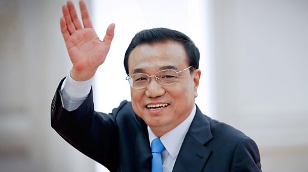

# [Chinese] 李克强逝世：被习近平边缘化的“弱势总理”

#  李克强逝世：被习近平边缘化的“弱势总理”

**李克强逝世：被习近平边缘化的“弱势总理”**

据中国官方媒体报导，中国前总理李克强因心脏病周五（10月27日）猝逝，享年68岁。

报导称，李克强“近日在上海休息”，周四突发心脏病，因抢救无效在（北京时间）周五0时10分逝世。

李克强在2013年至2023年担任国务院总理，被视为是中国政坛的二号人物。他在今年3月的全国人大会议上刚刚卸任。

由于有良好的健康维护服务，中国高级官员一般很长寿，李克强的去世显得颇为突然。中国网络上很多民众表示“不敢相信”、“太突然了”。

李克强是一名地方官员之子。他早年在中国共青团中央工作，后来在中共党内步步高升，成为中国最年轻的省长，甚至一度有望成为最高领导人。

他被广泛认为是前领导人胡锦涛的得意门生，而与习近平关系疏远。他历任共青团中央书记处书记、河南省省长、中共辽宁省委书记等职务。

作为从中国精英院校北京大学毕业的经济学者，他最初被委以中国经济重任，其减少财政刺激、推行结构改革和去杠杆化的经济政策被称为“克强经济学”。

但分析人士普遍认为，随着中国领导人习近平不断巩固权力，他在职业生涯后期越来越被边缘化。

