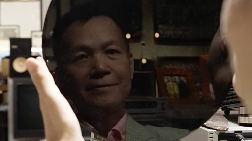

# [Chinese] 香港民间“唱片博物馆” 收藏家逆AI潮流保存“完美的录音”

#  香港民间“唱片博物馆” 收藏家逆AI潮流保存“完美的录音”

**香港民间“唱片博物馆” 收藏家逆AI潮流保存“完美的录音”**

在香港闹市区的一幢楼里，这个香港人将自己经营的唱片店变成一个独立的“唱片博物馆”。

自幼对音乐和旧唱片情有独钟的邓汉深（James Tang），数十年来一直从世界各地搜集“稀世珍藏”，其中最重要的部分是各种流行音乐母带，以及超过20,000份不同年代的录音复本。

他认为，即使在数码（数字）和人工智能时代，“模拟声”时代的录音制品仍有自己独特的“DNA”，值得穷毕生精力去收藏、溯源和整理。

在他的偶像“披头士”（The Beatles）即将以人工智能还原约翰·连侬（John Lennon）的声音，发行他们最后一首歌的这一周，BBC中文探访了这个香港闹市角落里的唱片“保育者”。

采访：邵智杰、王溦

摄影／剪辑：王溦

