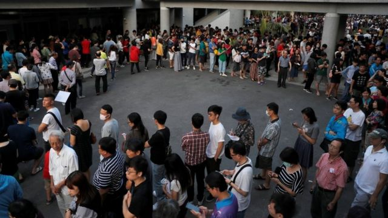
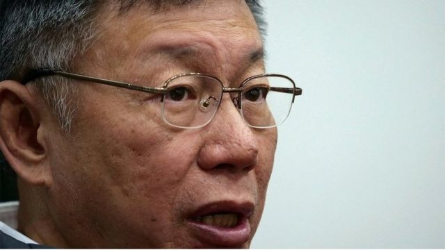
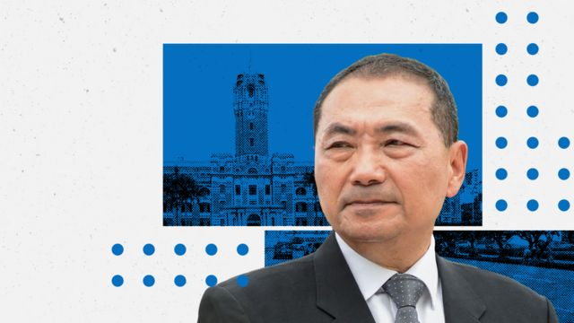
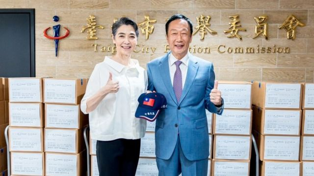
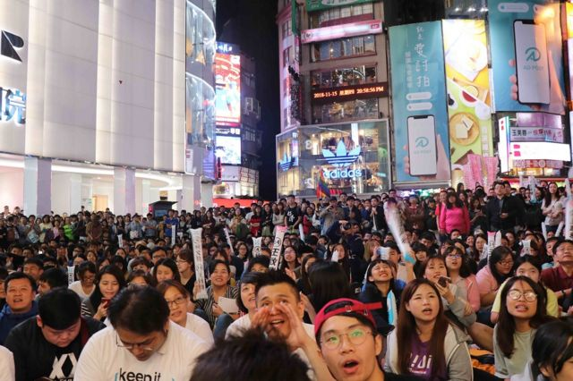

# [Chinese] 台湾总统大选2024：侯友宜与柯文哲策动“蓝白合”是否能成功

#  台湾总统大选2024：侯友宜与柯文哲策动“蓝白合”是否能成功

  * 吕嘉鸿 
  * BBC中文 

> 图像来源，  Reuters
>
> 图像加注文字，台湾选举一向激烈（图为几年前选民排队等候投票）。

**距离台湾2024年总统大选不到三个月，有关国民党参选人侯友宜与民众党柯文哲，是否会合作竞选正副总统大位，也就是“蓝白合”的议题，持续成为当下台湾政坛最大热点之一。**

上周，10月30日，“蓝白”双方首次展开政党协商，国民党主席朱立伦与柯文哲会面，但会后仅发表“四点声明”，表达希望将国会席次最大化，要求新任总统“下放权力”等理念，但仍未确认是否合作竞选总统大位。

星期三（11月1日），台北传出双方再次会面，据台媒报道双方仍旧未决定是否正式合作，但柯文哲有提及，冀盼国民党提出两党都同意的民调与合作办法之后，“再约下次会面；如果没有提出来，那可能也不需要再见。”

“蓝白”合作似乎仍然困难重重。

台湾东海大学政治系教授张峻豪向BBC中文说，“蓝白合”可能性很低。他解释，现在双方应当是在将合作的战场挪到立法院选举，希望在立法委员席次上蓝白加总能过半，打破民进党八年执政下立法与行政全拿的局面，将来可以在许多重要法案上合作，牵制民进党。

张峻豪认为，整个“蓝白合”谈判过程，不断看到双方所抛出来的合作方案，都很快会被对方拒绝。比如说要办民主初选或是全民调，或公开辩论等等没有一项谈拢。

“即便到了现在所谓第二阶段政党协商会面，又看到主帅侯友宜不在谈判中。我想，蓝白会面可能都只是表演给选民看的动作，铺陈最后‘蓝白合’破局后，要怎样甩锅给对方，” 张峻豪说。

美国圣汤玛斯大学国际研究讲座教授叶耀元向BBC分析说，蓝、白两党候选人都想当正的，“谁也知道谁想当副手谁就会泡沫化，所以根本无法取得交集。”

在侯友宜现在实力较弱的情况之下，张峻豪告诉记者，柯文哲应当是在计算如何拖住国民党，等待国民党的气势弱化之后产生“弃保效应”，民众党便能在总统大选及立委席次上有所斩获，吸走若干国民党的票，继续壮大自己。他说：“我觉得这是有可能发生的事。可以说，整个谈判都是围绕着柯文哲的盘算。”

> 图像来源，  Reuters
>
> 图像加注文字，由柯文哲领导的第三势力——民众党以打破蓝绿垄断，打破意识形态挂帅为口号望吸引中间选民及年轻选民的支持。

##  “蓝白”启动合作协商

在侯友宜以及柯文哲民调持续无法追上民进党参选人赖清德，以及同样来自蓝营、独立参选的郭台铭冲击下，侯柯合作一直被一些台湾选民认为可以击败赖清德的方法。在离投票日越来越近、支持者焦虑不断升温之下，上月底（10月30日），蓝、白两党主席正式会面，但国民党参选人侯友宜未参加引发许多讨论。

两党会面后，发出“四点声明”：

  * 共同进行台湾第三波民主改革，避免一党独大、赢者全拿的民主独裁，更进一步深化民主； 
  * 针对两岸共同主张在对等、尊严、友善的原则下重启两岸对话，以及能源议题等五大原则等； 
  * 要求总统应赴立法院进行国情报告、行政院长提名应获得立法院多数支持； 
  * 国民党、民众党两党同意于2024大选共同努力，发挥一加大于二的功效。在立委席次上，双方互相支援、将席次最大化。 

叶耀元教授在分析这四点时发文称，目前两党策略似乎都是在总统赢面不大的状况之下，将战场转向立法院，所以四点联合发言背后，他判断是立委席次上拿下过半后，蓝白两党要如何有效牵制民进党的总统与行政院内阁的机制。

> 图像加注文字，蓝白第二阶段的政党协商会面，侯友宜没有出席。

叶教授分析，柯文哲最大的筹码就是希望国民党未来能把立法院院长大位协商给民众党，但他强调，作为百年大党的国民党，选举之后真要将立法院院长的席次给成军仅几年的小党，仍是未知数。

张峻豪也告诉BBC，整个“蓝白合”谈判后发表的“四点声明”，重点是“国会席次最大化”以及总统该要“下放多少权力”，譬如提到要是否要修宪削弱总统权力等等，都可看出两党关心的应该是立法院而非总统选情，这亦是柯文哲乐意接受的。

张教授强调，因为若蓝白联合起来的立院席次过半，将来国民党可以让出多少权力给民众党，正是柯文哲在意的重点。

又或者，民进党赖清德即便胜选，为了尊重立院的多数党要在内阁中让出多少权力给蓝白两党，其中民众党作为关键第三势力，分到多少权力等等，也是柯文哲看重的一点。“因此，整个蓝白谈判过程都是围绕着柯文哲的利益，而这也是国民党要思考的问题。”张峻豪说。

> 图像来源，  Terry Gou Office
>
> 图像加注文字，11月1日，郭台铭与副手搭档赖佩霞前往台北市选委会送交连署书，郭台铭简单发言后便离开。

##  郭台铭“奋战到底”

除此之外，宣布独立参选的郭台铭的动向，一直也是近日台湾选举的重要焦点。

最近传出中国宣布对郭台铭创办的富士康集团进行查帐，震撼两岸政商界，郭台铭的公开行程骤降。自10月20日后在桃园露面后，郭台铭两周未接受媒体访问。台湾舆论普遍关注，在“蓝白合”及中国查税压力下，一度叱咤两岸政商界的郭台铭会否“知难而退”。

不过，郭台铭在周二（10月31日）发出新闻稿向台湾选民喊话称，“给他四年时间，他会带领大家走向黄金30年”。他又宣示“郭台铭跟赖佩霞定不负所托，会奋战到底”。

周三，郭台铭与副手搭档赖佩霞前往台北市选委会送交连署书，郭台铭简单发言后便离开。郭台铭前幕僚、现任国民党发言人林家兴向台媒喊话说，“虽然郭台铭送交连署书，但还有一个阶段是郭台铭到底会不会登记参选，国民党与郭台铭有很多沟通管道，相信郭一定会归队（国民党阵营）。”

叶耀元教授向BBC分析，但现在郭台铭的选情非常的冷，民众的关注都在“蓝白合”之上，而郭台铭在宣布副手之后，一直也无法持续创造议题，所以民调也一直探底。“目前看来，也没有起死回生的机会。”

根据台湾中央选举委员会规定，最终的连署结果将在11月14日前公布。11月20日至11月24日受理总统、副总统及立法委员选举候选人申请之登记。换言之，“蓝白合”的登记死线落在11月20日。台此次大选合资格的投票人数高达1950万人。

> 图像来源，  BBC NEWS CHINESE
>
> 图像加注文字，台湾此次大选合资格的投票人数高达1950万人。

