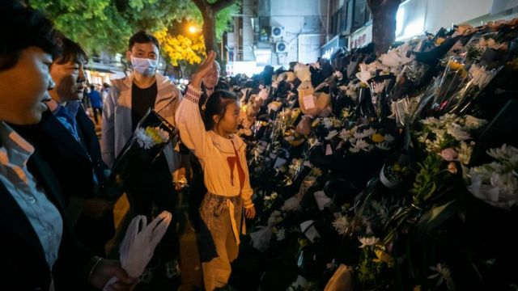
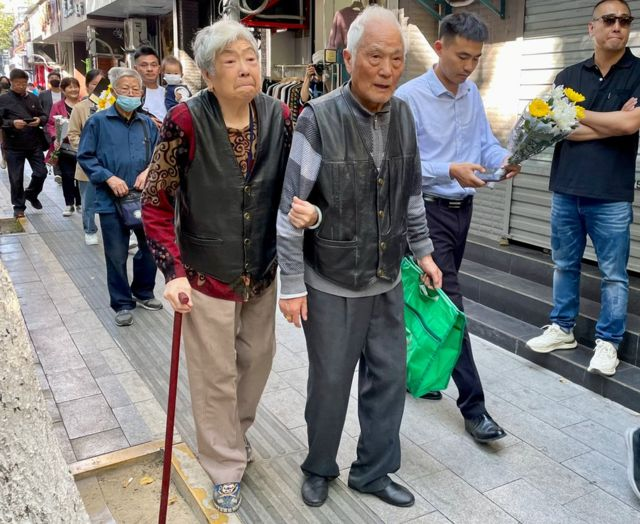
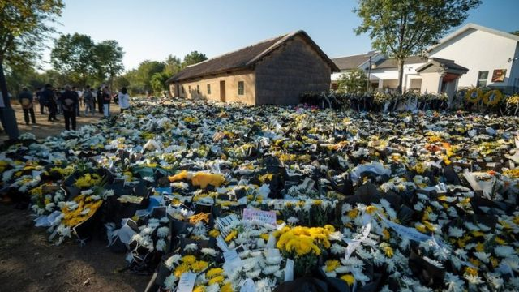

# [Chinese] “他赢得民心”——李克强家乡悼念者络绎不绝

#  “他赢得民心”——李克强家乡悼念者络绎不绝

  * 麥笛文（Stephen McDonell） 
  * BBC记者 发自中国安徽 

> 图像加注文字，哀悼者聚集在李克强位于合肥红星路的故居外。

**“在我们老百姓心中，他的形象是很伟大的。”一位在安徽合肥吊唁上周去世的中国前总理李克强的男子说道。**

他和儿子手捧鲜花，前往李克强位于合肥市红星路的童年故居，这里的鲜花已堆积如山。自上周官方媒体报道68岁的李克强在上海因心脏病突发而猝逝以来，前来凭吊的人群一直络绎不绝。

“他以前到过我们的家纺厂来。给我留下的印象很深。”这名男子说。李克强和他都来自安徽省，他说：“我们很惋惜，感觉很突然，接受不了”。

李克强在今年3月卸任前一直是中国二号领导人，但他的去世对习近平的权威构成了挑战。中国共产党别无选择，只能允许悼念活动进行。

这是因为在中国公开批评习近平或共产党是危险的，但李克强的去世提供了一个窗口，让人们可以谈及他对国家的愿景，以及他看似更加开放和温和的政治理念，许多人认为这与习近平的强硬风格形成鲜明对比。

“今天我和我的小姐妹特意请假，我们两个特意从其他的地方赶来的。“一名衣着得体、戴着珍珠耳环和项链的中年女子说。”他一直为我们基层的老百姓服务。心里特想着我们基层的人民。”

然而，有官员很快打断了她的话，要求她和BBC的团队不要停留。

越来越多的便衣人员聚集在我们的受访者周围，仔细听他们发言的内容。沿着红星路，约有数百名便衣人员和志愿者在维持秩序，同时将记者驱离该区域，阻止采访进行。

> 图像加注文字，哀悼者排队悼念李克强。

两名20多岁的女生试图表达对李克强的感激和敬意，但工作人员一直呼喊她们离开。

一名女子推着坐在轮椅上的母亲从红星路走出来。她说：“我们带妈妈来看一下总理。”

“看过他了，还拜了他。”她年迈的母亲双手合十，似乎在祈祷。她继续说：“他真是一个好人……”但这时，另一位女士突然从旁边出现，开始推着轮椅劝她们离开，不要与媒体交谈。

附近，一名背着包的男子正在围观。他说，他为了悼念李克强而从上海来到安徽，“李克强总理在老百姓心中，他是说真话的。”

“什么地方生活艰苦，他就下来了解了解，确定是什么样的情况。”在谈到接替李克强担任总理的李强时，他补充说：“不像李强，只会拍马屁”。

当我们向他求证是否真的认为李克强比李强更好时，他回答说：“没有必要我来讲，叫上海人来评价。”

这时，人群围拢过来。“中国的官，不习惯说真话。”他说道。“（听到）他去世了以后，我们很疑感，因为在我们看来，中国的高官退休以后都是长寿的。”

> 图像加注文字，志愿者组成一排，阻挡BBC的采访团队。

一名工作人员打断了采访，开始把他推到街的另一侧。她不停地告诉他，他不是本地人，暗示他没有资格来合肥接受记者采访。

这名男子后来对我们说：“我不能呆在这里”。工作人员后来将他推上一辆出租车，要求他离开。

距离合肥约一小时车程外，李克强曾居住过的另一栋房子也成为群众缅怀的地方。与省会合肥的情况类似，李克强在九梓村的祖宅也被成千上万朵鲜花所包围，这些花被用黑色塑料袋扎成束状，以示哀悼。

警方清理出一条供吊唁者进出的通道，人们在李克强童年时曾居住的茅草屋前鞠躬，鸡鸣和鸟叫在人们的脚步声和低沉的话语中清晰可闻。

> 图像加注文字，哀悼者在李克强位于九梓村的祖宅外留下鲜花。

李克强的家境并不显赫，这让其深受普通中国人的喜爱，尤其是在他公开承认中国有很大比例的人口仍然收入微薄之后。 两位带着年幼女儿来献花的女子提到了这一点。其中一人形容他为“老百姓、农民工着想”。

“他一直想着基层人民。我带孩子来，为了让孩子感受一下，让孩子送总理最后一程吧。”她说道。另一位妇女也走过来说：“他真的很朴实，是有农根的孩子，没有官架子。”

一名80岁的老人和她的家人也来到这里。老人的脖子上挂有一枚有共产党的标志锤子和镰刀图案的红色勋章。她高举勋章，自豪地表示她已经入党60年了。

当被问及李克强是否是中国最好的领导人之一时，她回答道：“对，对，对。”她年轻的同行者补充说：“他是最好的！”

老人紧握勋章，说道：“他赢得民心。”

