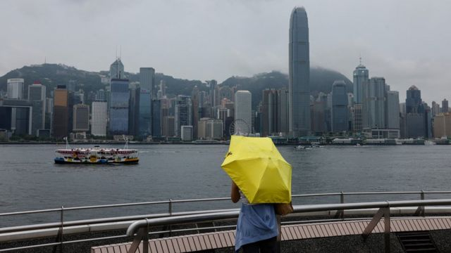
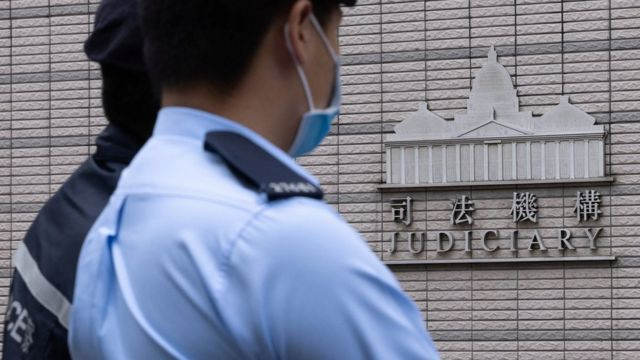
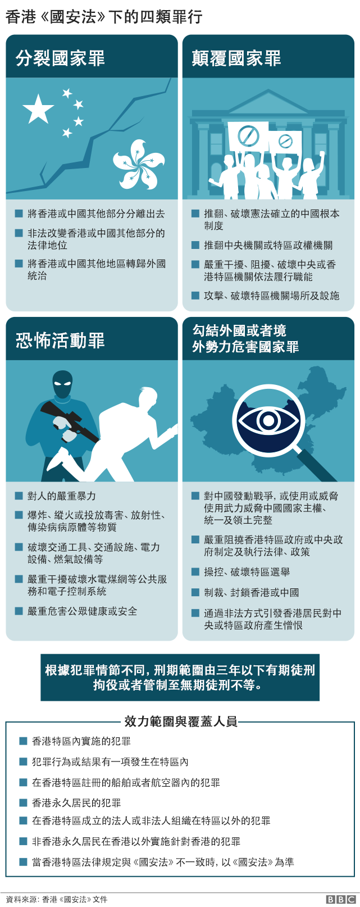

# [Chinese] 香港国安法：女生被控留日期间发“煽动港独”网帖 判囚两个月

#  香港国安法：女生被控留日期间发“煽动港独”网帖 判囚两个月

> 图像来源，  Reuters
>
> 图像加注文字，被告人涉案13篇网上帖文中，除两篇在香港境内发表外，都是在日本发表。

**一名留学日本的香港学生被中国香港国安警察指控发布网帖宣扬“港独”，被法院判囚两个月。**

23岁女生袁静婷稍早前承认一项《刑事罪行条例》下的“作出具煽动意图的作为”罪，中国香港特区西九龙裁判法院星期五（11月3日）对其判刑。

主审的香港总裁判官苏惠德在判决时质疑说，尽管被告人对相关法律“无知”，但被告有权编辑或删除自己的铁文，但2020年国安警察首次检控“煽动”罪之后，被告人并未删除帖文，且涉案13篇帖文中，12篇能让大众阅读，无知的人也有可能被微妙地煽动起来，因此必须判处具阻吓性刑罚。

起诉文件确认绝大多数涉案帖文都不是在香港境内发表，香港国安警察今年3月以被告人涉嫌中国《香港国安法》下的“煽动分裂国家”罪将其拘捕，因此案件当时被视为“中国《香港国安法》域外适用第一例”。

此案宣判之际，美国联邦众议院跨党派议员星期四（2日）正式动议 《香港制裁法》草案  ，要求对49名参与实施《香港国安法》的香港特区律政和司法官员颁布制裁，主审的总裁判官苏惠德“榜上有名”。

被列入拟制裁名单的还包括特区终审法院首席法官张举能、特区政府律政司司长林定国资深大律师，以及多位《香港国安法》指定法官和律政司检控官。推动草案的共和党籍加州韩裔众议员 金崔映玉（Young Kim）称  ，希望美国能透过这部法案，“采取强有力且决断的行动来支持爱好自由的香港人民，让侵害人权的官员受到问责”。

中国外交部驻香港特派员公署、香港特区司法机构与香港特区政府分别发表声明谴责美国议员举措。其中，特区政府形容美方议员“以卑劣行为尝试恫吓维护国家安全的特区人员”。
 外交部驻港公署称  ：“包括香港人民在内的中国人民不信邪、不怕鬼，维护国家主权、安全和发展利益的决心坚定不移，任何制裁、恐吓都吓不到中国人民，只会激发起中国人民更加团结一致、勇往前行的信心和决心。奉劝美国个别无良政客认清事实，立即停止干预香港事务，停止干涉中国内政，放弃‘以港遏华’的痴心妄想。”

> 图像来源，  Reuters
>
> 图像加注文字，美国跨党派议员的法案拟针对执行中国《香港国安法》的法官与检察官实施制裁。

##  日本发帖，香港判囚

香港国安警察最初拘捕袁静婷时并未披露其身份，直到日本东京大学研究生院综合文化研究科阿古智子教授于4月初发文说，一位她所认识，在日本留学的香港学生返回香港换领身份证时遭国安警察拘捕，案件才因此曝光。

阿古智子教授得知判决后透过即时通讯应用对BBC中文评论说：“她被判了两个月的徒刑，但一天的刑期是极其严厉的。”

“之所以判她有期徒刑，恐怕是为了达到令人寒心言论的效果。即使您在国外学习，您也会发现自己处于连社交媒体上的贴文都受到监控的境地。 出国留学的留学生一定要谨慎行事。 ”

西九龙裁判法院于10月26日开庭审理案件，被告人当庭认罪。警察方面证实，她在今年2月24日从外地返回香港，3月8日被捕。

香港媒体引述控方案情指出，警察“网上巡逻”期间发现，被告人在2018年9月7日至2022年5月14日期间，在网络社交平台Facebook与Instagram上发表13段具煽动性的言论或照片，其中四段在2020年6月《香港国安法》颁布生效前发表的文字“意图引起憎恨或藐视（中国）中央及／或香港特别行政区政府或激起对其离叛”，另外九段在《国安法》生效后的帖文“意图激起香港居民企图不循合法途径促致改变其他在香港的依法制定的事项”。

案情指出，这些帖文包括“我主张香港独立”、“中共未灭，何以为家”、“香港人报仇”等。

然而，这些帖文当中，只有两篇是在香港境内发表。不过国安警察向法庭指出，根据出入境纪录，被告建立Facebook帐户时身处香港。

> 图像来源，  Reuters
>
> 图像加注文字，2019年反修例示威以来，日本是其中一个不时出现声援香港游行抗议的地方。

裁判官认为，被告人的Facebook账户有约470名好友，Instagram则有600多名好友。其发帖数量不多，频率不高，法庭也接纳辩方称，被告人发布的内容原创性不高、流于口号，没有使用激进言辞及引起激烈讨论，认为罪责较大部分案件轻。

但裁判官认为，被告人的行为具有一定的延续性和永久性，而其中一则帖文以日文提及“港独”主张，身处香港境内能阅读日文的人也能读懂，或会让无知者潜移默化地被煽动。考虑到被告人认罪，以监禁三个月为量刑起点，认罪获扣减三分之一刑罚，最终裁定判监两个月。

辩护方确认，袁静婷2022年到日本某大学，同时修读法学院与政治经济系课程，被捕时为二年级生。

阿古智子教授对BBC中文记者评论说：“虽然她的审判与《国安法》无关，但该案由负责《国安法》相关审判的指定法官审理。 这位负责国安法的法官可能别无选择，只能判处监禁。 我不禁认为，这项裁决显然是出于中国政府的考量。 ”

袁静婷并非日本公民，但阿古教授说：“日本政府、日本大学、文部科学省以及日本社会并没有认真看待这个问题。”

“她发出的内容包括目黑区一家美术馆正在举办的展览的内容。日本法律承认言论自由。政府和司法部门不会干预博物馆展览的内容，除非有诽谤名誉或鼓励歧视的内容。日本政府应对这项裁决提出强烈抗议。”

袁静婷被捕后虽然获准保释候审，但被限制出境。关于她一旦服刑完毕后能否恢复学业的问题，阿古教授透露，她目前处于休学状态，但日本居留签证已经过期。她说已就此跟日本入国管理局联系，要是袁静婷可以返回日本，可提出重新办理留学生在留资格。

根据《香港国安法》，无论被告人是否香港居民，是否身在香港，《香港国安法》同样适用。若被告人被起诉“煽动分裂国家”罪，一旦被判有罪，“情节严重的，处五年以上十年以下有期徒刑；情节较轻的，处五年以下有期徒刑、拘役或者管制”。

但国安警察最终引用英国殖民地时代订立的《刑事罪行条例》“作出具煽动意图的作为”条文落案起诉袁静婷，首次定罪可被判监两年，罚款5000港元（639美元；4675元人民币；2.06万元新台币），再次被定罪可被判处三年监禁。

