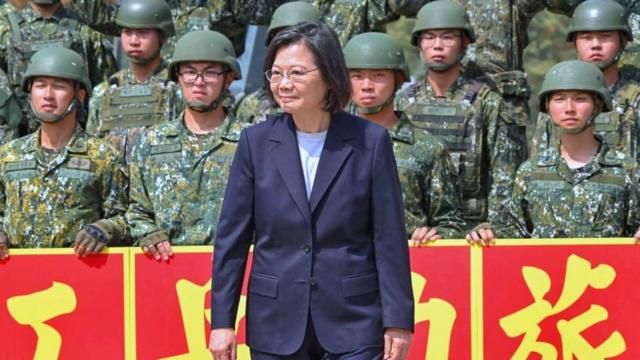
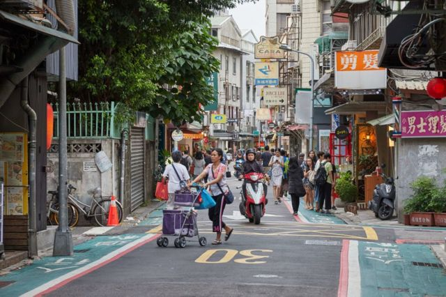
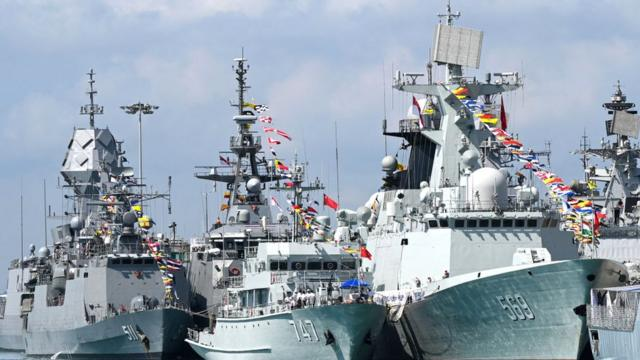
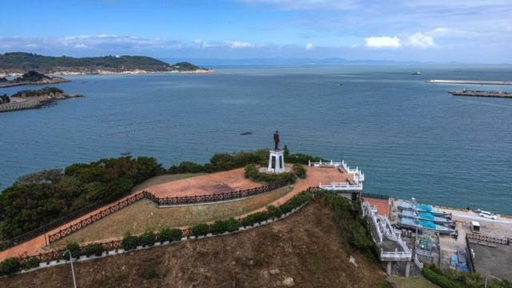
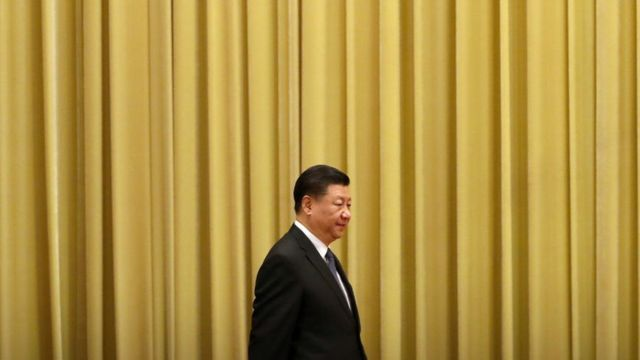

# [Chinese] 两岸关系：美国正低调地将台湾“武装到牙齿”

#  两岸关系：美国正低调地将台湾“武装到牙齿”

  * 傅东飞（Rupert Wingfield-Hayes） 
  * BBC记者，发自台湾 

> 图像来源，  Getty Images
>
> 图像加注文字，台湾在蔡英文总统任内，对于与美国的同盟关系更加高调（图为蔡英文在嘉义县视察期间与台湾工兵部队合影。）

**当美国总统乔·拜登（Joe Biden）最近批准向台湾提供8000万美元（6460万英镑）拨款用于购买美国军事装备时，北京对华盛顿的行动表示“坚决反对”。**

对于漫不经心的观察者来说，这似乎不是巨大的金额。它还不到一架现代战斗机的价格。台湾已经订购了超过140亿美元的美国军事装备。再加区区8000万美元真的很严重吗？

虽说愤怒就是北京对任何对台军事支持的标准回应，但是这次却有些不一样。

这8000万美元不是贷款，而是来自美国纳税人。40多年来的头一回，美国在用自己的钱去向一个它官方并不承认的地方提供武器。这是在一个名为外国军事融资（FMF）的计划下进行的。

自去年俄罗斯入侵乌克兰以来，外国军事融资计划已经被用于向基辅提供过约40亿美元的军事援助。

它还被用来向阿富汗、伊拉克、以色列、埃及等国提供了数十亿美元。但到目前为止，它只向联合国承认的国家或组织提供——台湾并不是其中之一。

1979年美国将外交承认从台湾转向中国之后，它依旧根据《台湾关系法》（Taiwan Relations Act）条款继续向这个岛屿出售武器。当中的关键是只卖出足够多的武器，令台湾能够在中国可能发动攻击时防卫自身，但又不会多到破坏华盛顿与北京之间的关系。几十年来，美国一直依靠这种所谓的战略模糊来与中国打交道，同时继续做台湾最坚定的盟友。

但在过去的十年中，台湾海峡的军事平衡已经大幅倒向对中国有利的方向。老套路不再奏效。华盛顿坚称其政策未有改变，但是在一些关键方面，它确实变了。美国国务院迅速否认“外国军事融资计划”意味着对台湾的任何承认。

> 图像来源，  Getty Images
>
> 图像加注文字，作为一个实际上的自治政体，台湾正面临着中国大陆的军事威胁。

但是在台北，很明显美国正在重新定义与台湾的关系，尤其反映在华盛顿正急切地推动台湾重新武装起来。而在军力上不比中国大陆的台湾，正需要这样的帮助。

“美国正在强调提高我们军事能力的迫切需要。这是在向北京传递一个明确的战略讯息，我们是站在一起的，”执政的民进党立法委员王定宇说。他与台湾总统蔡英文及美国国会领导人均有密切联系。

他说，8000万美元只是一块可能很庞大的冰山当中的一角，而且还指出，今年7月拜登总统动用自由裁量权批准了向台湾出售价值约5亿美元的军事服务和装备。

王定宇表示，台湾正准备派遣两个营的的地面部队到美国接受训练，这是自1970年代以来的首次。

但关键是钱。他说，以此为开端，未来五年可能会达到100亿美元。

总部位于台北的智库远景基金会（Prospect Foundation）的执行长赖怡忠说，涉及军备的交易需要长达10年的时间。“但是有“外国军事融资计划”，美国就直接从自己的库存中发放武器，而且是美国的钱——这样我们就不需要走一整个审批的流程。”

这很重要，因为一个分裂的国会已经拦住了价值数十亿美元的对乌援助，只不过台湾似乎有更多两党一致的支持。

但是加沙的冲突无疑会令美国对台供应武器带来压力，就像乌克兰的战争一样。拜登总统正在寻求向乌克兰和以色列提供战争援助，当中也包括给台湾更多的资金。

> 图像来源，  Getty Images
>
> 图像加注文字，中国现在有世界上最庞大的海军——这是2023年5月在新加坡停靠的导弹护卫舰榆林舰（右）和扫雷舰赤壁舰（中）。

要是向台北的国防部询问美国的资金将用在哪里的话，得到的回应是会心一笑加三缄其口。

但是赖怡忠博士表示，可以做有根据的猜测：“标枪”（Javelin）和“刺针”（Stinger）防空导弹——这些是非常有效的武器，部队也可以很快地学会使用。

“我们没有足够的这些武器，而我们需要很多，”他说，“在乌克兰，‘刺针’导弹很快就用完了，而乌克兰使用它的方式表明，我们可能需要现在所拥有的10倍数量。”

一些长期观察者的评估则直截了当：对中国大陆的进攻，这个小岛是严重准备不足。

问题有很多。台湾陆军有数百辆老旧的战斗坦克，但是现代轻型导弹系统又太少。台军的指挥架构、战术和理念已经半个世纪没有更新。许多前线部队的人员只具备应有兵力的60%。

据报道，台湾在中国大陆的反情报行动基本上不存在，而其兵役制度也已崩坏。

2013年，台湾将军队服役期从一年减少至仅四个月，然后再次恢复到12个月——这将于明年生效。但是还有很大的挑战。那些服过兵役的年青男子开玩笑说它是“夏令营”。

“常规训练是没有的，”一个最近期满退伍的人说，“我们大概会每两星期去一次射击场，然后用的是1970年代的旧枪。我们有射靶，但是没有好好教会怎么瞄准，所以大家都一直射偏。我们没有任何操练。最后是会有体能测试，但是我们都是没有准备的。”

据他描述，这个制度当中的高级军官对这些年轻人是完全漠视的，而且完全没有兴趣去训练他们，一部分是因为他们反正只是在那里很短时间。

> 图像来源，  Getty Images
>
> 图像加注文字，在操练的台湾工兵部队

在华盛顿，有一种强烈的感觉是台湾已经快没有时间去改革和重建军队了。于是，美国也开始对台军进行重新训练。

几十年来，该岛屿的政治和军事领导人一直严重依赖着一种信念：进攻台湾岛对中国大陆来说太难、也太冒险。与英国颇为类似，台湾将重点放在海军和空军上——陆军就因此被牺牲。

“当中的理念是要在台湾海峡牵制他们，然后在海滩上歼灭他们。所以，我们将大量资源放在空中和海上防御，”赖怡忠说。

但是现在，中国大陆拥有世界上最大的海军和远强于台湾的空军。去年一个智库进行的一次战争演习发现，若与中国大陆发生冲突，台湾的海军和空军会在战斗的头96个小时内被完全消灭。

在华盛顿的强大压力下，台北正在转向一种“台湾堡垒”战略，要令中国大陆难以占领台湾岛。

焦点将转向地面部队、步兵和炮兵——在海滩上击退入侵，在必要时还会与解放军在乡镇和城市中作战，甚至在岛上深处被茂密丛林覆盖的山脉基地上战斗。但是，这就令台湾的防卫责任重新落到其落后的陆军头上。

> 图像来源，  Getty Images
>
> 图像加注文字，台湾的最大优势，是它作为一个有山地的岛屿。

“在1979年美国断交之后，我们的军队几乎完全被孤立。因此，他们仍然停留在越战时代的美国军事思维当中，”赖怡忠说。

这一点直到最近才开始令台北和华盛顿担心起来。在整个1990年代和2000年代，台湾和美国的企业都忙着在中国大陆各地建立工厂。

当时北京正在游说加入世界贸易组织（WTO）——并且成功了。世界拥抱中国经济，美国也认为，贸易和投资将确保台湾海峡的和平。

但习近平和他治下的民族主义兴起，还有俄罗斯对乌克兰的入侵，都打破了这些令人安心的假设。

对台湾来说，乌克兰战争的教训是令人震撼的。炮兵主导了战场——其火力密集且准确得可怕。

乌克兰的军团已经学会在发射一轮炮弹后必须立即转移——否则，几分钟内，俄罗斯的“反击炮火”就会在他们的位置上雨点般落下。

但是台湾的很多炮兵部队配备的是越战甚至是二战时期的火炮。这些火炮需要手动装填，并且移动起来困难又迟缓。它们会成为战场的活靶子。

台湾的脆弱正在迫使华盛顿采取行动。这就是为什么台湾的地面部队正被派往美国接受训练，而美国教官也正前来台北嵌入台湾海军陆战队和特种部队进行合作。

> 图像来源，  Getty Images
>
> 图像加注文字，习近平警告台湾统一不可阻挡，并表示“决不承诺放弃使用武力”。

但台北的国防安全研究院（National Defence and Security Research）的研究员钟志东表示，台湾仍然无法指望单独嚇阻中国大陆。这是乌克兰战争中的另一个教训。

“国际社会必须决定台湾是否重要，”他说，“如果七国集团（G7）或者北约认为台湾对它们的自身利益有重要性，那么我们就必须将台湾的问题国际化——因为这样才会让中国大陆三思而行。”

钟博士指，中国大陆的行为无意间已帮助台湾做到这一点。

“中国大陆在南海和东海正显示出它是扩张主义者，”他说，“而我们可以看到的结果是，日本的军费现正加倍。”

他说，这样的结果正在重塑本地区的联盟关系——无论是美、日、韩之间的历史性首脑会议，“四方安全对话”（日、美、澳大利亚和印度）还是正尽快建设新一代核动力潜艇的“奥库斯协定”（AUKUS，英、美、澳大利亚），还有美国与菲律宾之间更紧密的联系。

“中国正在试图改变本地区的现状，”他说，“（而这）意味着台湾的安全与南海及东海是相连的。这意味着我们不再孤立。”

在华盛顿，关于美国应该在多大程度上支持台湾，现在正存在激烈的辩论。很多长期观察中国的人士表示，美国的任何公开承诺都将激怒北京，而不是震慑它。但是华盛顿也知道，台湾无法指望独力保卫自己。

正如一位中国的长期观察者所说：“我们需要对整个战略模糊的问题保持沉默，同时又将台湾武装到牙齿。”

