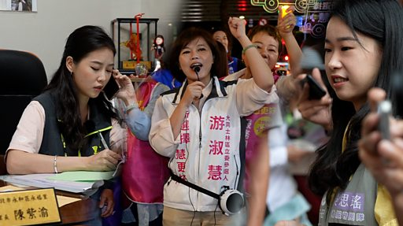

# [Chinese] 台湾大选：作为女性政治工作者 她们面对着什么挑战？

#  台湾大选：作为女性政治工作者 她们面对着什么挑战？

**台湾大选：作为女性政治工作者 她们面对着什么挑战？**

以政治幕僚为主角的职人剧《人选之人——造浪者》开播后在台湾掀起一波 MeToo 运动，让政治工作者、尤其是基层女性政治工作者的经验走进大众视野，从幕后走向幕前。

从政治圈开始的 MeToo 自5月起蔓延至台湾包括文化、演艺、学术、传媒等数个领域，开启社会对性暴力案件处置的检讨，并促成台湾立法院于7月底三读通过修法《性骚扰防治法》、《性别平等教育法》、《性别平等工作法》等“性平三法”，修正内容包括加重权势性骚扰裁罚、延长申诉期限和强化监督机制等。

随着2024年大选接近，各候选人与团队的竞选活动正如火如荼进行。BBC中文以三位不同岗位、不同世代、不同政党的政治圈女性为切片，透过她们尝试看见这个群体的挑战：在台湾，作为一名女性政治工作者是什么样子？

影片制作：张友慈

