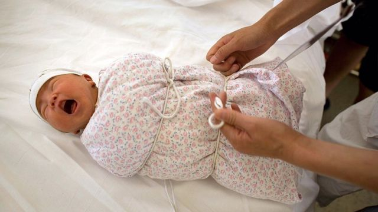

# [Chinese] 湖北民营医院为贩卖婴儿“洗白” “打拐志愿者”揭发后官方介入

#  湖北民营医院为贩卖婴儿“洗白” “打拐志愿者”揭发后官方介入

> 图像来源，  Getty Images
>
> 图像加注文字，拐卖儿童在中国是一个长期存在的问题（资料图片）

**中国一名自发调查拐卖儿童的民间人士实名举报一家民办医院为非法贩卖的婴儿“洗白”身份的链条，引发卫生部门介入调查。**

“对你们来说是解决了你们出生证明的问题，但我们犯的是死罪……”据中国媒体报道，这句陈述是出自中国湖北省襄阳市一所民营医院院长之口。当时一名暗访者在襄阳健桥医院假装以9.6万元换取一张由医院开具的《出生医学证明》。

据报道，这种“真实可查”的出生证——以及与之“配套”的婴儿疫苗纪录和母亲病历，有可能被用作为贩卖得来的婴儿进行落户登记。而在暗访镜头下，与卧底记者讨价还价的叶姓院长似乎对这一犯罪行为的性质非常清楚。

本周一（11月6日），襄阳市卫生健康委通报称，针对媒体平台发布的有关“湖北襄阳健桥医院院长勾结网络中介利用抖音平台公开贩卖出生证贩卖婴儿”的情况，已联系公安部门和卫生监督局介入调查。

一天后，襄阳卫健委再次通报称，涉事医院妇产科已停业整顿，相关责任人已被控制，医院院长被采取刑事强制措施并接受调查。

这宗似乎是涉及一整个链条的婴儿贩卖和伪造身份事件，据称是被一名人称“打拐志愿者”的民间人士卧底一年多之后发布在社交平台上。

微博署名为“上官正义”的举报人在11月6日的帖文中称，襄阳健桥医院院长“勾结网络中介”，以近10万元人民币的价格售卖出生证和疫苗本，并在网上公开贩卖出生证明，为通过贩卖得来的婴儿“洗白”身份（获得合法身份）。

Skip podcast promotion and continue reading

* BBC 時事一周 Newsweek (Cantonese)   **

BBC國際台粵語節目，重溫一周國際大事，兩岸四地消息，英國境況。並備有專題環節：〈記者來鴻〉、〈英國生活點滴〉和〈華人談天下〉。

分集

End of podcast promotion

据举报的帖文，涉事的中介人声称帮助“领养”来的孩子解决户口问题，而买证者只需提供身份信息，支付9.6万元人民币，医院就会按照“正常”的生产流程，输建档、产检、住院、分娩、出院等全套“真实”信息，并办理出生证明，全过程在7天内完成。

此外，医院还可以提供全国版本的疫苗本，按新生婴儿流程为这些小孩“打疫苗”。

在帖文中，中介人所称的“领养”孩子，实际上可能是指贩卖得来的婴儿——文中指襄阳健桥医院可以为“买来的”婴儿采集足底血（中国为新生婴儿进行的标准程序），而如果 “不能带孩子前往医院采集足底血”，则需加1万元，由医院安排其他婴儿替代采血。

上官正义称，他在9月曾向其中两个为这类婴儿办理过落户手续的地方警方进行举报，但是这一团伙的多地网络中介仍然在社交平台上活跃并公开售卖出生证，“无受到任何调查”。

帖文还指，该院长还与网络中介合作贩卖男女婴儿，价格在10万以上，而且数量“惊人”。

“如果身边有怀孕的大学生不想要孩子，都可以介绍给她们，由她们帮助找买家，”上官正义的帖文这样引述该医院的线下中介人。

帖文指，今年9月、10月该团伙分别出售过一名女婴，售价为11.8万元和14万元，且均已通过这一链条等成功登记户口。

BBC无法独立核实帖文中举报信息的真实性，而至截稿时，除上述卫生部门通报外，中国警方还未就该事件进行通报。

在中国，拐卖和贩运婴幼儿是一个长期以存在的问题，“情节特别严重”者可判死刑，但同时也是利润丰厚的生意，因此相关的案件屡见报端。

但是，以民间身份多年参与举报和打击拐卖儿童的上官正义在接受中国媒体访问时表示，这一次曝光的事件涉及医院开具真实的医学证明，“也是跌破了我们的认知和眼界。”

他表示，中介人在网络上的“广告”常常隐藏在一些法律普及类的短视频后面。

“（他）们分工明确，利用抖音平台公开发布相关短视频，物色‘客户’，内外勾结，为涉拐孩子提供售后服务，从而洗白身份达到敛财目的，”上官正义在帖文中说。

公开资料显示，襄阳健桥医院是以有限公司的形式注册，法定代表人为叶有芝。

相关的举报曝光后，中国媒体报道称，55岁的叶有芝是妇科产医生，从业数十年来曾有过 非法就医纪录  ——2010年，她曾因为他人非法进行选择性别的终止妊娠手术而被判拘役5个月，而注册于2017年的襄阳健桥医院也曾多次因违法违规而受到行政处罚。

《南方都市报》网站在周二评论称，倘若上官正义的举报属实，“一张违法犯罪网络已呼之欲出，健桥医院俨然就是一个涉婴幼儿违法犯罪行为的‘洗白’工厂”。

目前关于此事的官方公布信息非常少，无法判断事件是否涉及更广大的犯罪链条。

但是，上官正义在周三的一条微博中写道：“襄阳健桥这位院长所干的坏事，比新闻里的还要多，性质还要恶劣！是谁这么多年在为她的违法犯罪行为保驾护航？”

