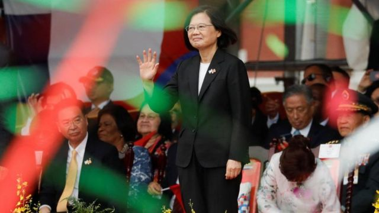

# [Chinese] 台湾大选逼近，“中共间谍”再引发关注

#  台湾大选逼近，“中共间谍”再引发关注

  * 黄思琪 
  * BBC记者，新加坡 

> 图像来源，  Getty Images
>
> 图像加注文字，台湾明年1月举行大选

**台湾大选进入倒数阶段，当局选前将矛头对准了中共间谍，台北与北京的关系再次成为选举中的焦点。**

自1949年国民党退守台湾以来，两岸政府就彼此监视。

过去10个月，台湾当局不断提出指控，其中一些也已定罪，并指出北京的间谍战略持续加强，并扩展到军事精英圈之外。退役空军上校刘圣恕被控吸收7名现职校级军官为中国刺探军情，他在10月被判处20年监禁。

今年初以来，至少有16人被控为中国从事间谍活动。相比之下，台湾司法部调查局在2013年至2019年期间公布的间谍案有44宗。

近年中国对台湾的主权宣示变得更具威胁性，不断增加对台军事和政治压力。即使美国支持台湾的呼声越来越高，北京也不排除武力攻台。

有报道称，北京一直扩大其全球间谍工作，尤其针对美国。华盛顿也在加强对中国的情报蒐集。

曾在印太地区服役数十年的美国海军陆战队退役上校格兰特·纽瑟姆（Grant Newsham）指出，台湾很容易成为中国间谍的目标。

他表示，地理上台湾靠近中国，大多数台湾人都说中文，而且台湾对间谍活动的惩罚“并不严格”。他説：“这会提高为中国从事间谍活动的意愿，因为你会觉得‘负面风险’不太严重。”

纽瑟姆说，台湾至今还没有一套健全系统，去限制机密资料的取得。

“如果你没好好控制敏感和机密资料......你应该预料到任何有能力的外国情报部门，都能取得这些讯息。这种情况在台湾存在已久。”

> 图像来源，  Reuters
>
> 图像加注文字，蔡英文即将结束8年总统任期

专家和台湾官员都表示，间谍活动是中国试图干预或影响台湾的众多方式之一。

台湾国安局长蔡明彦上周指出，北京长期对台湾进行一场“无烟硝战争”。

中国频繁派遣战斗机进入台湾的防空识别区，斥责台湾领导人的外交访问，并禁止台湾凤梨、芒果和部分鱼类等渔农产品进口。

随着明年1月大选临近，外界预料北京会有更多类似的施压举动。蔡英文又指责，中国政府试图通过网络攻击干预台湾选举。

一月的大选意义重大，执政民进党将与至少三位主张与北京重启对话来维持现状的反对党候选人对决。民进党候选人、现任副总统赖清德被中国政府称为“顽固坚持台独分裂立场，是彻头彻尾的‘麻烦制造者’”，若他获胜，将挑战中国的统一计划。

台湾国安单位似乎正密切关注军方。大多数被控的间谍都与军方有关，或被指控试图吸收军人。

今年7月，台湾知名扯铃教练鲁纪贤和另外四人，因涉嫌发展间谍组织而被拘留。鲁纪贤被指通过军队营区附近的当铺和地下钱庄，吸纳缺钱的士兵加入组织。第六名嫌疑人郭伯廷是台湾知名歌手郭书瑶的弟弟。

专家认为，当局针对台商的调查也将查出同样多的案件。今年7月，一名台商及其儿子因招募两名军人协助蒐集机密资料而被起诉。

> 图像来源，  Getty Images
>
> 图像加注文字，专家指中国对台湾的策略不只是军事压力，也包括舆论战

人们担心的是，中国“间谍”不仅窃取机密，还协助塑造舆论，为中国赢得支持。

台湾政治大学访问学者格沙内克（Kerry Gershaneck）表示，中国对台湾的战略有一半涉及“媒体战”，旨在心理上分裂台湾并打击士气。他指出，在2020年大选前，北京被揭付费给台湾媒体，报道中国的正面消息。

台湾政治大学政治学者南乐（Lev Nachman）表示，这次民进党在资讯战的作战计划，是对大众公开间谍案。

南乐说，这对民进党而言是“良好的公关”，但对中国的渗透不会产生什麽影响。他指出，尽管担忧中国的干预，但2020年蔡英文总统仍然大获全胜。

“这些（共谍）案件不是新鲜事。它们是台湾人日常生活的一部份，我相信选民对这些策略的认识，比我们想像的要深刻许多。”

执政民进党在2020年大选前通过了全面的反渗透法。此前，自称是中国间谍的王立强告诉澳大利亚媒体，他曾代表一个由北京指挥的外国干预集团，以台湾和香港为目标。中国当局驳斥了其说法。

政治学者南乐认为，这再次证明中国“所谓的渗透策略”未能奏效。

但其他学者，如澳大利亚国立大学的政治学者宋文笛认为，台湾当局公布间谍案是一把双刃剑，它在后端增强了人们对台湾反间谍能力的信心，但代价是削弱了外界对其前端能力的看法。

“人们会想，台湾能抓到间谍是好事，但为什么台湾不能从一开始就防止这些间谍渗透到系统中，或预防他们被敌方吸收呢？这可能会引起其他潜在合作伙伴和友好国家的警觉，使他们未来不敢与台湾合作。”

