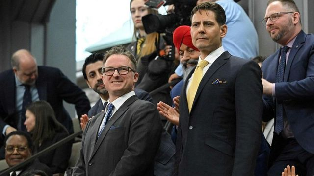

# [Chinese] 加拿大媒体：斯帕弗指康明凯的情报工作致其在华被捕

#  加拿大媒体：斯帕弗指康明凯的情报工作致其在华被捕

> 图像来源，  Reuters
>
> 图像加注文字，加拿大人康明凯和迈克尔‧斯帕弗

加拿大人康明凯（Michael Kovrig）和迈克尔‧斯帕弗（Michael Spavor）曾因被控从事间谍活动而被中国羁押了1000多天，但在他们获释回加拿大后，这一牵动加中关系的事件似乎有了新的余波。

加拿大媒体《环球邮报》（The Globe and Mail）报道，在回到加拿大两年多后，斯帕弗正在向加拿大政府索赔数百万美元作为赔偿。

该报道援引未透露姓名人士的话称，斯帕弗指他“无意中”与康明凯分享了朝鲜相关信息，但不知道这些信息会被传递给加拿大政府及其“五眼联盟”的情报合作伙伴。

他声称，正是康明凯的行动导致两人都身陷囹圄。BBC无法独立证实该说法。

加拿大全球事务部发言人对此回应称，“中国任意拘留迈克尔‧斯帕弗和康明凯是不公正和不可接受的。”

“继续任何一位迈克尔参与间谍活动的说法，只是在延续他们在中国被拘留的错误理由。”

中国驻加拿大大使馆也在报道刊发后回应称，“中国是法治国家，康明凯、迈克尔涉嫌危害中国国家安全犯罪，中国司法机关严格依法办案。”

“近日相关报道再次说明上述事实不容抵赖。”中国大使馆发言人说。

康明凯是一名前加拿大外交官，被捕时在国际危机组织（International Crisis Group）担任东北亚高级顾问。

斯帕弗是“长白山文化交流中心”（Paektu Cultural Exchange）主任，该组织致力于促进对朝鲜的投资和旅游，据报他是少数与朝鲜领导人金正恩建立关系的西方人之一。

斯帕弗和康明凯在2018年底被捕，在他们被拘捕不久前，加拿大应美国的要求拘留了中国电信巨头华为的高管孟晚舟，该事件导致中国和加拿大的关系迅速恶化。对他们的拘捕被广泛视为是中国的报复行动。

2021年9月，在孟晚舟获释离开加拿大后，康明凯与斯帕弗也获释离开中国。

