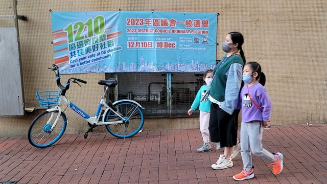
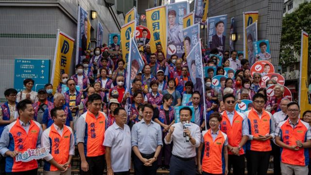
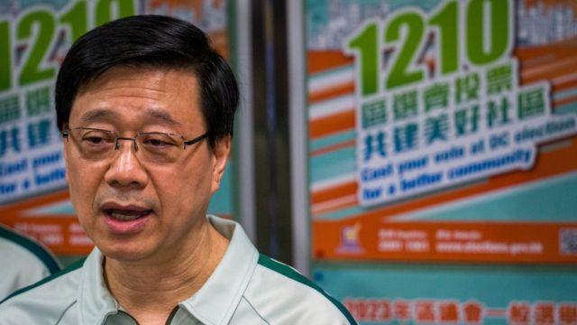
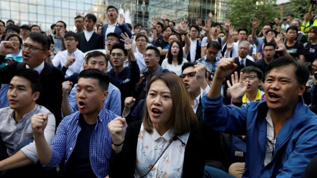
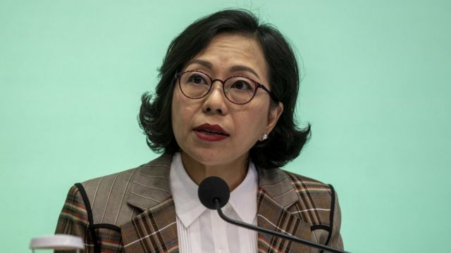
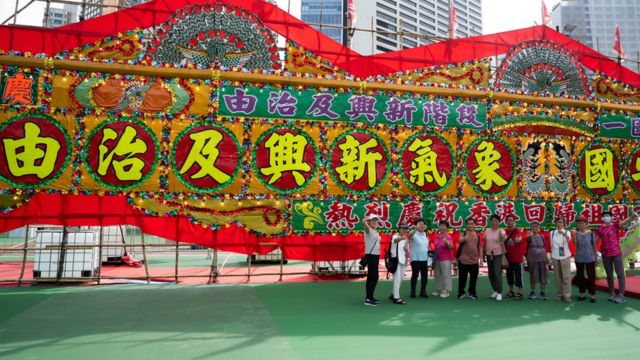
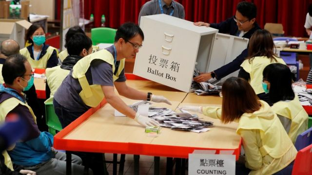
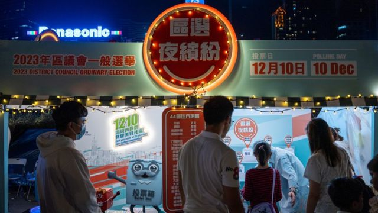
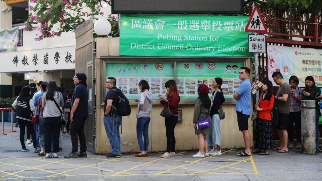

# [Chinese] 香港区议会选举2023：“整顿”后的候选人名单告诉了我们什么？

#  香港区议会选举2023：“整顿”后的候选人名单告诉了我们什么？

> 图像来源，  BBC News Chinese
>
> 图像加注文字，经“整改”的香港区议会选举只有约20%由选民直选产生，但参选人事先要取得特首委任的地区“三会”委员提名。

**中国香港特区18个区议会经过特区政府一轮“整顿”后，将于12月20日举行新制度下首次换届选举。据特区政府公报，62个地区委员会界别与地方选区合共399名参选人全数通过资格审查——即通过国家安全审查——可投入竞选活动。**

这基本确定新一届区议会将全面由建制派取代：候选人中无人报称来自任何昔日泛民主派政团，泛民阵营中最大政党民主党也证实无人取得足够提名参选。

2019年反对《逃犯条例》示威期间，民主派扩大阵营在区议会选举中 取得压倒性胜利  ，引起北京强烈警惕。中国全国人大修法，废止香港《基本法》下立法会与选举委员会内的所有区议员席位，特区政府也先后整顿了立法会与区议会的选举制度。

在官方强调新制度旨在确保“爱国者治港”的同时，BBC中文接触到的评论人士认为，香港政治生态将进一步向中国大陆靠齐。

##  香港区议会选举经整顿后有何特征？
 经整顿后的香港区议会选举中  ，全香港18区共470个议席里面，264席将经由投票程序产生。

其中，176席“地区委员会界别”议员将由统称“三会”的各区扑灭罪行委员会、防火委员会和分区委员会委员互选产生，竞逐议席候选人有228名。“三会”委员均由特区政府委任。

88席地方选区议员分属44个选区——2019年时分为452个选区——171名取得“三会”委员提名后“入闸”的候选人将透过“双议席单票制”决出所有议席。

将“地区委员会界别”与地方选区合并计算，建制派第一大党民主建港协进联盟（民建联）与建制派第一大工会香港工会联合会（工联会）派出了超过40%的候选人；特区行政会议召集人叶刘淑仪领导的新民党占7%；代表商界的自由党与香港经济民生联盟（经民联）合共占不到7%；约39%参选人报称独立、无政治联系或未标明政治联系。

自1985年英属香港政府首次举办区议会选举至今38年来，民主派首次全面缺席地方选举。曾研究香港选举多年，并参与民调工作的旅英香港社会政策及公共行政学者钟剑华博士认为是意料中事。

钟剑华对BBC中文评论说：“谁当选都一样，都得听阿爷（北京）的话。”

但让舆论稍感意外的是，建制派内一些靠拢中间路线的政团也难以把党友送入选战，遑论将他们送进议会——中国全国人大港区代表兼香港立法会议员田北辰领导的“实证圆桌”，以及特区行政会议成员汤家骅资深大律师领导的智库“民主思路”，各只有一人成功获得足够的“三会”成员提名。

10月30日截止提名当天， 田北辰在一场街头新闻发布会上抱怨  ：“我们根本接触不到大部分的‘三会’成员，没办法告诉他们我们都做了什么工作，为什么值得他们去提名。”

田北辰甚至质疑没有理睬他们的“三会”成员“背弃了作为提名人的责任”：“我们‘敲门’（登门拜访）的那些，连听介绍都不想听的，那一类人政府将来不应该委任。”
 他还形容  ，区议会的提名门槛，比立法会“难上十倍”。

> 图像来源，  NurPhoto via Getty Images
>
> 图像加注文字，本届香港区议会选举候选人以民建联占最多。

钟剑华对BBC中文记者说：“区议会改变了，只剩80多个议席，根本就不够分——大家都觉得自己有资格去收割支持北京的成果，那自然就得亲疏有别……先分给‘子弟兵’。”
 香港《信报》  引述北京官方智库全国港澳研究会顾问刘兆佳教授说：“传统爱国组织的成员肯定加分，这些组织发挥担保人、监督人和纪律审查人的作用。”

刘兆佳解释说，有意参选者若知名度低，其“政治轨迹”无迹可寻，不易被提名人看到，则提名人不敢贸然承担风险，提名不熟悉的人，除非这些拟参选人本身就来自传统爱国组织，或有明显的公开言行证明自己是个“爱国者”。

然而，没能“进场”的中间派也许不用等到四年后下届换届选举才能再次获得效力特区政府的机会：新制度下179名委任议员重新登场，行政长官李家超将于年底前公布任命。

民营亲政府报章《星岛日报》 11月20日  刊登对特区民政及青年事务局局长麦美娟的专访。曾担任26年区议员和十余年立法会议员，于2019年区议会换届选举中被中国官方媒体标签为被“反中乱港”政党击败的麦美娟说，委任原则是用人唯才、“爱国者”、熟悉地区需要。

根据特区政府于2023年5月公布的 “完善地区治理”方案  ，新制度下470名区议员中，除新界地区27名乡事委员会主席当然议员外，其余议席按照行政长官委任——“地区委员会”界别——地方选区议员约4:4:2比例产生。

候选人、委任议员和当然议员资格获确认前，须接受资格审查，由区议会资格审查委员会根据中国香港特区国安委的“意见”，裁定其是否“拥护《基本法》、效忠特区”，未能通过者，不得参选、就职。

> 图像来源，  NurPhoto via Getty Images
>
> 图像加注文字，中国香港特首李家超：“每个人都是公平的，可以用自己的方法争取提名人的提名票。”

特区政府此前表明，整顿后的区议会“担当配合政府的角色，令政府能更有效地策划和推展地区服务”。区议会主席不再由议员互选产生，而是由相当于区长的当区民政事务专员兼任。所有议员均须受“区议员履职监察制度”监督。

麦美娟先后对《星岛日报》与中共在港官方报章《文汇报》称，“履职监察制度”将订立“负面行为清单”，而“负面行为”将包括“阻碍区议员进行会议”、“侮辱其他议员或官员”、“禁锢官员”等。

麦美娟称这是扩大了选民的权力。 她稍早前对《文汇报》称  ：“我们加入了履职监察机制，可真正体现和实践全过程人民民主。”

“全过程人民民主”一词源于2021年11月2日，中共中央总书记兼中国国家主席习近平 在上海考察时的言论  。同年12月4日， 中国国务院发表《中国的民主》白皮书  ，称中国发展的是“全过程人民民主”。

两周多后的12月20日——经整顿后首次香港特区立法会选举以 建制派取89席  ，自称民主派政团取得一席的结果落下帷幕当天——中国国务院发表《“一国两制”下香港的民主发展》，宣告“中国共产党和中国政府是香港特别行政区民主制度的设计者、创立者、维护者和推进者”。

那么，只有建制派参选的区议会，是否符合北京要求？

总部设于美国华盛顿的国际人权组织“自由之家”（Freedom House）中国、香港和台湾议题研究主任王亚秋对BBC中文评论说：“要是自2019年以来在香港发生的事情具有任何指标性，要是中共几十年来对中国的统治具有任何指标性，那么中共不会满足于这个提名结果。”

“对于党来说，控制总要加强，总会有更多的‘不稳定因素’需要排除。”

前欧盟驻华外交官，英国皇家联合三军研究所（RUSI）资深副研究员彭朝思（Charles Parton）对香港政治也有研究。他对BBC中文称：“北京的要求总是含糊的，指引总是故意笼统的。这意味着在地方上有能力影响事情走向的那些人，为了确保他们不会遭受北京批评，总会比中共原意走得更前。”

从数字上看，在“地区委员会界别”与地方选区两组选举中，男候选人合共占比72.9%，女性只占27.1%。然而，若只计算地方选区，女候选人比例为28%，已比去届2019年选举增加了8个百分点，更是1999年以来最高。

王亚秋对女性参选比例远低于男性的局面不感意外，她指出，世界各地女性参政面对着重重困难，香港也不例外。彭朝思称他无法肯定女候选人多寡与整顿选举制度是否有关，但他说：“这刚好跟中共党内女性占比差不多吧！”

钟剑华博士认为，香港要是循自由、开放、公开的路线去走的话，自然要给女性更多机会，首任中国香港特首董建华 也曾提出要增加女性参与政府谘询组织及法定机构  ，“到头来不还是一群男人主导？”

“中共也说过‘ 妇女能顶半边天  ’，但长期以来有多少女性能当政治局常委？……我觉得这是父权世界的一个自然后果。”

##  泛民主派“清零”后等着消亡？

香港区议会选举提名结果公布后，中共《人民日报》旗下小报 《环球时报》  引述刘兆佳教授称，这次提名情况是向非建制派示范，如果日后仍希望参与特区管理工作，就要想办法证明自己“脱胎换骨”成为“爱国者”，争取中国中央当局信任。

作为老牌泛民大党，香港民主党无人取得足够提名参选，从此议会议席“清零”的结果，受到了关注。 民主党在提名截止后发表声明说  ：“纵使前路艰难，民主党将一如既往，透过不同渠道继续为留下来的港人发声，真实地反映不同市民的想法，提出我们认为对香港和香港人最有益处的建议。”

> 图像来源，  Reuters
>
> 图像加注文字，2019年区议会选举中，大多数议席由民主派夺得，但许多人后来因为宣誓问题提前辞职。

规模较小，但同属老牌泛民主派政团的民主民生协进会（民协）也在这次区议会选举中无法取得提名参选，议席“清零”。民协主席廖成利引述《论语》批评“三会”提名制度是“过犹不及”和“矫枉过正”，促请取消。

香港民主党内也有人尝试抗争：因经常对政府决策提起诉讼而为人认识的 “长洲复核王”郭卓坚  质疑“三会”提名制度违反香港《基本法》对公民选举权的保障， 以民主党党员身份提出司法复核  ，要求废止。特区高等法院目前排期于11月30日开庭审理。

香港特区官员在提名期内多次将无法取得提名的责任归咎于有意参选人员身上。 特首李家超曾在例行记者会上说  ，要是有人拿不到提名，“很可能”是提名人不相信参选人“爱国爱港”，或不“真诚”地“拥护《基本法》、效忠特区”。

“如果符合不到这些基本条件，就该自我研究为什么会出现问题。”

香港民青局局长麦美娟也曾以“攞嚟讲”（扯淡）来形容无法取得提名的情况， 《文汇报》称  她此言是在质疑民主党“借机抹黑”特区政府。

> 图像来源，  NurPhoto via Getty Images
>
> 图像加注文字，民青局局长麦美娟在当官前曾担任26年区议员，但在2019年寻求连任时遭民主派对手击败。

麦美娟说：“有人说自己做了好久地区服务，但就是不认识‘三会’成员，我觉得有些匪夷所思。”

“不要骗我啦，有些是校长、有些是街坊会主席、有社福机构代表、有业主立案法团主席，在区内做了那么多年都不认识，怪不得现在没得做议员。”

“他们一定有自己的目的，究竟所谓的‘不认识’，是不想认识，明明认识都特意说不认识，还是在做地区服务的时候根本不理睬他人，觉得根本无必要认识？”

刚在9月卸任的中华全国归国华侨联合会（全国侨联）副主席卢文端 4月时曾在《明报》撰文  ，警告民主党等泛民党派没有参选2021年立法会选举是“软性杯葛”（软性抵制），若再不参加整改后的区议会选举便是“自寻死路，无可救药”。如今无法参选，再也没有议席的民主党前路如何？

从目前的表态来看，解散并未出现在民主党的议事日程上。曾担任将近10年区议员的民主党主席罗健熙在《明报》撰文称：“我坚信仍有很多香港市民觉得香港应该比现在好，无力感强烈，却也不喜欢这种无力感。”

自北京于2019年示威后开始立法整顿香港政治制度以来，一直有观察人士在讨论香港是否要“新加坡化”，而成立于1980年的新加坡民主党自1990年代以来也从未赢得任何新加坡国会议席，但仍活跃至今。

然而，英国皇家联合三军研究所资深研究员彭朝思不认为香港民主党能像新加坡民主党一样发展下去。

“中共想要的是彻底服从的香港……我怀疑香港将出现相当于中国大陆‘八大民主党派’的团体：名义上是独立的，予人多元印象，但现实中仅仅是为了响应中共的政策而存在。”

在中国，“八个民主党派”指的是分裂自中国国民党的中国国民党革命委员会（民革）、中国民主同盟（民盟）、中国民主建国会（民建）、中国民主促进会（民进）、中国农工民主党（农工党）、中国致公党、九三学社和台湾民主自治同盟（台盟）。

旅英公共政策学者钟剑华指出，卢文端的文章发表后，民主党参选，但旋即遇到“靖海侯”文章的“六点要求”。“就是明摆着要你下跪，全面投降，才有望走运。”

对于“靖海侯”这位作者，目前外界普遍认知的身份仅限于中国大陆“知名博客”，他在 2023年7月  发表的一篇微信公众号文章在香港建制派圈子广传，引起讨论。《信报》前副社长，香港浸会大学传理学院新闻系专业应用教授陈景祥 其后撰文分析“靖海侯现象”  ，指出香港政圈揣摩这类身份神秘人士所撰，被认为代表北京官方声音的文章有何“玄机”的情况日趋普遍。
 靖海侯9月底发文质疑民主党参选“意欲何为”  ，并提出了民主党“彻底更生”以获取参选机会的六项条件：

  * “公开宣示与反中乱港势力决裂” 
  * “公开承认2019年修例风波属‘颜色革命’的性质” 
  * “公开为过往的煽暴反中行为道歉” 
  * “公开清除其党内的反中乱港分子” 
  * “公开表达对《香港国安法》和新选制的拥护” 
  * “公开其彻底反省后的政治纲领和行动规划” 

> 图像来源，  EPA
>
> 图像加注文字，北京称香港整顿区议会“必将为推动香港从由乱到治走向由治及兴发挥重要作用”。

钟剑华说：“所以，民主党要是不全面呼应‘阿爷’的期望，我相信（民主党的生存空间）很小，有没有机会存在下去都成问题。”

“可问题是，要是它呼应‘阿爷’的期望，它事实上也会把‘老本’赔掉——那些原本支持民主党的‘和理非’（和平、理性、非暴力理念支持者）也许会慢慢心淡。所以它是两难的。”

“自由之家”的中港台议题研究主任王亚秋则认为，这并非香港人自己选择的提名结果，即使泛民阵营没能取得议席，其代表性不会就此消失，民主派仍将在香港政治中担当重要角色。

“民主派在2019年选举中压倒性获胜，表明他们在群众之间广受欢迎……我不认为这情绪会很快消沉。”

##  新制度下的香港区议会选举能有多热闹？

经整顿的香港区议会制度公布后，英国外交部9月份发布的 最新《香港半年报告书》  与美国国会美中经济与安全审查委员会（USCC） 11月份发表的周年报告  均有提及此事。英方报告批评整顿“进一步背离在香港实行普选”的目标；美方报告形容这是“李家超消灭关键的地方选举”。

一如此前多份同类报告，北京与香港当局以强烈措辞反驳英美两国报告“诋毁‘一国两制’”、“粗暴干涉中国内政和香港事务”。中国外交部驻香港特派员公署 针对美方报告的声明称  ：“在香港国安法和新选举制度的护佑下，香港社会秩序井然，法治得到捍卫，正义得到伸张，市民各项合法权利在更加安全的环境中得到更好保障。”

> 图像来源，  Reuters
>
> 图像加注文字，英美质疑整改区议会选举进一步削弱香港民主，北京指责西方“诋毁”中国。

特区政府开展了被本地媒体形容为“总动员”的选举宣传攻势，并宣布 再次设立靠近边境的专用投票站  ，让预先登记的常住大陆港人在选举当天过境返港投票，同时 发函全体公务员  ，呼吁他们带上家人一同投票；公务员事务局局长杨何蓓茵带领女官员以潮州话、福州话和上海话拍摄宣传视频。

在微信上，东莞市外商投资企业协会发布了“ 倡议书  ”，促请在莞港人返港投票；在广州番禺知名港人聚居住宅小区祈福新村，开发商兼管理公司宣布在投票当日 开办“免费专车”接送住户到深圳福田口岸  ，“便利业主们过关回港到各自所属选区投票”。

由于投票站多为学校，政府宣布投票翌日为学校假期，一些舆论指出，这可能导致家长请假照顾小孩，变相形成三天长周末，反会影响投票率。

不过，特区政务司司长陈国基 接受《星岛日报》专访时称  ：“最重要的是市民有没有去投票的新，要是没这个心，哪怕只有一天假日，他们也能照样北上，甚至于没有假期也不会去投票。”

对于呼吁公务员带同家属投票，陈国基称，这是要提醒公务员，参与投票具备履行公民责任与公务员支持政府政策的“双重责任”。

但陈国基称不同意选举投票率高便是好事：“2019年投票率超过71%，是很高，但大家看到的情况又是怎样呢？是一个乱局。大家都不会觉得那是一个很成功的区议会。”

> 图像来源，  NurPhoto via Getty Images
>
> 图像加注文字，香港特区政府“总动员”宣传整顿后的区议会选举，专门在为振兴经济而开设的夜市里摆设宣传游戏摊位。

“自由之家”的王亚秋对BBC中文评论说：“不论候选人还是选民，对这次选举都没很大热情，整座城市的士气低沉，要是投票率高我会觉得很意外。我不觉得人们对选举体制，无论是立法会的还是区议会的，还留有多少信心。”

英国皇家联合三军研究所的彭朝思也对BBC中文说：“我预期投票率会很低。”香港民众都知道何谓真正民主，为什么要出去走过场？”

民青局局长麦美娟表示不会在投票率上追求特定数字，又称只要社会相对稳定，市民便不会想去投票，甚至不会登记为选民。

香港选民登记数字过去几年出现先升后跌的变化：2019年区议会选举时，登记选民为413万余人，其后上升至2021年的447万余人，但来到2023年，总登记选民回落至433万余人。

经历2019年的高投票率后，2021年经整改后的首次立法会选举里，地方直选投票率只有30.2%，比2016年跌28个百分点。

在舆论观望投票率高低之际，特区政府尚未透露投票当天将派出多少警力执法，但分管选举舞弊执法的廉政公署已公开表示将派出800余人驻守投票站等地方。他们的职务包括查处“呼吁不投票”。

香港特区廉政专员胡英明 接受有线新闻专访时说  ：“在2021年新法例实施后我们严格执行此法例，成功起诉了10人，全部被定罪，相信我们的执法和法庭的判决，给予公众一个非常重要的讯息。所有破坏或控制选举的行为，呼吁别人投白票、投无效票，或很简单转载一些相关的讯息也是违法的。”

根据经修订的《选举（舞弊及非法行为）条例》，任何人的言行被视为怂恿他人不投票、投白票或投废票等， 均属刑事犯罪  ，可被法庭判处最高三年监禁，并罚款20万港元（2.57万美元；18.27万元人民币；80.9万元新台币）。

旅英学者钟剑华博士对BBC中文说：“现在香港很多人实质上确是在‘软对抗’，对政府的呼吁冷言相对，投票率必然偏低。”

但从事民调工作多年的钟剑华说，如今缺乏民调数据，他也无法对投票率作任何推断。

他说：“大家到时候看吧。”

> 图像来源，  Reuters
>
> 图像加注文字，2019年区议会选举投票率高达71%，但中国香港特区官员称这不一定是好事。

