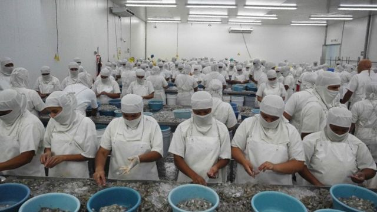
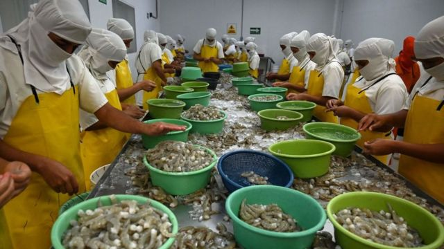
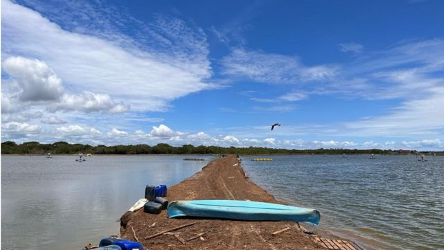

# [Chinese] 台湾人餐桌上的美中台外交角力与洪都拉斯的白虾

#  台湾人餐桌上的美中台外交角力与洪都拉斯的白虾

  * 吕嘉鸿 
  * BBC中文 

> 图像来源，  Getty Images
>
> 图像加注文字，近年来，台湾的白虾大概仅有三分之一来自自产，三分之二的白虾来自进口。

**台湾2024总统大选即将到来，激烈的选战已经展开。但较少人知道，远在千里之外的中美洲，台北与北京的外交战也同样喧嚣。**

事实上，自2016年蔡英文选上台湾总统后，两岸关系跌至谷底。蔡政府拒绝习近平的“一国两制”台湾方案以及国共两党谈判的条件——“九二共识”后，北京持续在外交及经济上反制挤压台湾。

远在台北千里之外，被称为“美国后院”的中美洲，亦是台湾外交邦交国最多、关系最好之地，自此开始出现与台北的“断交潮”。

从2017年的巴拿马开始，到2023年3月的洪都拉斯（Honduras，台湾译宏都拉斯），台北共丢掉了五个邦交国，即便美国曾经试图协助，都无法挽回断交危机。

目前台湾在中美洲仅剩中美洲第一大国——危地马拉（Guatemala，台湾译瓜地马拉）为盟友。但今年8月，该国“变天”，新总统曾言有意与中南海加深交往，与台北的外交关系是否生变亦引发关注。

香港政治学者沈旭晖分析，北京在中美洲进一步压缩台湾外交空间的作法已经奏效。他认为，深受美国影响的中美洲国家本是台湾“外交最后的桥头堡”，“一来在2010年前，中共政权的影响力未能深入这地域；二来美国也会配合台湾，默契地暗示这些国家——如果保留对台邦交，也等同于深化对美关系。”

但是，在中美洲“断交潮”下，台湾与这些国家建立数十年的经贸关系，签订多年的经贸协定何去何从？美中台在该区域的这些外交战，又如何延伸到台湾人的餐桌上？在台湾火锅店及市场上深受台湾饕客钟爱，来自宏都拉斯的“白虾”或许可以提供一些线索。

台湾前农业部长、​​​​现任台湾中兴大学特聘教授陈吉仲向BBC中文分析，今年3月宏都拉斯与台湾断交时，没有听过对方希望再与台湾签订一个新的“自由贸易协定”（FTA）。

陈吉仲看好台湾白虾自产的前景，原因是台湾现在成功培育出了“无特定病原”（SPF）虾苗，若能好好配合“渔电共生”政策（结合养殖渔业绿能发电系统，利用鱼塭堤岸、引水渠道设置环保发电系统），“过去被称为草虾王国的台湾，现在开始自产白虾还有很大潜力”。

陈吉仲亦强调，所谓市场的替代，基本上仍是渐进式的贸易行为。市场变动很大程度上是取决于合作多年的台湾进口商与中美洲养殖业者。

换言之，他认为，目前看来不大可能就看到宏都拉斯的白虾产地“一夜之间被替换掉”，但这也意味着中国不大可能马上就变成宏都拉斯养殖业者的最大市场。

##  宏都拉斯的白虾

鲜有台湾人知道，在台湾的火锅餐厅及生鲜市场极为热卖的白虾，其实一直是台湾与中美洲友邦的重点进口货物。台湾所需的白虾大概仅有三分之一来自自产（约一万吨），三分之二来自进口冷冻白虾，其中约三成是从中美洲的宏都拉斯进口。

但是，宏都拉斯和台湾两地紧密的经贸关系在今年三月开始被颠覆。宏都拉斯正式宣布与台湾断交，双方签订多年的自贸协定也在今年9月终止。失去关税优待后，曾经大量进口的宏都拉斯白虾价格涨了20%。而宏都拉斯养殖业者失去大量台湾订单，深怕白虾卖不出去，宏都拉斯新政府承诺的中国市场成为希望所在。

宏都拉斯养殖业者“太平洋海鲜”（Pacific Fresh）公司负责人安德里亚·塞拉（Andrea Sierra）女士接受BBC中文采访时说，她的公司是三代家族事业。中美洲与台湾的市场变动，她观察了数十年。

她说，过去20年来，台湾养殖业者及政府大力协助白虾的冷冻运输技术，提升了白虾品质，因此价格可卖得不错。但是，现在与台北断交，台湾征税增加了20%，许多买家离去，导致他们需要开始寻找其他市场。

许多中美洲养殖业者告诉BBC中文，过去几十年来熟悉台湾的客户及市场，当地养殖业者现在重新寻找新市场并不容易。塞拉女士坦言，宏都拉斯政府及北京今年积极邀请他们前往中国各地参加水产品展示会，并与中国商会见面，试图打开新市场，但挑战重重。

她说，“我们尚未向中国出售任何一批货物，原因是对方买进价格过低。而且，我们在中国找的是一个可以重视我们产品新鲜度，质量并重的高端市场。”

> 图像来源，  Getty Images
>
> 图像加注文字，北京称会协助洪都拉斯白虾进入中国市场。

##  中国市场将取代台湾吗？

塞拉女士坦言，许多公司据报在政治环境变动后都开始要重新寻找市场，“但这并非易事”。她向记者强调，因为许多加工厂的设备、包装材料多数都是为满足台湾市场而设计的，“因此，所有这些投资在其他市场并不那么关键”。

现在，太平洋海鲜公司的战略是在基础设施方面做出改变，适应巨大的市场变动。她说：“我们的目标是降低20%的成本，进入各国不同市场时更有竞争力，同时还为台湾市场保留一些量”。

北京与宏都拉斯政府要如何弥补失去的台湾订单引发了关注。今年6月，宏都拉斯官方说与北京建交后出口的重点商品，包含咖啡及虾等农产品可直接销往中国市场，不再需要从台湾中转。

宏都拉斯官方称，进入中国市场“成本更低、速度更快、机会更多”。

中国海关总署则表示，已经与宏都拉斯签署养殖水产品输入中国市场的相关议定书。并称此举将促进两国贸易发展，“以丰富中国市场对优质水产品的消费需求”。

> 图像来源，  Getty Images
>
> 图像加注文字，与洪都拉斯断交前一天（3月25日），蔡英文在嘉义县视察军队。

宏都拉斯总统希奥玛拉·卡斯特罗（Xiomara Castro，台湾译卡斯楚）亦在今年6月访问北京，与习近平首度会晤，双方签署区域经济合作框架“一带一路”等多项双边合作文件。7月，传出宏都拉斯正与中国进行自贸协议谈判。该国正在寻求投资者，特别是中国，资助该国兴建一条连接太平洋和太西洋海岸的铁路，要价约200亿美元。

塞拉向BBC中文表示，目前中国市场需要的是较低价的白虾，但就公司来说，以低价出口并不符合他们的商业战略。低价且新鲜度较差一点的白虾，买家也可以从其他竞争者国家，特别是厄瓜多尔那里获得，因此拉低价格卖出白虾并不能带来好利润。

此外，今年中国经济放缓，贸易商更谨慎，也不愿一次购买大量水产。她说：“我们公司希望产品能在其他市场找到立足之地，以继续营运我们的业务，这是宏都拉斯南部地区两万多人的就业来源。各种政治决定已经影响到我们生计，我们盼望有好的产业政策及前景。”

##  台湾白虾断货？

宏都拉斯养殖业者盼望有新的市场解决问题。那么，对台湾经销商来说，忧心的可能是品质不错的白虾可能会断货。

根据台湾官方统计，台湾主要向宏都拉斯进口九项产品，冷冻白虾与咖啡分别是前二大进口产品。

就白虾而言，根据2022年台湾农业部统计，台湾每年自产白虾1.1万公吨，进口则占2.5到3.6万公吨，其中宏都拉斯进口占30%，贸易额约有1.641亿美元，当年成长幅度达59.35%。因此可以说，台湾对于宏都拉斯的白虾需求量十分庞大。与宏都拉斯断交后，白虾供应情况引发台湾餐饮业者关切。

> 图像来源，  BBC News Chinese
>
> 图像加注文字，巴拿马的白虾养殖池。

台北一家与宏都拉斯养殖业者往来10多年的贸易公司代表林经理告诉BBC中文，随着台湾在中美洲遭遇断交浪潮，台北的贸易商确实需要适应变化，灵活地在不同国家寻找新客户，挖掘新产品。

不愿透露公司名称的林经理强调，最近刚从中美洲拜访客户回台。她说，其实2021年末尼加拉瓜与台北断交后，台湾给予了六个月的关税缓冲，当时影响稍小。进入2023年，公司曾规划将重心转往宏都拉斯，结果又遇到宏都拉斯宣布断交，只好将重心再转往巴拿马。

林经理说，公司在台湾与宏都拉斯的自贸协议终止前，这几年进口总量成长至180-200个货柜。主要进口来自尼加拉瓜 （年进口量150柜上下）、宏都拉斯（年进口约30-50柜），一柜约有18000至20000公斤的白虾。过去宏都拉斯白虾每公斤的进口价格是七至八美金不等。

据分析，巴拿马的优势是，虽然该国与台湾断交多年，但双方还享有自贸协议，原因是业务在全球排名前几大的台湾长荣及阳明海运等是巴拿马运河的大客户。因此，台湾和巴拿马并未因为断交就取消自贸协议，反而订制一个新的自贸协议。林经理表示，“而且，巴拿马现在的养殖技术也在提升中，有大规格白虾养殖，生产品质也较往年好，成为现在进口商主要的规划产区。”

台湾渔业署养殖渔业组代表陈文深对台湾媒体说，进口白虾确实能够由其他国家如巴拿马、泰国替代，因此台湾不担忧供应会中断。

台北一位不愿具名的贸易商解释称，与台北断交后，宏都拉斯有养殖业者将价格降价到每公斤六美金，希望台湾仍可以继续下订单。

但该养殖业者告诉BBC中文，由于全球白虾市场价格都下跌，台湾还有很多白虾库存，所以台湾贸易商不会因为便宜就购买，还是会去评估台湾市场的供需状况。

换言之，台湾贸易商面对中美洲国家与台湾的断交，一开始的冲击不小，因为需要再花时间培养可靠的供应商。但林经理认为，在自由贸易市场，“基本上永远会找到替代方案，对我们商人来说，便是需要伺机而动”。

而对于当地的政治商业变化，台湾商家其实或多或少都有所准备。林经理表示：“刚好今年处在完全的买方市场，全球景气差、虾量供过于求，市场并无缺虾状况。目前的首选会是巴拿马。”

陈吉仲教授则强调，从全球粮食安全角度而言，因为政治原因介入宏都拉斯与台湾的水产供应，的确伤害到宏都拉斯；他向BBC中文解释，因为白虾等水产品很容易受到感染，不好培养，透过双边稳定的贸易关系，可以满足消费者营养需求及生产者的经济，“但现在透过政治外交，破坏了市场机制，不是好事。政治过度介入产品出口进口的贸易会走不长远”。

宏都拉斯的白虾养殖业者表示，过往产品多半都销往台湾市场，可以说“鸡蛋都放在同一个蓝子”，如今面对出口到台湾的关税优惠取消，若未找到其他市场，冲击可能比台湾进口商还大。

宏都拉斯商人未来能否顺利进入中国市场，正在检视中国经济实力在中美洲的影响力。

> 图像来源，  BBC News Chinese
>
> 图像加注文字，白虾一直是台湾餐厅很好卖的食材；图为运往台湾的货柜。

