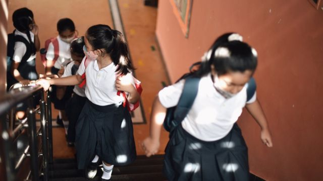

# [Chinese] 儿童肺炎：中国北方出现感染潮，官方称无“异常或新型病原体”

#  儿童肺炎：中国北方出现感染潮，官方称无“异常或新型病原体”

  * 费兰·查特吉（Phelan Chatterjee）、弗格斯·沃尔什（Fergus Walsh）、图利浦·玛宗达尔（Tulip Mazumdar） 
  * BBC记者 

> 图像来源，  Mayur Kakade

**世界卫生组织（WHO）表示，据中国的报告，在多宗儿童集体感染肺炎病例中并未发现“任何异常或新型病原体”。**

此前向中国要求提供更多病例数据的世卫表示，北京方面已经将一些类似流感的疾病数量增加归因于新冠（Covid）防疫措施的解除。

不过，世卫仍然促请中国境内的居民采取预防措施，比如接种疫苗和佩戴口罩。

近日，中国当地媒体报道了一些医院面临不堪重负的情况。

世卫组织在周三的 一份声明  中表示，已请求中国就媒体的报道和新发疾病监测规划机构（ProMed）的报告提供更多的信息，后者是全球疫症爆发监测系统，报告中提到了“中国北方出现儿童未确诊肺炎聚集性病例”。

肺炎是一个大致的医学术语，用来描述肺部的感染和炎症。它可能由多种不同的病毒、细菌或真菌引起。

在世卫作出要求之后，中国官媒新华社发布了 一篇文章  ，引述中国国家卫生健康委员会（NHC）官员指，他们正密切关注对患有呼吸系统疾病儿童的诊断和治疗。

Skip podcast promotion and continue reading

* BBC 時事一周 Newsweek (Cantonese)   **

BBC國際台粵語節目，重溫一周國際大事，兩岸四地消息，英國境況。並備有專題環節：〈記者來鴻〉、〈英國生活點滴〉和〈華人談天下〉。

分集

End of podcast promotion

随后在周四，世卫组织在 一份声明  中表示，中国并未检测到任何“异常或新型病原体”，目前在中国北方传播的呼吸系统疾病增多是由于“多种已知病原体”造成的。

世卫组织表示，自10月份以来，中国北方报告与过去三年同期相比，“类似流感的疾病有所增加”。

声明中说：“其中一些疾病增加的时节，与历史相比更早一些，但是由于解除了2019冠状病毒病（Covid-19）的封锁措施，这并不在意料之外，其他国家也有类似情况。”

世卫表示目前“正在密切监控此情况，并与中国国家相关部门保持着密切联系”。

尽管提及中国以及一波疾病感染可能会令人感到不安，因为这会唤起对新冠疫情大流行的记忆，但是世卫组织要求澄清是一种好的做法。

世卫组织要求各国提供关于疾病群组的更多信息并非不寻常，他们通常几乎每天都在这么做。

世卫组织有一支专项团队会每天对来自各国的成千上万媒体报道和内部监测信息进行逐一核查。然后专家们会决定是否需要更多信息，以防它成为影响国际的重大公共卫生紧急事件。

不过公开宣布要求提供更多信息却是不寻常的。一般来说，这在过去往往是通过世卫组织和一个国家卫生官员之间的私人渠道进行。

联合国机构无疑会在意人们可能会对中国出现病毒的报道感到更加紧张，因为不久前的新冠疫情仍记忆犹新。在新冠疫情全球大流行之后，世卫组织也正试图变得更具透明度。

英国健康安全署（UKHSA）表示，正在密切关注这一情况。

上周，中国国家卫健委表示，全国多地几种呼吸系统疾病有所增加：特别是流感、新冠、在幼童当中多发的肺炎支原体感染，以及呼吸道合胞病毒（RSV）等。

官方将此次病例增加归因于新冠防疫措施的解除。

包括英美在内的其他国家，在解除防疫限制之后也出现过类似的类流感疾病激增的情况。

“中国现在很可能正在经历一波儿童呼吸系统感染的高峰，因为这是他们长时间封锁之后的第一个冬天——封锁大大减少了呼吸道病毒的传播，因此也降低了对地方病毒的免疫力，”伦敦大学学院基因研究所的弗朗索瓦·巴劳教授（Prof Francois Balloux）说。

东英吉利亚大学（UEA）的保罗·亨特教授（Prof Paul Hunter）指，目前掌握的信息还太少，无法明确判断导致感染的原因。

他补充说：“总的来说，对我来说，这不像是由新型病毒引起的流行病。如果是的话，我会预期在成年人当中看到更多得多的感染。成年人中仅有少数病例出现，表明在先前的接触中已形成对病毒的免疫力。”

