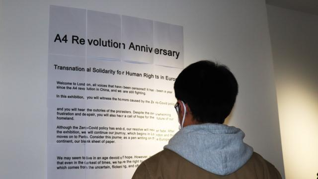
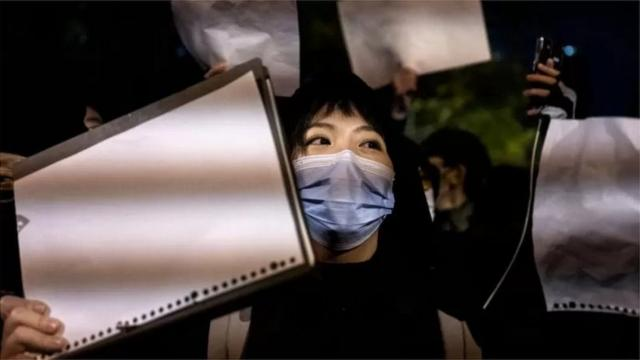

# [Chinese] 白纸运动一周年： 海外青年希冀建墙外异见网络 “抢夺公共记忆”

#  白纸运动一周年： 海外青年希冀建墙外异见网络 “抢夺公共记忆”

  * 林子晴 
  * BBC中文撰稿人 

**从举起白纸反疫情封控，到高喊“习近平下台”，一年前“白纸运动”浩浩荡荡的抗议呼声，今年在中国国内街头已不复存在。**

但受运动启发的内地年轻一代，矢志在墙外连结起异见网络，以艺术巡展延续呼声，说要在记忆被抹去前，唤起一场“抢夺公共记忆的运动”。

运动一周年前夕的周五（11月24日）晚上，近60名大多来自中国大陆的年轻人挤满了一家伦敦市中心狭小的展览室，见证一场罕见由中国留学生社群主办、公开谈论政治的艺术展的开幕。

在北京长大、现居巴黎的30岁艺术家蒋不对BBC中文说：“白纸运动是我们这个世代第一次公开地，从线上走到线下，在街头对这个政权说不的重要记忆。”

“如果我们第一个周年就不去纪念它，可能（以白纸抗议）这个符号，就会越来越远了。”

> 图像来源，  Getty Images

##  正被抹去的记忆

这次以“白纸续写”为题的巡回艺术展， 由多个驻扎欧洲的中国年青异见组织举行，周五在首站伦敦拉开序幕。前八九学运领袖、维吾尔、香港人、西藏社群的代表也有出席开幕式。

艺术展将于12月初将移施至巴黎。接着，部分展品将由一辆称“人权车”的小货车载着，从巴黎出发，花近一个月游走7000多公里，抵达阿姆斯特丹、柏林、慕尼黑、华沙、布拉格、拉昂等多个城市作流动展览。

伦敦展览场内有雕塑、有纪录片、有画作，有照片，诉说出一个个关于疫情封控，或对政权不服从的故事。但更真实反映今天国内情况的，或许是一些展品的缺席。

有份筹备展览的蒋不说：“我们最初的投稿里，有30%的是来自国内的艺术家，但当中一半艺术家后来相继撤展。”

他说，有在北京欲参展的艺术家，透过微信传送关于活动的讯息，招来警员“叫去喝茶” （盘问），被迫退出；也有艺术家看到活动愈做愈大，不敢投稿。

运动的记忆，一边拼命在夹缝中存活，一边被官方打压抹去。蒋不慨叹，“这种不完全消失的记忆，是愈来愈模糊了”。

国内参展人承担着安全风险，来观展的内地留学生也要克服不少恐惧。

30岁的玛戈，4个月前从中国到伦敦修读艺术硕士。她在学校接到了展览的传单后，脑海了闪过各种参与后会面对的风险，“我有可能会被人举报，然后我在国内的家人会被调查。”

但她想，如果每人都如此退缩，“活动就没有意义了”。因此，她还是鼓起了勇气，第一次出席了具这样规模的异见活动。“如果这次不来的话，下次可能就没有机会来了，因为你不知道下一次能鼓起勇气是什么时侯了，” 她说。

玛戈在白纸运动时身在国内，出于到安全顾虑没有参与。但她说，这一年来，身边的人私下聊天时都会谈及运动，“大家都没有忘记这件事”，但墙内终究没有对运动的纪录，恐怕记忆“会被渐渐淹盖掉。”

> 图像加注文字，展品中一座中国国家主席习近平的塑胶雕塑

##  白纸运动促海外异见网络萌生

办起这场伦敦站展览的社群，是在白纸运动后发展出来的；而参与组织的25岁伊夫林（Evelyn），一年前也只是一名身处伦敦的中国留学生，政治素人。

她当时是看到四通桥抗议的新闻，深受启发，有感面对封控不公，“中国大陆民众也站出来为自己发声﹐是时候要行动。”

于是，从小没受民主公民教育的伊夫林，凭起不圆熟的组织技巧，从举办第一场百人声援四通桥示威的集会。接着又借白纸运动浪潮，组织更多声援示威，最后更成立了今次主办伦敦站展览的组织“中国反贼”（China Deviants）。

除了举行六场示威抗议外，伊夫林与其他组织者着眼于深耕细作的公民教育工作，举办了至少20场谈论民主、自由与公民权利的放映会和工作坊。这些公民活动每次有约15至20人出席。

“我们是自天安门事件后，第一代会开始组织这样的公民社会空间的人，现在已发展得不错，”伊夫林说。现时，伦敦另有两个由留学生发起、关注中国女权的组织也应运而生，渐渐形成英国的华人异见网络。

前八九六四学运领袖周锋锁，也特意前来伦敦观展。他形容说，这是自八九民运一代后，他在英国见过最具组织的华人异见社群﹐“她们用持续的行动证明了自己，当之无愧，而且单单是大潮过后，仍能保持热情。” “这一年能坚持下来，就已经十分值得支持了，”他说。

##  “使命感超越安全考虑”

担起筹备异见活动的角色后，伊夫林感受到安全威胁的压力。她去年在伦敦中国大使馆外主持了一场悼念乌鲁木齐大火集会后，曾被两名不明男子跟踪回家，最后要躲进医院良久才甩掉两人。

另外，近两个月正密锣紧鼓筹备白纸运动一周年活动时，她的英国手机几乎每天都接到大约四通至五通普通话录音电话，自称来自中国大使馆。她说：“我觉得很烦，分不清哪个是诈骗，哪个是要接的电话。” 有关情况， 与一些海外维吾尔族社群成员的经历相似。

但是她说，“我的使命感超越了对安全的考虑”，而且由于她不再打算回国，国内也没有关系密切的家人，所以这些风险不能阻止她继续行动。

伦敦艺术展开幕仪式结束后，展览室里仍逗留了不少参与者，他们隔着保护身份的口罩，交流政治和讨论展品，话声始起彼落。

玛戈说： “只要有反抗的想法在，只要有人还在，它（国家）总会有一天变成另一个样子。”

当前的中国社会看似丝毫不被白纸运动动摇，但伊夫林说，“改变不可见，不代表它没有发生， 而白纸运动只是一个开始。”

为保护受访者身份，蒋不、伊夫林和玛戈均为化名。

