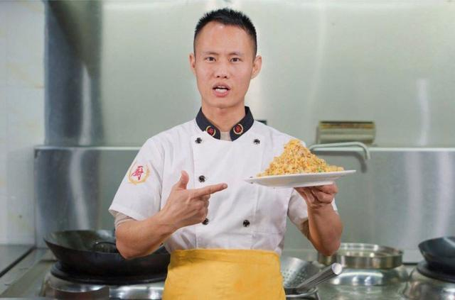

# [Chinese] 一碗蛋炒饭引起网络围攻 网红厨师被指“侮辱英烈”

#  一碗蛋炒饭引起网络围攻 网红厨师被指“侮辱英烈”

> 图像来源，  Weibo
>
> 图像加注文字，这部十多分钟的影片发布于周一（11月27日）。影片中，王刚向观众们展示了如何制作一碗蛋炒饭。

**在发布了一条“蛋炒饭”教学影片后，中国知名的网红厨师王刚身陷“侮辱英烈”风波，他随后发布视频致歉。**

这部十多分钟的影片发布于周一（11月27日）。影片中，王刚向观众们展示了如何制作一碗蛋炒饭。

这段看似普通的教程却引起许多网友的口诛笔伐，他们称王刚是故意在影射中共前领导人毛泽东长子毛岸英之死。

1950年11月25日，时年28岁的毛岸英在朝鲜战场上遭美国主导的联合国军空袭阵亡，但关于他的死亡细节众说纷纭。

在中国人民解放军出版社出版的一本赴朝将领撰写的回忆录中，曾提及毛岸英在联合国军轰炸到来时正在司令部做蛋炒饭。该回忆录称，因做饭时的炊烟被敌方发现，导致遭轰炸丧生。

在另一本1994年由中国官方批准出版的中共元帅彭德怀的传记中也提到了类似细节。

因此，"蛋炒饭"被部分网民用于代指毛岸英。一些人对他的死亡表示庆幸，认为该事件使得中国至少没有陷入类似朝鲜的世袭制当中。

不过，许多历史学者对“毛岸英死于做蛋炒饭”提出质疑。当局近几年来也多次斥责这一说法是“谣言”。

官方的中国历史研究院甚至形容其是“最为恶毒”的谣言。

中国当局自2018年5月起实施《英雄烈士保护法》。这部引起争议的法律对保护中国官方的英雄烈士作出了一系列详细的规定，包括保护他们的姓名、肖像、名誉、荣誉，禁止歪曲、丑化、亵渎、否定其事迹和精神。

##  发布道歉影片

围绕该争议，“蛋炒饭”一词也在近年成为中国网络上的敏感禁忌，尤其是在10月24日和11月25日——毛岸英的生日与忌日。

跳过 Twitter 帖子, 1

**允许Twitter内容**

此文包含Twitter提供的内容。由于这些内容会使用曲奇或小甜饼等科技，我们在加载任何内容前会寻求您的认可。 您可能在给与许可前愿意阅读Twitter 小甜饼政策  和 隐私政策  。 希望阅读上述内容，请点击“接受并继续”。

Accept and continue

结尾 Twitter 帖子, 1

无内容
 继续浏览 Twitter  BBC对外部网站内容不负责任。

在网民的不断攻击下，网红厨师王刚在同日发布了一段道歉影片。他表示蛋炒饭影片由团队发布，他个人没有参与，但他保证以后会更加小心谨慎。

“作为厨师，以后再也不做蛋炒饭，也不拍蛋炒饭。”身穿白色上衣的王刚承诺道。

“这个视频对大家造成了非常大的困扰和很不好的体验。”他补充说。

今年34岁的王刚自2017年当起了美食博主，发布各种菜肴的烹饪制作教程，活跃在微博、抖音、西瓜视频和哔哩哔哩等社交媒体平台上，总粉丝量达到数千万。

马来西亚喜剧演员黄瑾瑜（Nigel Ng）常以“罗杰叔叔”（Uncle Roger）的食评人形象出现在YouTube节目中。他曾在一段视频节目中盛赞王刚的蛋炒饭才是“正确的打开方式”。

在王刚道歉后，仍有不少网民并不买账，呼吁以“侮辱英烈”罪名对他进行调查。有质疑者表示，王刚在2020年就已因在10月发布“蛋炒饭”食谱而遭到批评，此次“不会是无意”。

但也有微博网友表示，王刚的账号曾在其他月份也发布过类似视频，这并不能说明什么。还有人批评围攻者是在“上纲上线”、“牵强附会”。

王刚并不是唯一卷入“蛋炒饭”争议的人。2021年10月24日，中国联通江苏分公司发布了一条“姜蛋炒饭”教程，随即引发很多网友的批评。尽管这条帖子很快就被删除，但其账户一度被暂停。

