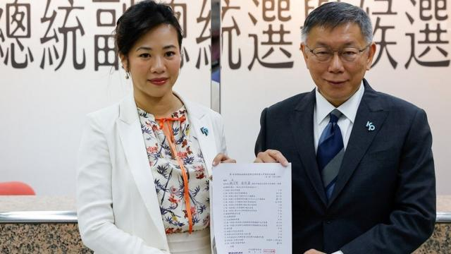
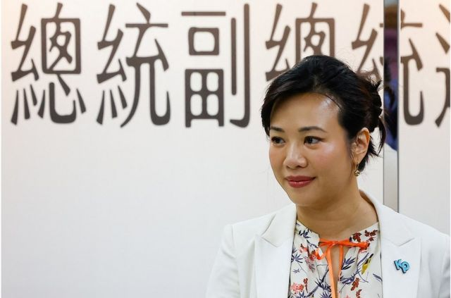
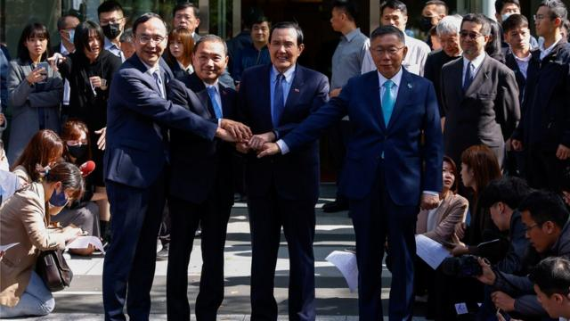

# [Chinese] 柯文哲副手搭档吴欣盈是谁

#  台湾2024总统大选：柯文哲副手搭档吴欣盈是谁

  * 吕嘉鸿 
  * BBC中文 

> 图像来源，  Reuters
>
> 图像加注文字，民众党总统参选人柯文哲宣布，副总统竞选搭档为吴欣盈。

**台湾2024总统大选在上周“蓝白合”破局，鸿海创办人郭台铭宣布退选后，民众党总统参选人柯文哲隔日便宣布其副总统搭档为该党现任立委吴欣盈，立即引发台湾政商界骚动。**

1978年在美国出生的吴欣盈是台湾五大财团之一的“新光集团”第三代长孙女，被媒体称为“新光公主”，一直是台北商界及社交界的名人。

吴欣盈四年前被提名列入民众党不分区立委名单，去年正式替补进入立法院，占据各大新闻版面。多年在美英两国求学工作，她作风直率“洋派”，柯文哲称吴欣盈与他极为不同的背景可以彼此互补，协助他往总统府迈进。

有分析称，民众党选择吴欣盈是希望凭藉吴女士的国际及性别背景，扩大该党的女性及年轻族群选票。

不过，台湾东海大学政治学系张峻豪教授则告诉BBC中文称作用不大。他说，吴女士加入总统大选，主因是该党参选确实需要经费来应对开销庞大的大型选战。

张峻豪不认为吴女士的性别年龄及国际背景能有效“中和”柯文哲呛辣的政治风格，他分析说，“该党还会以柯氏风格为主轴打选战，而且吴小姐的求学经历与政治较无相关，加入政坛的时间也很短。”

有分析称，有着钜富人家背景，又接受美式教育成长，吴欣盈对外十分重视往来对象及个人隐私。她虽然个性外向爽朗，但对于捍卫自身权益不假辞色。

面对各界近日对其在海外的资产，或曾拿配戴顶级名牌包在议场询问贫穷议题等话题，她都直接面对媒体。她告诉台湾媒体称，这些评价她的人都非不动产及时尚的专业人士，又表示媒体准备的问题并不准确。

她称，有关美国国籍一事，她已在台湾“落地生根”，没有出示放弃美国国籍证明的计划，“那是我跟美国政府之间的事情”。

吴欣盈后来在社交媒体上发文称已经放弃美国国籍，12月5日会有正式声明。

##  从政之路

> 图像来源，  Reuters
>
> 图像加注文字，吴欣盈后来在社交媒体上发文称已经放弃美国国籍，12月5日会有正式声明。

来自历史悠久的台湾本土商业巨擘家族，吴欣盈先在台湾就读台北美国学校，后来到国外求学。因此她主要使用的语言是英文，而台语（闽南语）又说得比国语好。

媒体描绘她个性十分外向、直接和“洋派”。由于长期在英美工作，回台北协助父亲管理集团，她以“美式作风”冲撞日式谨慎风格的新光集团；在父亲麾下董事会工作时，与其他董事的路线之争激烈，一直是台北商界的关注焦点。

台湾舆论界对吴欣盈并不陌生，与其他亚洲社会相似，财团间透过婚姻扩大商业版图，并不少见。吴女士过往也曾与台北另一大财阀集团后代成婚，彼时豪华婚礼及两人之后的相关离婚诉讼，也一直是社交圈话题。

不过，事实上吴欣盈长期以来一直对公共事务很有兴趣。

她在美国就读的是蒋宋美龄、连战女儿连惠心及前美国国务卿希拉里·克林顿的母校——美国卫斯理学院，主修国际关系及美术史；在英国时，吴女士又加入一名保守党议员办公室担任政策研究助理。

十多年前在返回台北后，吴欣盈主持集团的慈善基金会，在台湾及世界各地倡议人权及福利等。最后，在柯文哲担任市长后，她开始与民众党有所接触，顺利进入政坛。

四年多前，民众党党魁柯文哲在连任台北市市长后，便开始重新规划与财团的关系，柯文哲除了邀请“金控家族”后代进入市长室当实习生，在上届立委选举中，他还策划提名鸿海集团的高虹安及新光集团吴欣盈为不分区立委，引发政坛关注。

2022年，吴欣盈递补民众党一委员离职之空缺正式加入立法院，以社会福利、国际金融管理为主要问政目标，逐步往专业政治工作者迈进，最终获得柯文哲青睐成为副手搭档。

吴欣盈上周在获邀参与总统大选后说，她将在选战中发挥国际观和金融经验，“并强调会充分运用每一天，充实自己，以期更好地为国家服务。”

事实上，吴欣盈并非新光集团首位从政的人士。她的叔叔吴东升便曾任国民党立委，后来追随台湾前总统李登辉，加入台联党担任不分区立委。

1945年成立的台湾本土新光集团，总资产至少达千亿美金，主要经营事业包含保险、银行、医疗、能源以及百货零售业等，其中新光百货是台湾百货业龙头。

##  民众党危机？

虽然柯文哲最终以总统参选人竞逐下届台湾总统，但在“蓝白合”破局后，各项台湾民调都指出柯文哲支持度开始下滑，位居第三，与原本支持度不相上下的国民党候选人侯友宜的差距越来越远。民众党内亦浮现退党潮，引发政坛议论纷纷。

台湾东海大学政治系教授沈有忠对台湾《天下》杂志分析说，“蓝白合”失败，或许对国民党的影响不大，反而是柯文哲受到内伤。

沈有忠认为，国民党宣布党内“深蓝”人士赵少康担任副手及韩国瑜列为不分区第一名之后，有助于保住国民党的基本盘、降低在总统大选遭“弃保”的风险。他认为反倒是柯文哲在此次蓝白协商后，遭到对手间接点出“诚信”问题，如何能维系支持者的信赖将是他的选战胜负关键。

柯文哲在本周接受媒体访问称，自己对于民调起落并不担心，他说两个星期内就可以重整步伐，再往前冲刺。他还发出一封公开信对党内同志喊话，称要义无反顾地团结，“对于近期的纷扰，大家难免沮丧或生气，但只要齐心矢志，民众党就有机会翻转台湾。”

> 图像来源，  Reuters
>
> 图像加注文字，11月15日蓝白密室协商两个多小时后，柯文哲签下协议书。但之后破局。

