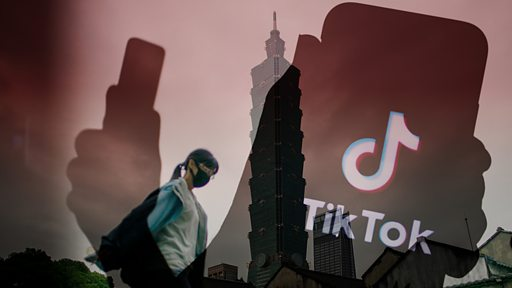

# [Chinese] 台湾总统大选2024：抖音小红书在这里流行吗？是否担心大陆“认知战”？

#  台湾总统大选2024：抖音小红书在这里流行吗？是否担心大陆“认知战”？

**台湾总统大选2024：抖音小红书在这里流行吗？是否担心大陆“认知战”？**

近年来，中国大陆的社群平台，例如小红书、抖音或TikTok，在台湾年轻族群中流行起来。根据台湾网路资讯中心2023年8月发布的报告，有超过22%的台湾成年有使用“抖音”或TikTok。这也引来舆论关注，具中国背景的软体是否会对台进行“认知战”。

BBC中文走访台北多地，询问市民如何看待来自中国的社群软体。

有市民说：“某些很‘台独’的朋友，他们其实也很爱用抖音。”

也有人表示已删除这些软体，不用的原因是“它的上瘾性太强”。

对于“认知战”一说，有市民表示：“我觉得任何的影音、视频都存在认知战的作用。”

（采访、拍摄、剪辑：李洛）

